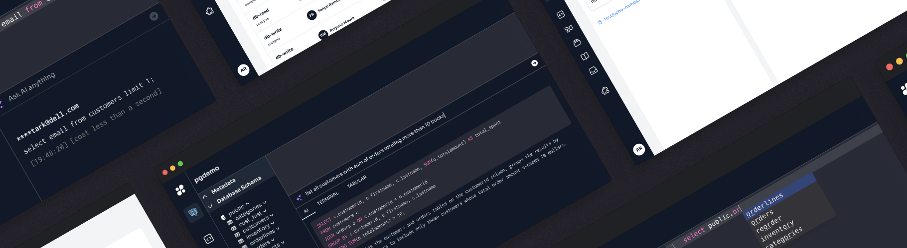

<h1 align="center">
<b>hoop.dev</b>
</h1>
<p align="center"> 🔒 Access any database or server. Customer data automatically hidden. Everything recorded.
  
<br /> <br />
 <a target="_blank" href="https://hoop.dev">Website</a> · <a target="_blank" href="https://hoop.dev/docs">Docs</a> · <a href="https://github.com/hoophq/hoop/discussions">Discussions</a> </p> </p>
 <p align="center"><a href="https://github.com/hoophq/hoop/actions/workflows/release.yml"> </a></p>

The only access proxy that blocks dangerous linux commands and scrubs sensitive database outputs

## Without Hoop

*Debugging production issue...*


*You screenshot the result for Slack...*
SSNs, credit cards, and phone numbers now in your team chat 💀

One query, one screenshot, **one data breach**.

## With Hoop

Same query through Hoop
*You see:*


It's safe to share 🔒

## Without Hoop

*Fixing bug at 3AM...*


1000000 rows updated 💀

## With Hoop

*Fixing bug at 3AM...*


Query blocked by Guardrail: "Prevent UPDATE without WHERE" 🚫

**That's it.** Hoop sits between you and your infrastructure. Sensitive data gets masked automatically. Dangerous operations blocked. Everything gets recorded.

## 30-Second Demo

```bash
# create a jwt secret for auth
echo "JWT_SECRET_KEY=$(openssl rand -hex 32)" >> .env

# download and run
curl -sL https://hoop.dev/docker-compose.yml > docker-compose.yml
docker compose up
```

[View full installation options](https://hoop.dev/docs/setup/deployment/overview)

## How It Works

```
You → Hoop → Your Infrastructure
       ↓
   • Masks sensitive data (ML-powered)
   • Blocks dangerous commands
   • Records everything (for compliance)  
   • Controls access (who, what, when)
```

Works with:
- **Databases**: PostgreSQL, MySQL, MongoDB, Redis
- **Servers**: SSH, Kubernetes, Docker
- **Tools**: HTTP APIs, internal services

## Why Teams Love Hoop

### 🧠 Smart Masking
Not regex. Machine learning that understands context.
- Knows "555-1234" is a phone number in user data
- Knows "BUILD-555-1234" is a build number
- Works in any language

### ⚡ Actually Fast
- <5ms latency
- No performance impact
- Works with existing tools

### 🔐 Real Security
- Nothing to configure
- Full audit trail
- SOC2/HIPAA/GDPR compliant

## 📚 Popular Guides

### Databases

-   [MySQL](https://hoop.dev/docs/quickstart/databases/mysql)
-   [PostgreSQL](https://hoop.dev/docs/quickstart/databases/postgres)
-   [MongoDB](https://hoop.dev/docs/quickstart/databases/mongodb)
-   [MSSQL](https://hoop.dev/docs/quickstart/databases/mssql)

### Cloud & Infrastructure

-   [Kubernetes](https://hoop.dev/docs/quickstart/cloud-services/kubernetes)
-   [AWS](https://hoop.dev/docs/quickstart/cloud-services/aws/aws-cli)
-   [SSH Jump Hosts](https://hoop.dev/docs/quickstart/web-applications/jump-hosts)

[View all guides](https://hoop.dev/docs/quickstart)

## Installation

### Docker

bash

```bash
# create a jwt secret for auth
echo "JWT_SECRET_KEY=$(openssl rand -hex 32)" >> .env

# download and run
curl  -sL https://hoop.dev/docker-compose.yml > docker-compose.yml &&  docker compose up
```

[See Docker Compose installation documentation](https://hoop.dev/docs/setup/deployment/docker-compose)

### Kubernetes

[See Kubernetes Deployment Documentation](https://hoop.dev/docs/setup/deployment/kubernetes)

### AWS

[See AWS Deploy & Host Documentation](https://hoop.dev/docs/setup/deployment/AWS)

| Region | Launch Stack |
|--------|--------------|
| N. Virginia (us-east-1) | [](https://us-east-1.console.aws.amazon.com/cloudformation/home?region=us-east-1#/stacks/quickcreate?templateURL=https%3A%2F%2Fhoopdev-platform-cf-us-east-1.s3.us-east-1.amazonaws.com%2Flatest%2Fhoopdev-platform.template.yaml) |
| Ohio (us-east-2) | [](https://us-east-2.console.aws.amazon.com/cloudformation/home?region=us-east-2#/stacks/quickcreate?templateURL=https%3A%2F%2Fhoopdev-platform-cf-us-east-2.s3.us-east-2.amazonaws.com%2Flatest%2Fhoopdev-platform.template.yaml) |
| N. California (us-west-1) | [](https://us-west-1.console.aws.amazon.com/cloudformation/home?region=us-west-1#/stacks/quickcreate?templateURL=https%3A%2F%2Fhoopdev-platform-cf-us-west-1.s3.us-west-1.amazonaws.com%2Flatest%2Fhoopdev-platform.template.yaml) |
| Oregon (us-west-2) | [](https://us-west-2.console.aws.amazon.com/cloudformation/home?region=us-west-2#/stacks/quickcreate?templateURL=https%3A%2F%2Fhoopdev-platform-cf-us-west-2.s3.us-west-2.amazonaws.com%2Flatest%2Fhoopdev-platform.template.yaml) |
| Ireland (eu-west-1) | [](https://eu-west-1.console.aws.amazon.com/cloudformation/home?region=eu-west-1#/stacks/quickcreate?templateURL=https%3A%2F%2Fhoopdev-platform-cf-eu-west-1.s3.eu-west-1.amazonaws.com%2Flatest%2Fhoopdev-platform.template.yaml) |
| London (eu-west-2) | [](https://eu-west-2.console.aws.amazon.com/cloudformation/home?region=eu-west-2#/stacks/quickcreate?templateURL=https%3A%2F%2Fhoopdev-platform-cf-eu-west-2.s3.eu-west-2.amazonaws.com%2Flatest%2Fhoopdev-platform.template.yaml) |
| Frankfurt (eu-central-1) | [](https://eu-central-1.console.aws.amazon.com/cloudformation/home?region=eu-central-1#/stacks/quickcreate?templateURL=https%3A%2F%2Fhoopdev-platform-cf-eu-central-1.s3.eu-central-1.amazonaws.com%2Flatest%2Fhoopdev-platform.template.yaml) |
| Sydney (ap-southeast-2) | [](https://ap-southeast-2.console.aws.amazon.com/cloudformation/home?region=ap-southeast-2#/stacks/quickcreate?templateURL=https%3A%2F%2Fhoopdev-platform-cf-ap-southeast-2.s3.ap-southeast-2.amazonaws.com%2Flatest%2Fhoopdev-platform.template.yaml) |

[View all regions](https://hoop.dev/docs/deploy/AWS)

## Advanced Features

What makes Hoop unique is its ability to not only inspect but also modify connections between users and infrastructure:

-   [**AI Data Masking**](https://hoop.dev/docs/learn/features/ai-data-masking)  - Automatically hide sensitive data like emails, SSNs, and credit cards
-   [**Just-in-Time Reviews**](https://hoop.dev/docs/learn/features/reviews/overview)  - Approve risky commands in real-time through Slack or MS Teams
-   [**Runbooks**](https://hoop.dev/docs/learn/features/runbooks)  - Create pre-approved workflows for common tasks
-   [**Web & Native Modes**](https://hoop.dev/docs/clients)  - Use the web interface or connect through your native database tools

[See all features](https://hoop.dev/docs/learn/features)

## You'll be in Good Company

-   **200+ successful deployments**  from companies around the world
-   **4.3 minute average setup time**  across all deployments
-   **Trusted by teams**  from startups to enterprises

## 🤝 Contributing

We welcome contributions! Check out our [Development Documentation](/DEV.md) to get started.

## 📣 Community

Join our [Discussions](https://github.com/hoophq/hoop/discussions) to ask questions, share ideas, and connect with other users.

⭐ Star this if you've ever worried about screenshots in Slack

## Backed by


