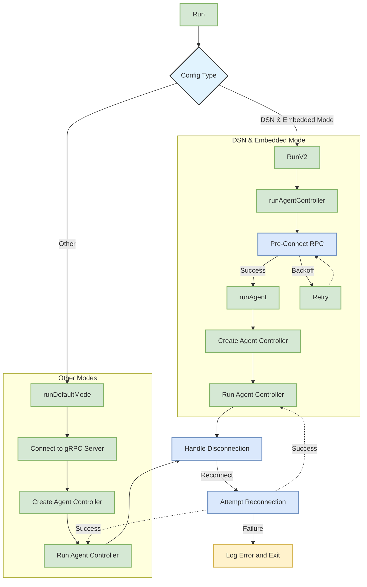

# Hoop Agent

## Project Overview

Hoop Agent is a robust and flexible agent system designed for managing and controlling connections in distributed environments. It uses gRPC for communication and supports various modes of operation, including embedded and default modes.

## Architecture

The following Mermaid diagram illustrates the high-level architecture of the Hoop Agent:

## Key Components

1. **Config**: Manages the configuration for the agent, including the mode of operation and connection details.
2. **GRPC Client**: Handles communication with the gRPC server.
3. **Agent Controller**: Manages the main logic of the agent, including connection handling and command execution.
4. **Pre-Connect RPC**: Performs initial communication with the server to determine if a connection should be established.
5. **Backoff Mechanism**: Implements exponential backoff for retry attempts in case of connection failures.

## Main Functions

### Run()

The main entry point of the application. It loads the configuration and determines whether to run in embedded mode or default mode.

### RunV2()

A newer implementation that supersedes the older agent modes. It supports running with pre-connect requests, runtime environments, and command arguments.

### runAgentController()

Manages the agent controller, handling pre-connect requests and initiating the main agent loop.

### runAgent()

Establishes the gRPC connection and runs the main agent controller loop.

### runDefaultMode()

Implements the default mode of operation, connecting to the gRPC server and managing the agent controller with exponential backoff for retries.

## Error Handling

The application implements robust error handling, including:
- Graceful shutdown on OS interrupts
- Exponential backoff for connection retries
- Detailed logging of errors and connection status

## Configuration

The agent supports various configuration options, including:
- Agent mode (embedded, default)
- gRPC server URL
- TLS settings
- Custom environment variables

## Usage

To start the Hoop Agent, simply run the compiled binary. The agent will load its configuration and begin operation based on the specified mode.

## Development

To contribute to the Hoop Agent project:

1. Clone the repository
2. Install the required dependencies
3. Make your changes
4. Run tests to ensure functionality
5. Submit a pull request with your changes

## Contact

For more information or support, please contact hi@hoop.dev