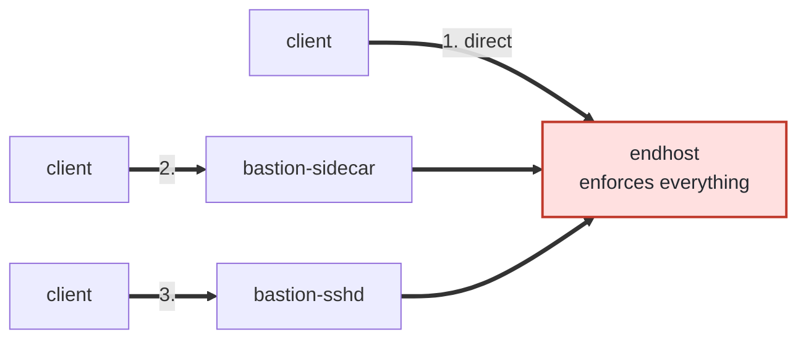
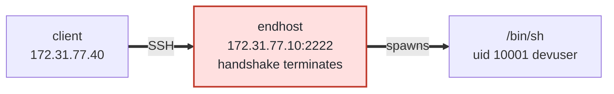
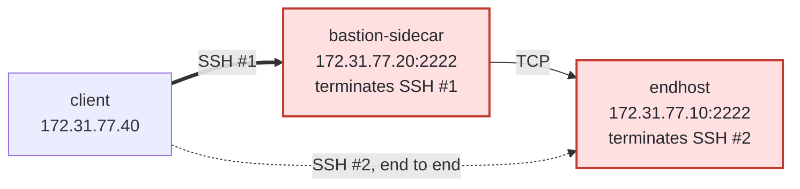
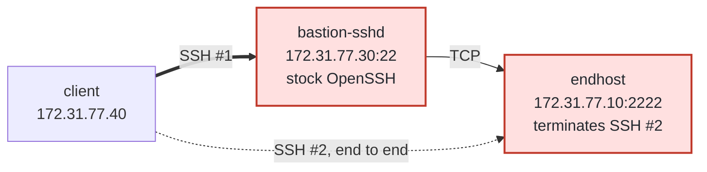
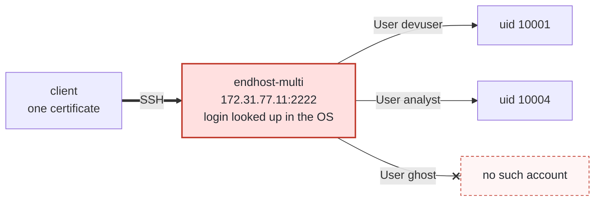
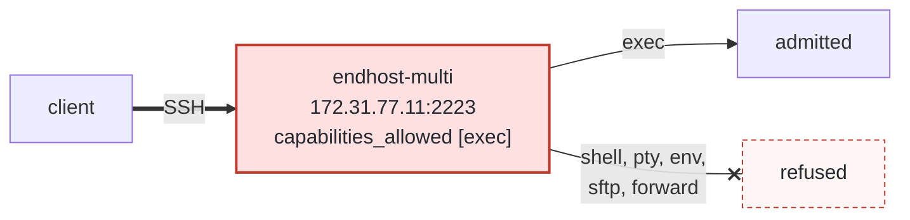
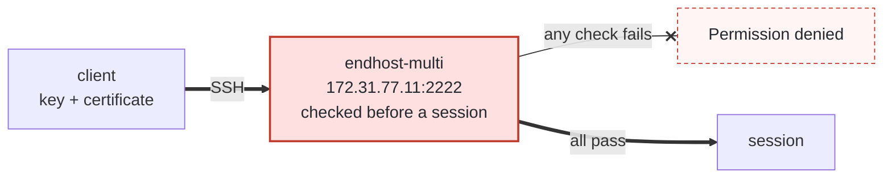
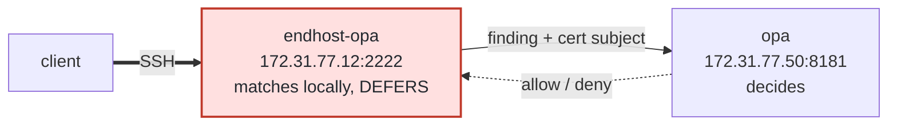
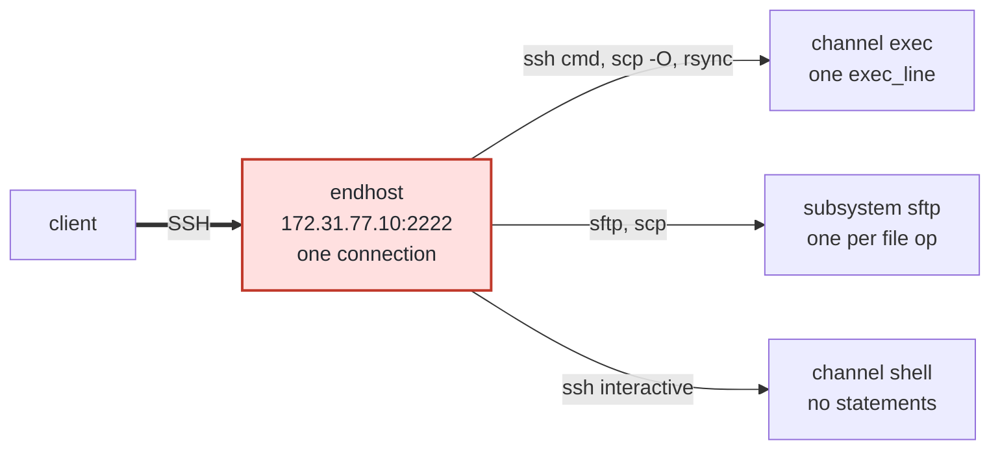

# SSH stack: three topologies, one end-hop

A local, complete demonstration of ADR-0015. Three ways a client can reach the
same host, and the same enforcement in all three.



Three more lanes, all in a second sidecar process on `172.31.77.11`, cover
who a session RUNS AS, what it may DO, and who the trail NAMES:

| | Lane | Port | What it answers |
|---|---|---|---|
| [4](#4-users--one-listener-several-accounts) | `multiuser` | `:2222` | **who it runs as.** The login name is looked up in the OS per connection — `devuser` and `analyst` resolve, `ghost` is in the certificate and is an account nowhere |
| [5](#5-capabilities--a-lane-that-admits-exec-and-nothing-else) | `exec-only` | `:2223` | **what it may do.** `capabilities_allowed: [exec]` — shell, pty, env, sftp and forwarding are each refused, and each says so |
| [6](#6-certificate-attributes--which-field-decided-what) | `identity-ext` | `:2224` | **who the trail names.** The same certificate, with the human read from an extension instead of the key id |

Two more decide with something that is not a local rule at all:

| | Lane | Where | What it answers |
|---|---|---|---|
| [7](#7-opa--the-lane-matches-rego-decides) | `opa-policy` | `172.31.77.12:2222` | **who decides.** The word list matches locally and DEFERS; Rego reads the finding beside the certificate subject and rules on it |
| [8](#8-risk-analysis--a-model-reads-the-command) | `ai-analyzer` | `172.31.77.13:2222` | **what a pattern cannot see.** A model reads the whole command, which is the only control here that survives shell expansion |

**The end-hop is the same container in all three.** That is the claim this
stack exists to make concrete: ADR-0015 puts the whole decision — the
certificate, the capabilities, the guardrails, the masking, the audit trail —
at the end, so what sits in front changes nothing about what is enforced.
Topology 3 is the strongest form of it, because the bastion there is stock
OpenSSH that has never heard of hoop.

```bash
./run.sh      # mint a CA and one certificate, build, bring up
./demo.sh     # run every check below and assert the result
./certs.sh    # one certificate per attribute: which FIELD decided what
./run.sh down # tear down, including the generated keys
```

Section 8 is the one part that needs a credential. Everything else runs
without one:

```bash
export ANTHROPIC_API_KEY=sk-ant-... && ./run.sh
```

`./run.sh` needs `../../../libhoop` beside the repo — sidecar's codecs are a
private module, and this stack builds them from a local checkout.

---

## Before the walkthrough: what is where

| Piece | Is | Why it matters here |
|---|---|---|
| `endhost` | the sidecar, as an SSH server, running AS devuser | terminates the handshake, so it can read a command at all — and can serve `sftp`, because it is the account |
| `endhost-multi` | the same binary as root, two more lanes | several accounts on one listener, and a listener that admits one capability |
| `bastion-sidecar` | the same binary, carrying one destination | the sidecar in the bastion role, with the shell also removed |
| `bastion-sshd` | real OpenSSH `sshd` | proves the end-hop needs no cooperation from what is in front |
| `endhost-opa` | the same binary, deferring | its rule reports instead of deciding; Rego rules on the finding |
| `opa` | stock Open Policy Agent | knows nothing about SSH or hoop — it answers a document posted to it |
| `endhost-ai` | the same binary, classifying | a model reads the command. Only up when `$ANTHROPIC_API_KEY` is set |
| `client` | `ssh`, `sftp`, `scp`, `rsync` | four clients that take four different routes through SSH |

**One certificate opens all three paths.** `run.sh` mints it:

```bash
ssh-keygen -s keys/ca -I rider@example.com -n devuser,jump -V +8h keys/user.pub
```

- `-I` is the key id, which this stack maps to the identity's **subject** —
  the name in every audit record.
- `-n` is the principals list, and it is the **only** place login names are
  decided: `devuser` and `analyst` on the end-hops, `jump` on both bastions.
  A login name absent from this list is refused before any policy runs.
  `ghost` is in the list on purpose and is an account nowhere — see
  [Users](#4-users--one-listener-several-accounts).
- `-V` bounds it in time, checked at the handshake.

Read it back at any point:

```bash
ssh-keygen -L -f keys/user-cert.pub
```

### The network, and how to read the diagrams

Every container has a static address on one `/24`, so a diagram can name the
exact hop a command takes:

```
  client             172.31.77.40
  endhost            172.31.77.10:2222     lane prod-endhost
  endhost-multi      172.31.77.11:2222     lane multiuser
                     172.31.77.11:2223     lane exec-only
                     172.31.77.11:2224     lane identity-ext
  endhost-opa        172.31.77.12:2222     lane opa-policy
  endhost-ai         172.31.77.13:2222     lane ai-analyzer  (profile: ai)
  bastion-sidecar    172.31.77.20:2222
  bastion-sshd       172.31.77.30:22
  opa                172.31.77.50:8181     stock OPA, serving opa/policy.rego
```

Each section below opens with the path its commands take:

- a **thick arrow** is an SSH session
- a **thin arrow** is plain TCP
- a **dotted arrow** is a session carried inside another
- a **crossed arrow** is a refusal
- a **red box** is where an SSH handshake terminates

The red boxes are the ones to watch. Everything ADR-0015 enforces happens
where a handshake terminates, and a box without one is carrying bytes it
cannot read — which is the whole argument: topologies 1, 2 and 3 all put the
last red box in the same place.

---

## 1. Direct — the end-hop enforcing on its own



The certificate, the account, the guardrail, the mask and the audit record
all happen in that one red box.

One hop, one termination. Nothing sits between the client and the decision,
which makes this the baseline the next two topologies have to match.

```bash
docker compose exec client ssh direct id
```

```
uid=10001(devuser) gid=10001(devuser) groups=10001(devuser)
```

You are `devuser` because the certificate's principals said you could be and
because that is the login name you asked for — `User devuser` in the client's
config. There is no key naming the account: the login name IS the account
request, as it is under `sshd`, and the certificate only decides whether you
may make it. The trail records the certificate's subject; the process runs as
the account.

Now hit the guardrail:

```bash
docker compose exec client ssh direct "cat data/secrets.env"
```

```
hoop: this path is not readable through hoop
```

That is the operator's own message from `endhost/config.yaml`, not a generic
refusal. The whole command line is one statement — the protocol gives the
boundary — so the rule matched text nobody had to reassemble from keystrokes.

Watch it land:

```bash
docker compose exec endhost sh -c 'grep violation /tmp/audit.jsonl | tail -1' \
  | jq .
```

### Masking, in the same breath

```bash
docker compose exec client ssh direct "cat data/customers.csv"
```

```
id,name,email,plan
1,Ada Lovelace,***************,enterprise
2,Alan Turing,****************,team
3,Grace Hopper,*****************,enterprise
```

Count the asterisks against the addresses they replaced: fifteen, sixteen,
seventeen. **Length preservation is the safety property**, not a nicety. An
ssh lane rewrites a byte stream in place — there is no length header to
correct and no frame to rebuild — so a replacement of a different size would
shift every byte after it and desynchronize a terminal's escape sequences.
`strategy: mask` is the only strategy the lane accepts, and a rewrite that
came back a different length would fail the stream closed rather than
forward a corrupted one.

Nothing of either version is kept:

```bash
docker compose exec endhost grep -c ada@example.com /tmp/audit.jsonl   # 0
```

---

## 2. Through the sidecar bastion



The bastion terminates the outer session — that is how `destinations_allowed`
can be checked at all — and carries the inner one blind.

**Two SSH sessions, nested.** The bastion terminates the outer one — that is
its own termination, and it is how `destinations_allowed` can be enforced at
all. It
does not terminate the inner one: SSH #2 is encrypted between the client and
the end-hop, so the bastion carries those bytes without being able to read
them, and re-signs no identity.

```bash
docker compose exec client ssh via-sidecar id
docker compose exec client ssh via-sidecar "cat data/secrets.env"
```

Identical results to topology 1. Look at `client/ssh_config` to see why:

```
Host via-sidecar
    HostName 172.31.77.10
    Port 2222
    User devuser
    ProxyJump jump@172.31.77.20:2222
```

**ProxyJump does not log in to the bastion and run `ssh` there.** It opens a
forwarded channel through the bastion and speaks SSH to the end-hop *over*
it. So the end-hop sees, and verifies, the **client's** certificate. The
bastion carries bytes it cannot read.

### Configuring it to act as a bastion

The whole of `bastion-sidecar/config.yaml`'s `ssh` block:

```yaml
ssh:
  host_key: /etc/hoop-inspect/keys/bastion_host_key
  trusted_ca: /etc/hoop-inspect/keys/ca.pub
  capabilities_allowed: []
  destinations_allowed:
    - 172.31.77.10/32:2222
```

| Key | Does |
|---|---|
| `destinations_allowed` | **Carries the jump.** Every forward is denied until an address is written here, so this is the key that puts the listener in the role. One address, one port: the end-hop's SSH port on this network |
| `capabilities_allowed: []` | **Drops the shell.** Written empty, a session channel is refused, so there is no shell, no command and no file transfer — and no content policy, because there is no session to inspect. Omit the key to keep a shell, for users who log in to the jump host and run `ssh` onward by hand |
| `trusted_ca` | Admits the client's certificate. The same CA the end-hop trusts, which is what lets one certificate open the whole path |
| `host_key` | The listener's own identity, as any SSH server has |

Ask the process what it resolved to:

```bash
docker compose exec bastion-sidecar \
  hoop-inspect -validate -config /etc/hoop-inspect/config.yaml
```

```
prod-bastion     ssh       no rules to enforce
   note: ssh: carries forwards to 172.31.77.10/32:2222, and nowhere else
   note: ssh: admits no session capability, so this listener has no shell, ...
```

### The destination list is the whole control

The bastion carries forwards to `172.31.77.10/32:2222` and nowhere else. Try
somewhere else — same bastion, different destination:

```bash
docker compose exec client ssh -v denied-jump id 2>&1 | grep prohibited
```

```
channel 0: open failed: administratively prohibited:
  this listener does not carry forwards to 172.31.77.30:22
```

**The address checked is the address dialled.** The endpoint resolves the name
once, hands the resolved `AddrPort` to the policy check, and connects to that
exact value. Checking a name and then dialling it again would leave a window
where the resolver answers differently the second time and the connection
lands somewhere policy never saw.

A forward gets no statement, deliberately — its bytes are relayed blind, so
there is nothing to evaluate. It gets an event instead:

```bash
docker compose exec bastion-sidecar \
  sh -c 'grep forward /tmp/audit.jsonl | tail -2' | jq .
```

---

## 3. Through a stock sshd bastion



Same shape as topology 2. The middle box changed vendor and nothing moved.

Compare this diagram with the previous one. The middle box changed vendor and
nothing else moved — same hops, the last termination in the same place, same
enforcement.
That is the claim, drawn.

```bash
docker compose exec client ssh via-sshd id
docker compose exec client ssh via-sshd "cat data/secrets.env"
```

Identical again. `bastion-sshd` is plain OpenSSH:

```
TrustedUserCAKeys /etc/ssh/hoop_ca.pub
AllowTcpForwarding yes      # already the default; written to be explicit
```

Trusting the CA is the whole cooperation the design needs from an existing
bastion; the forwarding a corporate jump host already does. It carries the
session without learning what it is, and re-signs no identity: the end-hop
verifies the same certificate it would have verified on a direct connection.

This is the topology to reach for when someone asks whether adopting hoop
means replacing their bastion. It does not.

---

## 4. Users — one listener, several accounts



The crossed edge is a refusal, not a fallback. Three connections to the same
address and port, differing only in the name asked for at the handshake.

The login name the client asked for is looked up in the OS user database per
connection. Nothing in the config file names an account.

```bash
docker compose exec client ssh multi-devuser id
docker compose exec client ssh multi-analyst id
```

```
uid=10001(devuser) gid=10001(devuser) groups=10001(devuser)
uid=10004(analyst) gid=10004(analyst) groups=10004(analyst)
```

Same listener, same certificate, two different accounts — resolved from the
login name, with the full supplementary group list the account actually has.

### A name the CA vouches for is not a name that exists

The certificate's principals are `devuser,jump,analyst,ghost`. Three of those
are accounts somewhere in this stack. `ghost` is not an account anywhere:

```bash
docker compose exec client ssh multi-ghost id
```

```
channel 0: open failed: administratively prohibited:
  login "ghost" is not an account on this host
```

**Two checks, and they are different questions.** The certificate answers *may
this person claim to be this name?* The OS answers *is this name an account on
this host?* A login has to pass both, and `ghost` passes only the first.

The refusal is the point. Every alternative is wrong:

- falling back to the sidecar's own account would hand the session to whoever
  the process happens to be, and the audit trail would name an account nobody
  chose;
- falling back to a fixed default would make the principals check decorative.

So there is no default account and no fallback. What an administrator has to
line up for this never to happen in production is
[Running this against a real host](#running-this-against-a-real-host).

Confirm from the far side:

```bash
docker compose logs endhost-multi | grep "is not an account"
docker compose exec endhost-multi id ghost     # no such user
```

### Why this lane runs as root, and what it costs

`endhost-multi` runs as **root**; `endhost` runs as **devuser**. That is not an
inconsistency, it is the same trade taken from both sides.

| | `endhost` (as devuser) | `endhost-multi` (as root) |
|---|---|---|
| accounts it can serve | one — devuser | any account on the host |
| `sftp` | works | **cannot be admitted** |

Dropping to a different uid needs privilege, so serving several accounts
requires root. But file transfer is served **inside** the sidecar process —
there is no child to hand a credential to — so a root process serving
devuser's files would serve them as an account the session never became, for
the one capability where file ownership matters most. Neither lane on `endhost-multi` admits `sftp`, and
`-validate` says so on the lane that does:

```
note: ssh: file transfer runs in this process (uid 10001/gid 10001), so a
      session resolving to any other account is refused
```

Pick per deployment: run as the account and get file transfer for one user, or
run as root and get many users without it.

---

## 5. Capabilities — a lane that admits `exec` and nothing else



The refusals happen per channel, after the handshake — the certificate got
the client this far, the lane decides what may be opened over it.

One connection, one termination, and the refusals happen **after** it — per
channel and per request, not at the handshake. The certificate got the client this
far; the lane decides what may be opened over it.

A refused *request* is not a failed command: `ssh -o SetEnv=FOO=bar exec-only
'echo ran'` still prints `ran`, because `ssh` sends `env` as a request, takes
the rejection, and runs the command anyway. The trail records it either way —
`capability_refused`, `"capability":"env"`. A refused *channel* (`shell`,
`direct-tcpip`, `sftp`) has nothing to fall back to and ends there.

`capabilities_allowed: [exec]`. Admission is **default-deny over the whole
surface**, so everything not named is refused — not ignored, and not
half-working.

```bash
docker compose exec client ssh exec-only "id; echo ran"       # runs
docker compose exec client ssh -T exec-only                   # shell
docker compose exec client ssh -tt exec-only "echo x"         # pty
```

```
uid=10001(devuser) ... ran
shell request failed on channel 0
PTY allocation request failed on channel 0
```

This is the shape for a deployment that wants **every action to be a statement
a rule can read**. A shell is the one capability with no boundary a guardrail
can act on — ADR-0015 admits it and writes no rules for it — so a listener
that refuses it has no unpoliced surface left.

### Forwarding is refused too, and by a different control

The certificate carries `permit-port-forwarding`. The forward is still
refused:

```bash
docker compose exec client sh -c '
ssh -N -L 15559:172.31.77.10:2222 exec-only 2>/tmp/fwd.err &
sleep 2; nc -w 2 127.0.0.1 15559 </dev/null >/dev/null 2>&1
sleep 1; kill %1; cat /tmp/fwd.err'
```

```
channel 2: open failed: administratively prohibited:
  this listener does not carry forwards to 172.31.77.10:2222
```

**The certificate says what the holder may ask for; `destinations_allowed`
says what the listener will carry.** Both have to agree, and this lane's list
is empty. Note also that forwarding is deliberately *not* a member of
`capabilities_allowed` — it has its own default-deny control, on its own
terms.

### Every refusal is recorded

```bash
docker compose exec -T endhost-multi   sh -c 'grep capability_refused /tmp/audit.jsonl | tail -3'
```

```
exec-only    shell   not admitted by this listener
exec-only    pty     not admitted by this listener
exec-only    env     not admitted by this listener
```

A refused capability leaves exactly one event. An `env` request refused this
way does not fail the session — the command still runs, without the variable —
which is worth seeing once so it is not mistaken for the variable being set:

```bash
docker compose exec client ssh -o SetEnv="FOO=bar" exec-only 'echo "FOO=[$FOO]"'
```

```
FOO=[]
```

---

## 6. Certificate attributes — which field decided what



Checked in that box, in order: signature, validity window, critical options,
then the principals against the login name asked for. The client only ever
learns *that* it failed — the reason goes to the operator's log. Past it, the
login name picks the OS account, the extensions grant pty and forwarding, and
`-I` names the session in the audit trail.

The order matters as much as the path. Everything above the termination is
decided before a session exists, which is why a failure there can only ever be
`Permission denied` — there is no channel yet to explain anything over.

Everything above ran on one certificate. This section takes it apart: each
probe mints a certificate that differs from a working one in **exactly one
attribute**, so a refusal has one possible cause.

```bash
./certs.sh    # 27 checks, one per attribute
```

It mints its family into `keys/probe/` and leaves it there, so every command
below can be re-run by hand afterwards. They all share one set of flags — a
dedicated key with no certificate beside it, and no `ssh_config`, so nothing
but the certificate differs:

```bash
P='-F /dev/null -o StrictHostKeyChecking=no -o UserKnownHostsFile=/dev/null -o IdentitiesOnly=yes -i /home/rider/probe/id'
```

Each subsection names the `certs.sh` check that asserts it.

| `ssh-keygen` | The field | What reads it |
|---|---|---|
| `-s ca` | the signature | `trusted_ca`. The whole admission decision |
| `-n` | principals | the **login name**, and nothing else |
| `-I` | key id | the audit trail, and nothing else |
| `-V` | validity | the handshake, both ends of the window |
| `-z` | serial | recorded; what a KRL revokes by |
| `-O permit-*` | extensions | pty and port forwarding. Unknown ones are **ignored** |
| `-O source-address=` | a critical option | the handshake. Unknown ones **refuse** |

### `-I` names the human. `-n` decides the login

This is the pair worth getting right, because the names suggest the opposite
of what they do. `-I` is free-form and no part of authorization reads it:

```bash
docker compose exec client ssh -F /dev/null -o StrictHostKeyChecking=no \
  -o UserKnownHostsFile=/dev/null -o IdentitiesOnly=yes \
  -i /home/rider/probe/id -o CertificateFile=/home/rider/probe/evilkeyid-cert.pub \
  -p 2222 devuser@172.31.77.10 id
```

```
uid=10001(devuser) gid=10001(devuser) groups=10001(devuser)
```

That certificate's key id is `root@evil.example`. It logged in anyway, as
`devuser`, because `-n devuser` is what the endpoint checks. What the key id
did do is name the session:

```bash
docker compose exec endhost sh -c 'grep connection_open /tmp/audit.jsonl | tail -1' | jq .
```

```json
"principal": "root@evil.example",
"metadata": { "key_id": "root@evil.example", "login": "devuser", "serial": "0" }
```

So `-I` answers *who ran this* and `-n` answers *as what*. A CA that puts the
Unix login in `-I` and a human name in `-n` produces a host that logs in the
wrong people under a name that means nothing.

There is no `AuthorizedPrincipalsFile` here. Under `sshd` that file is where
a principal like `alice@corp.example` gets mapped onto the account
`devuser`; these listeners have no such indirection, so **principals must be
literal login names**. Identity belongs in `-I`, or in an extension — see
below.

### A certificate with no principals is refused

Omit `-n` and `ssh-keygen` signs a certificate valid for *every* login name.
`crypto/ssh` reads an empty list exactly that way, which is correct for a
host certificate and a hole for a user certificate:

```bash
docker compose exec client ssh -F /dev/null -o StrictHostKeyChecking=no \
  -o UserKnownHostsFile=/dev/null -o IdentitiesOnly=yes \
  -i /home/rider/probe/id -o CertificateFile=/home/rider/probe/noprincipal-cert.pub \
  -p 2222 devuser@172.31.77.11 id
```

```
devuser@172.31.77.11: Permission denied (publickey).
```

The client is told nothing, deliberately — naming the field that failed helps
an attacker more than a user. The reason is in the operator's log:

```bash
docker compose logs endhost-multi | grep 'handshake refused' | tail -1
```

```
"error":"[ssh: no auth passed yet, certificate carries no principals; a
certificate valid for every login name cannot decide who may log in, only
certificate authentication is accepted on this listener]"
```

The error is a **list**, because `ssh` offers every identity it has: the
certificate failed for the reason above, and the bare key behind it failed
for the standing one. The middle entry is the answer. Note that it is a JSON
string inside a JSON log line, so a `grep` needle carrying quotes needs them
escaped — `\"devuser\"`, not `"devuser"`.

This is the one refusal that is not stock `crypto/ssh`, and `ssh-keygen`
produces such a certificate whenever `-n` is left off — a plausible mistake,
not a theoretical one.

### Extensions are ignored; critical options refuse

Same certificate, same CA, one field moved from one bucket to the other, and
the answer inverts:

```bash
# -O extension:x-hoop-probe@hoop.dev=1
docker compose exec client ssh $P -o CertificateFile=/home/rider/probe/unknownext-cert.pub \
  -p 2222 devuser@172.31.77.11 id
# -O critical:x-hoop-probe@hoop.dev=1
docker compose exec client ssh $P -o CertificateFile=/home/rider/probe/unknowncrit-cert.pub \
  -p 2222 devuser@172.31.77.11 id
```

```
uid=10001(devuser) gid=10001(devuser) groups=10001(devuser)
devuser@172.31.77.11: Permission denied (publickey).
```

The reason, from the end-hop:

```bash
docker compose logs endhost-multi | grep 'handshake refused' | tail -1
```

```
ssh: unsupported critical option \"x-hoop-probe@hoop.dev\" in certificate
```

That is the certificate format's own rule and both halves matter. Ignoring
unknown extensions is what lets one certificate be issued to a mixed fleet.
Refusing unknown critical options is what stops a pin the endpoint cannot
honour from being silently dropped.

**`force-command` lands on the refusing side, and it is a real interop
edge.** `sshd` honours it; these listeners do not implement it, so a
certificate carrying it is refused outright rather than admitted with the pin
ignored. Fail-closed and loud, but a CA already stamping `force-command` for
an `sshd` fleet cannot issue to these listeners unchanged.

> Asserted by `certs.sh`: *an UNKNOWN extension is ignored, not refused* ·
> *an unknown critical option refuses the certificate* · *force-command is
> refused too, and this one is an interop fact*.

### `source-address` is enforced, and the probe proves it

```bash
# -O source-address=172.31.77.40/32 -- the client's own address
docker compose exec client ssh $P -o CertificateFile=/home/rider/probe/srcok-cert.pub \
  -p 2222 devuser@172.31.77.11 id
# -O source-address=10.99.99.0/24 -- a network it is not on
docker compose exec client ssh $P -o CertificateFile=/home/rider/probe/srcbad-cert.pub \
  -p 2222 devuser@172.31.77.11 id
```

```
uid=10001(devuser) gid=10001(devuser) groups=10001(devuser)
devuser@172.31.77.11: Permission denied (publickey).
```

```
ssh: remote address 172.31.77.40:45560 is not allowed because of
source-address restriction
```

This pair is worth more than it looks. `source-address` is enforced by the
SSH library **after** the public-key callback returns, off the `Permissions`
value the callback handed back. A callback that returns a fresh empty
`Permissions` — the obvious thing to write — drops the pin with no error
anywhere, and a certificate locked to one network works from everywhere. The
refusal above is the evidence the value is being carried back.

> Asserted by `certs.sh`: *source-address matching the client is admitted* ·
> *source-address that does not match is refused*.

### The grants say what may be asked for, not what is carried

`-O clear` strips the standard extension set. On a lane that admits `pty`:

```bash
docker compose exec client ssh $P -o CertificateFile=/home/rider/probe/base-cert.pub \
  -tt -p 2222 devuser@172.31.77.10 id
docker compose exec client ssh $P -o CertificateFile=/home/rider/probe/nogrants-cert.pub \
  -tt -p 2222 devuser@172.31.77.10 id
```

```
uid=10001(devuser) gid=10001(devuser) groups=10001(devuser)
PTY allocation request failed on channel 0
```

Same listener, same account, same `capabilities_allowed` — only the
certificate differs. The same pair run against the bastion shows
`permit-port-forwarding` doing the same job for forwards, with the bastion's
`destinations_allowed` admitting the address in both cases.

Note the direction of the default: `ssh-keygen` enables the standard
extensions unless told otherwise, so **their absence is the deliberate
signal**. A default-issued certificate says nothing; `-O clear` is a CA
saying no.

The forwarding half runs against the bastion, where `destinations_allowed`
admits the address for both certificates and only the grant differs:

```bash
docker compose exec client sh -c "ssh $P \
  -o CertificateFile=/home/rider/probe/jumpnogrant-cert.pub \
  -N -L 15590:172.31.77.10:2222 -p 2222 jump@172.31.77.20 & \
  sleep 2; nc -w 2 127.0.0.1 15590 </dev/null; kill %1"
```

```
channel 2: open failed: administratively prohibited:
  this certificate does not permit port forwarding
```

> Asserted by `certs.sh`: *a certificate with the standard grants gets a
> terminal* · *-O clear does not, on the same lane* · *the trail records
> which grants the certificate carried* · *permit-port-forwarding carries a
> forward through the bastion* · *-O clear does not, to the same
> destination*.

### Which field carries the human is a config choice

`identity:` is a mapping, not a read — a certificate has no field called
`email` and none called `groups`. The `identity-ext` lane on
`endhost-multi:2224` reads two namespaced extensions instead of the key id:

```yaml
      identity:
        subject: extensions.login@hoop.dev
        groups: extensions.groups@hoop.dev
```

```bash
ssh-keygen -s keys/ca -I ca-internal-ref-99 -n devuser -V +1h \
  -O extension:login@hoop.dev=alice@corp.example \
  -O extension:groups@hoop.dev=sre,oncall  keys/probe/identityext.pub
```

Connect with it and read what the trail called the session:

```bash
docker compose exec client ssh $P -o CertificateFile=/home/rider/probe/identityext-cert.pub \
  -p 2224 devuser@172.31.77.11 'echo probe-idext'
docker compose exec endhost-multi sh -c 'grep connection_open /tmp/audit.jsonl | tail -1'
```

```json
"principal": "alice@corp.example",
"metadata": { "key_id": "ca-internal-ref-99", "login": "devuser" }
```

The trail names the extension; the key id is recorded beside it. So a CA can
keep `principals` a list of login names — all this endpoint checks them for —
and carry identity somewhere the login check will never be tempted to read.
The prefix is `extensions.` with a dot, not `extension:`; the `-O` flag and
the config key are not spelled the same.

> Asserted by `certs.sh`: *the extension lane admits the certificate* · *and
> the trail names the EXTENSION, not the key id* · *the key id is not the
> subject on this lane* · *though the key id is still recorded beside it*.

### What is not probed here

- **Revocation.** The serial is recorded, but no KRL is loaded by these
  listeners, so `-z` is an audit fact here and not yet a control.
- **`verify-required`, `no-touch-required`.** Hardware-backed keys; these
  are critical options and would be refused by the same rule as
  `force-command`.
- **Groups reaching policy.** `identity.groups` fills the Rego context, and
  no lane in this stack runs a policy, so the mapping is asserted through
  `subject` only.

---

## 7. OPA — the lane matches, Rego decides



Two halves of one decision, split where they belong. *Is `curl` in this
command* is a fact, and the local engine answers it in microseconds with no
network. *May this person run a network tool on this host* is a judgement,
and it lives in one policy instead of being copied into every lane's YAML.

The rule is what makes the split, and the whole of it is `action: defer`:

```yaml
- name: network-tools
  type: deny_words_list
  words: [curl, wget, nc]
  operations: [exec_line]
  action: defer            # report, do not decide
```

```bash
docker compose exec client ssh opa-lane "id"
docker compose exec client ssh opa-lane "curl https://x.test"
```

```
uid=10001(devuser) gid=10001(devuser) groups=10001(devuser)
hoop: curl is not available to rider@example.com on this host; an
      incident-response certificate may run it
```

### The identity in that message is the point

`rider@example.com` is the **key id the CA signed**. This lane verified the
certificate itself at the handshake, so `input.context.subject` is not a
header somebody set and not a name a component upstream claimed — it is a
field inside a signature. A policy keyed on it cannot be talked out of its
answer by the client.

Prove it by changing only that field. `run.sh` mints a second certificate,
identical except for `-I`:

```bash
P='-F /dev/null -o StrictHostKeyChecking=no -o UserKnownHostsFile=/dev/null
   -o IdentitiesOnly=yes -i /home/rider/probe/id'
docker compose exec client ssh $P \
  -o CertificateFile=/home/rider/probe/breakglass-cert.pub \
  -p 2222 devuser@172.31.77.12 "curl -s -m 2 https://x.test; echo rc=\$?"
```

The same command, on the same lane, now runs. `opa/policy.rego`:

```rego
break_glass := "incident-response@example.com"

... else := {"allow": true, "rule": "break-glass"} if {
	phase == "decide"
	count(flagged) > 0
	input.context.subject == break_glass
}
```

### Rego can also decide with no rule at all

The lane has exactly one guardrail rule, and it says nothing about files. The
policy still refuses a write, because `input.operation` is a fact the
protocol reports:

```bash
docker compose exec client sh -c 'sftp -q opa-lane <<EOF
put /tmp/up.txt /home/devuser/upload/up.txt
EOF'
```

```
dest open "/home/devuser/upload/up.txt": Permission denied
```

A read on the same lane is untouched. Nothing local matched either one —
`writes` in the policy is a set of operation names.

### fail_open: false, and why this lane picks it

```bash
docker compose stop opa
docker compose exec client ssh opa-lane "id"
docker compose start opa
```

```
hoop: policy engine unavailable; denying
```

A policy engine that cannot be reached is not an allow-list. Compare
[section 8](#8-risk-analysis--a-model-reads-the-command), which takes the
opposite setting for a defensible reason.

### Why this is its own process

The free tier enforces one guardrail rule **per process**, and `endhost`
already spends its one on `protected-paths`. Each sidecar carries its own
budget, so a second process is what buys this lane a rule of its own — the
same reason the bastion's budget is separate.

---

## 8. Risk analysis — a model reads the command

```bash
export ANTHROPIC_API_KEY=sk-ant-...
./run.sh
```

Without the variable this lane does not start and nothing else in the stack
notices. It is a compose profile, not a dependency.

### The credential, and why it is a file

`credentials_file` takes a **path**, never the key, and the sidecar refuses
a file readable by group or other. So a file is the only thing the product
reads — the only question is what you type. `run.sh` bridges the two:

```bash
printf '%s' "$ANTHROPIC_API_KEY" > keys/anthropic.key
chmod 600 keys/anthropic.key
```

`keys/` is gitignored and `./run.sh down` deletes it, so the credential
neither reaches the repository nor outlives the stack.

**This lane runs as root, and that is about the key rather than about SSH.**
A `0600` file bind-mounted from the host keeps its host owner; on Linux that
uid is not the image's `devuser`, and the lane would refuse to start on a
file it cannot read. Root reads it either way, and `0600` still satisfies the
permission check.

### What it buys that a pattern cannot

Every other control in this stack matches text. None of them survives the
shell's own expansion:

```bash
docker compose exec client ssh ai-lane 'X=cat; $X /root/.aws/credentials'
```

There is no `.aws/credentials` in that command for a regexp to find — the
string does not exist until the shell builds it, which is after every rule
has already seen the statement. A model reading the whole line can say what
it intends. That is the gap this lane fills, and it is the only thing here
that fills it.

### It answers for `exec_line` and nothing else

A variable name and a file path are short structural strings with no room
for intent. A model asked to rate `/srv/data.csv` returns a guess at full
price, once per path, and a rule written against that verdict acts on noise.
The builder skips them — no call, no charge, no invented finding — and
`env_set` and the `sftp_*` operations stay the pattern engine's job.

```yaml
analyzer:
  trigger:
    operations: [exec_line]     # states what is already the only option
  high: block
  medium: warn
```

### fail_open: true, which is the opposite of section 7

```yaml
fail_open: true
```

Written out because it is the opposite default from every other evaluator in
the system, and because the consequence is easy to miss. Point the lane at a
bad credential and watch:

```bash
docker compose logs endhost-ai | tail -1
```

```
"msg":"ssh statement evaluation continued after error",
"error":"analyzer/anthropic: provider returned 401 Unauthorized"
```

**The command ran.** That is deliberate: a policy engine outage is a security
decision nobody made, so denying is the safe reading; a classifier outage is
a paid dependency being down, and denying there takes production with it. Set
`fail_open: false` where the classification is a compliance requirement, and
know that you have made the model a hard dependency of every command.

### Cost controls

| Key | Does |
|---|---|
| `trigger.operations` | the only thing that narrows WHICH statements are classified |
| `max_calls` | a process-lifetime ceiling. Past it, statements fall through to the local rules — the same outcome as a lane with no analyzer |
| `cache` | same command shape, same verdict, one call. The key is the command after whitespace normalization and nothing else: `rm -rf /tmp` and `rm -rf /` differ only in their arguments, so arguments cannot be stripped |
| `send: redacted` | detected entities are replaced before the command leaves the process. `raw` sends it verbatim; `refuse` skips the call rather than send anything |

---

## Running this against a real host

`ghost` is not an edge case, it is the shape of every integration problem
here: **two independent systems have to agree, and nothing reconciles them
for you.** The CA decides which names a holder may claim. The host decides
which names are accounts. A login needs both, there is no default account and
no fallback, and a disagreement surfaces at the first session rather than at
load.

This section is the checklist for making them agree.

### What the CA must put in a certificate

| Field | Requirement | What happens if you get it wrong |
|---|---|---|
| signature | signed by a key in the lane's `trusted_ca` | refused. The file is `authorized_keys` format and takes **several** keys, which is what makes CA rotation possible — trust the new key before you issue from it, drop the old one after the last certificate expires |
| `-n` principals | **literal Unix login names**, at least one | an empty list is refused outright; a name the host has no account for is refused at the session |
| `-V` validity | as short as you can operate | there is no revocation here (see below), so `-V` is the only control that expires access. Both ends are checked, so host clocks must be in sync |
| `-I` key id | whatever names the human | no effect on access. It is the audit trail's `principal` unless `identity.subject` says otherwise |
| `-O` extensions | `permit-pty`, `permit-port-forwarding` if the holder needs them | `ssh-keygen` enables the standard set by default, so you only act to take them **away** (`-O clear`). Unknown extensions are ignored, which is what makes one certificate safe to issue across a mixed fleet |
| `-O` critical options | `source-address` only | **any other critical option refuses the whole certificate.** If your CA already stamps `force-command` or `verify-required` for an `sshd` fleet, those certificates will not authenticate here |

A working issuance, in full:

```bash
ssh-keygen -s ca -I alice@corp.example -n devuser,deploy -V +8h alice.pub
```

### What the host must already have

For each login name in `-n` that should work on that host:

| Requirement | Checked by | If absent |
|---|---|---|
| an entry in **`/etc/passwd`** | `user.Lookup`, then a direct read of the file | session refused: `login "x" is not an account on this host` |
| resolvable groups in **`/etc/group`** | `u.GroupIds()` | session refused rather than run with fewer memberships than `id` reports |
| a login shell that exists and is executable | the passwd entry's 7th field | session refused. An empty field takes `/bin/sh`, the same reading `sshd` gives it |
| a home directory | stat at session start | **not** fatal — the session starts in `/` and the reason goes to the operator's log, which is what `sshd` does with the same condition |

To disable an account without deleting it, use the host's own mechanism:
`usermod -s /sbin/nologin alice`. There is no deny-list in the config, on
purpose — `/sbin/nologin` is a program whose job is to refuse, so the session
runs it and *that* is the refusal, in the words the host already uses.

### Which accounts a listener can serve

This is decided by the uid the sidecar process runs as, and **no config key
can override it** — changing to another uid needs privilege, staying put
needs none.

| The process runs as | Accounts it can serve | `sftp` |
|---|---|---|
| the account itself (e.g. `devuser`) | that one account | **works** |
| `root` | any account on the host | **cannot be admitted** |

`sftp` is served *inside* the sidecar process — there is no child to hand a
credential to — so a root process serving `devuser`'s files would serve them
as an account the session never became, for the one capability where file
ownership matters most. Pick per listener; the stack runs both so the
difference is visible (`endhost` takes the first row, `endhost-multi` the
second).

### What this does NOT do

Most integration surprises are an assumption carried over from `sshd`. These
are the ones to drop:

| You may assume | What actually happens |
|---|---|
| **NSS** — LDAP, SSSD, AD, `systemd-homed` accounts | only `/etc/passwd` and `/etc/group` are consulted. **This is not a build flag**: the login shell is read from `/etc/passwd` directly, so even a cgo build that resolves the account through NSS refuses the session for having no passwd entry. Directory-backed accounts do not work — put the served accounts in the image, or run one listener per account |
| `AuthorizedPrincipalsFile` / `AuthorizedPrincipalsCommand` | not read, and there is no equivalent. This is the mapping layer that lets `sshd` turn a principal like `alice@corp.example` into the account `devuser`. Without it, **principals must be login names**; carry identity in `-I` or in a namespaced extension instead |
| `authorized_keys` | not read. Certificates only — a bare public key is refused, and there is no per-user state to hold an exception in |
| passwords, keyboard-interactive | no such method is offered, so there is nothing to brute-force. This is why a listener on a public address is defensible |
| `force-command`, `verify-required`, any critical option but `source-address` | the certificate is **refused**, not admitted with the option ignored. Fail-closed and loud, but it is an interop edge with an existing CA |
| a KRL, `RevokedKeys` | **there is no revocation.** The serial is recorded in the audit trail but never checked. A short `-V` is the whole expiry story |
| host certificates | `host_key` takes a plain private key. A client with an `@cert-authority` line in `known_hosts` will not match it — distribute or pin the host public key |
| `sshd_config`: `AllowUsers`, `DenyUsers`, `PermitRootLogin`, `Match` blocks | not read, no equivalent. Nothing refuses a session as root; what bounds a privileged session is the capability list and the guardrail chain, which run identically whatever the account |
| PAM | not invoked. No `pam_limits`, no `pam_access`, no session modules |
| `utmp` / `wtmp` / `lastlog` | not written. `who` and `last` will not show these sessions — the audit trail is where they are recorded |
| `motd`, login banners | not printed |
| `ChrootDirectory` | no equivalent |
| `SSH_TTY` | not set. `SSH_CONNECTION` and `SSH_CLIENT` **are**, in `sshd`'s own spelling |

What a session does get, so `.profile` and audit rules behave:

- `USER`, `LOGNAME`, `HOME`, `SHELL`, `PATH`, plus `TERM` when a pty was
  allocated, and any `env` variables that passed the guardrail.
- `SSH_CONNECTION` and `SSH_CLIENT`.
- The sidecar's **own** environment is never inherited — it holds the
  sidecar's configuration and possibly its credentials.
- An interactive session runs `<shell> -l`, so profile files are sourced. A
  command runs `<shell> -c`, so they are not. Same split as `sshd`.
- Supplementary groups are applied in the child, `setgroups` → `setgid` →
  `setuid`, before exec.

### Pre-flight

```bash
hoop-inspect -validate -config /etc/hoop-inspect/config.yaml
```

This reports, per lane, the CA key count, the host key type, which
capabilities are admitted, and whether forwarding is denied. It also names the
uid and gid `sftp` will be served as, whenever that capability is admitted.

**It cannot check the accounts.** The login name arrives in the handshake, so
a host missing an account it meant to serve is discovered by the first session
that asks for it. Verify that side yourself, per host, for every name you
issue:

```bash
grep "^devuser:" /etc/passwd     # the check that matches what the sidecar does
id devuser                       # the groups the session will carry
ls -ld ~devuser                  # home; missing only costs you a warning
```

Use `grep` on the file, **not** `getent passwd devuser`. `getent` goes
through NSS, so on a directory-joined host it answers for an account the
sidecar will refuse — which is the exact disagreement this section is about.

---

## The four clients, and why they differ

They are not four ways to do the same thing. Each takes a different route
through an SSH connection and therefore produces different statements — which
is what decides whether a rule can see it.



Same network path for all six — one hop, one termination. What differs is the
channel opened over it, and that is what decides the statements a rule gets to read.

| Client | Route | Statements |
|---|---|---|
| `ssh <cmd>` | `exec` | one `exec_line`, the whole command |
| `ssh` (interactive) | `shell` | **none** — a keystroke stream has no boundary a rule could act on |
| `sftp` | the `sftp` subsystem | one per file operation, carrying the path |
| `scp` (OpenSSH 9 default) | the `sftp` subsystem | same as `sftp` |
| `scp -O` | `exec` | one `exec_line`: `scp -f <path>` |
| `rsync` | `exec` | one `exec_line`: `rsync --server ...` |

### sftp

Paths are resolved from `/`, not from the home directory, so use absolute
paths:

```bash
docker compose exec client sftp -q direct:/home/devuser/data/customers.csv /tmp/dl.csv
docker compose exec client cat /tmp/dl.csv
```

Masked, same as the terminal — one rule set covers every content-bearing
stream the lane produces.

Each operation is its own statement:

```bash
docker compose exec endhost sh -c 'grep sftp_ /tmp/audit.jsonl | tail -3' \
  | jq .
```

Note there is **no `sftp_open`**. A client's open surfaces as the first read
or write against the path, which is the earliest point a rule can act; an
operation nothing emits would be a rule that loads and never fires.

### sftp uploads: refused, never altered

```bash
docker compose exec client sh -c 'sftp -q direct <<EOF
put /home/rider/outbox/notes.txt /home/devuser/upload/notes.txt
EOF'
docker compose exec endhost ls /home/devuser/upload       # notes.txt
```

Now push a file the mask rule would touch:

```bash
docker compose exec client sh -c 'sftp -q direct <<EOF
put /home/rider/outbox/leaked.csv /home/devuser/upload/leaked.csv
EOF'
```

```
close remote: Permission denied
```

```bash
docker compose exec endhost ls /home/devuser/upload       # still just notes.txt
```

**A download is masked; an upload is refused.** Silently rewriting a file
someone believes they uploaded is worse than refusing it — they would go on
believing the original landed. The verdict is only decidable once every byte
exists, which is why it arrives at close.

### scp, twice, for the same file

```bash
docker compose exec client sh -c 'scp -q direct:/home/devuser/data/customers.csv /tmp/a.csv'
docker compose exec client sh -c 'scp -O -q direct:/home/devuser/data/customers.csv /tmp/b.csv'
docker compose exec client cat /tmp/a.csv /tmp/b.csv
```

Both masked. But look at what the end-hop saw:

```bash
docker compose exec endhost sh -c 'grep -E "scp|sftp_read" /tmp/audit.jsonl | tail -4'
```

The default run produced `sftp_*` statements. `-O` produced a single
`exec_line` reading `scp -f /home/devuser/data/customers.csv`. Same file, same
user, same result — two completely different policy surfaces.

Which is why the guardrail catches it either way:

```bash
docker compose exec client sh -c 'scp -O -q direct:/home/devuser/data/secrets.env /tmp/x'
```

```
hoop: this path is not readable through hoop
```

One rule, scoped with `operations`, fences the path by every route to it.
That is the single most useful thing in `endhost/config.yaml`:

```yaml
- name: protected-paths
  type: pattern_match
  pattern_regex: '(secrets\.env|/etc/shadow|\.aws/credentials)'
  operations: [exec_line, sftp_read, sftp_write, sftp_rename,
               sftp_remove, sftp_stat, sftp_setstat]
```

`operations` is what makes one rule set usable on a lane whose statements
carry different *kinds* of text — a command for `exec_line`, a variable name
for `env_set`, a path for every `sftp_*`. Unscoped, the same regex would be
evaluated against all of them.

### rsync

```bash
docker compose exec client sh -c 'rsync -e ssh direct:/home/devuser/data/README.txt /tmp/plain.txt'
```

Works, and the end-hop saw a command:

```bash
docker compose exec endhost sh -c 'grep rsync /tmp/audit.jsonl | tail -1'
```

```json
"operation":"exec_line","statement":"rsync --server --sender -e.LsfxCIvu . /home/devuser/data/README.txt"
```

(the `-e` flag string encodes rsync's own protocol negotiation and varies by
version — what matters is that the path is in it, and so is the verb)

So a guardrail can fence rsync the same way it fences anything else:

```bash
docker compose exec client sh -c 'rsync -e ssh direct:/home/devuser/data/secrets.env /tmp/no'
# rsync error: ... connection unexpectedly closed
```

**But rsync verifies what it receives**, and that collides with masking:

```bash
docker compose exec client sh -c 'rsync -e ssh direct:/home/devuser/data/customers.csv /tmp/masked.csv'
```

```
ERROR: customers.csv failed verification -- update discarded.
```

This is not a bug and it cannot be fixed at this layer. rsync checksums the
file at both ends; the sidecar rewrote the bytes in between, so the checksums
disagree and rsync correctly discards what it got. **Any transfer protocol
that verifies its own content integrity will reject masked data.** Plan for
it: either exclude rsync paths from mask rules, or accept that rsync and
masking do not coexist on the same lane.

---

## What the audit trail holds

The end-hop image is deliberately thin and has no `python3`, so read the
trail out and summarize it on the host:

```bash
docker compose exec -T endhost cat /tmp/audit.jsonl | python3 -c '
import json, sys, collections
c = collections.Counter()
for line in sys.stdin:
    e = json.loads(line)
    k = e["kind"]
    if k == "activity":
        k += ":" + e.get("metadata", {}).get("activity", "?")
    c[k] += 1
for k, v in sorted(c.items()): print(f"{v:4d}  {k}")
'
```

```
  23  activity:connection_close        23  session_end
  23  activity:connection_open         23  session_start
  10  activity:session_close           28  statement
   5  activity:sftp_transfer            7  violation
   9  masked
```

| Capability | Recorded |
|---|---|
| `exec` | the command in full, with its verdict |
| `env` | the variable name as the statement, the value beside it |
| `sftp` | one statement per operation per path, plus a transfer record with direction and byte count |
| `shell`, `pty` | events only — open, geometry, duration, byte counts |
| forwards | destination, resolved address, and the reason when refused |

### The assertion that matters most

```bash
docker compose exec client sh -c 'ssh -tt direct <<EOF
echo SECRET-MARKER-12345
exit
EOF'

docker compose exec endhost grep -c SECRET-MARKER-12345 /tmp/audit.jsonl   # 0
```

The marker appears on your terminal and **nowhere in the trail**. v1 records
no session content: no keystrokes, no output, no file bytes, and no setting
that would add them. A shell's entire record is its open, the geometry its
pty contributed, its duration and its byte counts.

If that grep ever returns non-zero, something has grown a capture path and the
change belongs back at ADR-0015 before it belongs in code.

---

## Known gaps

Found by this stack, and worth knowing before you read a failure as your own
mistake.

**`scp` exits 1 even when the transfer succeeded.** In its default (SFTP)
mode, the bytes arrive and are masked correctly, but the subsystem channel
closes without sending an `exit-status`, and `scp` is the only client that
requires one — `ssh` and `sftp` both exit 0. `scp -v` shows
`debug1: Exit status -1`. A script using `scp` under `set -e` will stop on a
transfer that actually worked. The fix belongs in libhoop's sftp subsystem
(`v2/codec/sftp`), which should report an exit status the way the session
channel already does.

**An sftp denial reaches the client as "not found".** The refusal is enforced
— nothing is transferred — and the rule and its message are in the audit
trail. But the client prints `File "..." not found` rather than a permission
error, which reads like the file is absent. Until it is fixed, the audit trail
is the answer to "why was I refused".

**The free tier enforces one guardrail rule and one mask rule per process.**
That is why `endhost/config.yaml` makes its point with a single, well-scoped
rule rather than five. Each sidecar is its own process, so the bastion's
budget is separate.

## Gotchas

**`adduser -D` leaves an account locked.** Alpine writes `!` into the shadow
password field, and `sshd` reads that as locked and refuses the login before
it looks at the certificate — `User jump not allowed because account is
locked`, which reads like a key problem. `bastion-sshd/Dockerfile` rewrites it
to `*`, which is what a certificate-only account wants.

**The sidecar runs as `devuser`, not as root.** This is load-bearing rather
than hygiene: file transfer is served inside the sidecar process — there is no
child to hand a credential to — so the subsystem is refused unless the process
already *is* the account. Running as root would leave `sftp` denied and `ssh`
working, which is a confusing way to learn the rule. `-validate` says so up
front:

```
note: ssh: file transfer runs in this process (uid 10001/gid 10001), so a
      session resolving to any other account is refused
```

**Static IPs are deliberate.** `bastion-sidecar` carries forwards to
`172.31.77.10/32:2222`, and a policy written against an address cannot be
tested against a DHCP lease.

**`mask_char` is a number.** It is a Go rune, so write `42`, not `'*'`.

## Files

| Path | Is |
|---|---|
| `endhost/config.yaml` | the end-hop: capabilities, the guardrail, the mask rule |
| `endhost-multi/config.yaml` | three lanes: several accounts on one listener, an `exec`-only listener, and one that maps identity from certificate extensions |
| `bastion-sidecar/config.yaml` | the bastion role: one destination, plus the optional empty capability list |
| `endhost-opa/config.yaml` | a rule that DEFERS, and the opa block it defers to |
| `opa/policy.rego` | the decision: a finding, a certificate subject, and an operation |
| `endhost-ai/config.yaml` | the analyzer: provider, credential, trigger and the cost controls |
| `bastion-sshd/sshd_config` | the one line that makes stock sshd trust our CA, and the shell-less `Match` block |
| `client/ssh_config` | the four host aliases, and what ProxyJump actually does |
| `run.sh` | mints the CA and certificate, builds, brings up, prints what each lane resolved to |
| `demo.sh` | every check above, asserted; exits with the number of failures |
| `certs.sh` | one certificate per attribute, each differing from a working one in exactly one field; same exit convention |
