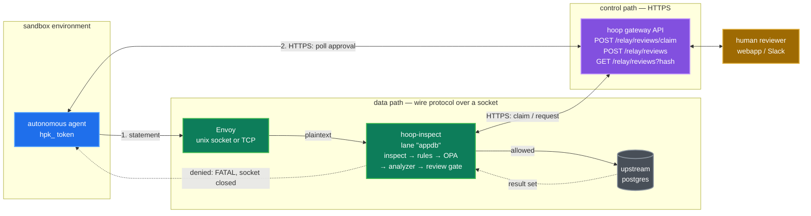
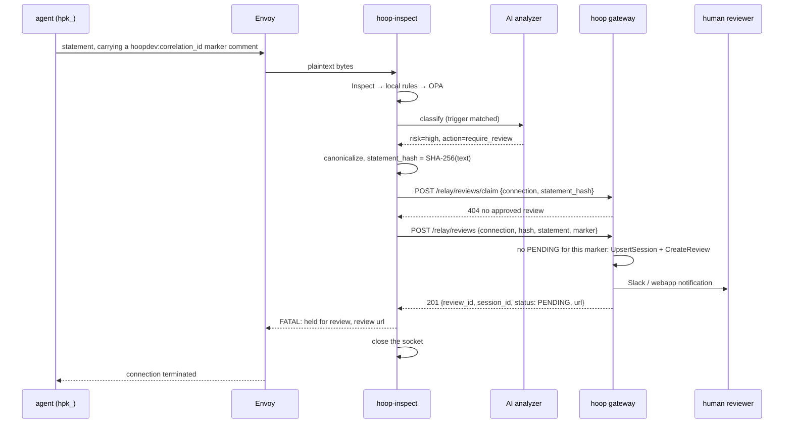
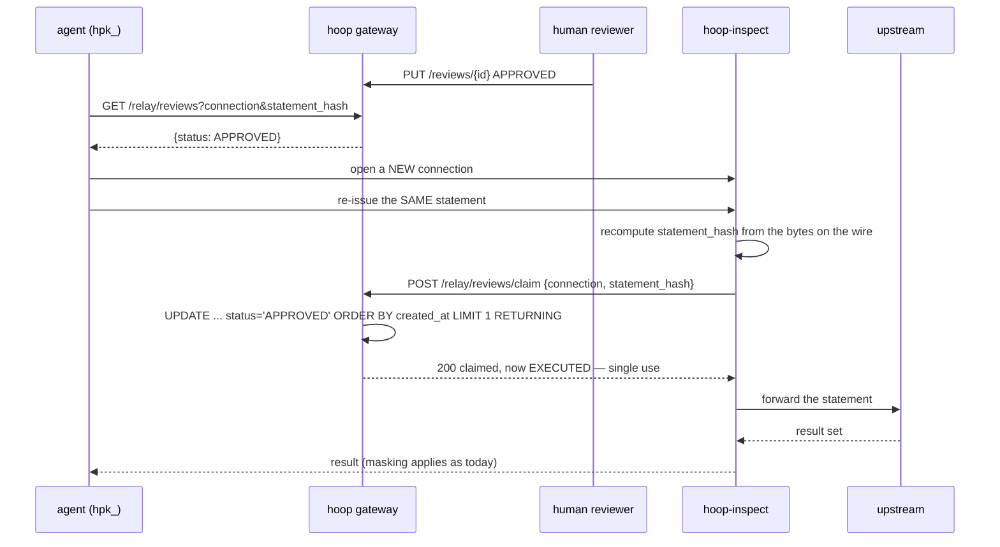

# ADR-0005: Human-in-the-loop review gate for hoop-inspect

- **Status:** Accepted — build order steps 1–4 implemented (2026-08-16/17);
  step 5 (`Bind` decoding, which lifts D4) outstanding. The demo lane is
  `deploy/docker-compose/envoy-stack` with `./run.sh --review`.
- **Date:** 2026-08-14
- **Related:** [`hoopinspect/analyzer`](../../hoopinspect/analyzer) (`ActionRequireReview`, refused at startup), [`hoopinspect/proxy/deny.go`](../../hoopinspect/proxy/deny.go) (terminal denials), [`gateway/api/session/ai_review.go`](../../gateway/api/session/ai_review.go) (out-of-band review creation), [`gateway/api/apiroutes/auth.go`](../../gateway/api/apiroutes/auth.go) (`hpk_` agent identity), [ADR: How a request flows through hoop-inspect](hoopinspect-flow.md)

## Context

### The workflow being asked for

An autonomous agent runs in a sandbox environment with two ways out and no
others: it writes the database's wire protocol to a **socket** Envoy owns, and
it makes **HTTPS calls to the hoop gateway API**. No MCP, no hoop client, no
gRPC stream. Envoy forwards the socket's bytes to a `hoop-inspect` lane.

Every statement the AI risk analyzer flags must pass a human approval gate
before it reaches the upstream:

1. hoop-inspect inspects the statement against in-memory configuration.
2. Only statements the AI analyzer flags are candidates for review.
3. hoop-inspect checks whether an approved review already exists for *this
   execution*.
4. If one exists, the statement proceeds and the review settles as `EXECUTED`.
5. If none exists, a session + review are created for approval.
6. The agent polls the hoop API for approval before re-issuing the statement.

### Identity: the token *is* the sandbox

The `hpk_` token is bound to a **named sandbox environment**, not to a human it
acts for. Each sandbox carries its own groups, and those groups are what grant
it access to its connections. Two consequences that shape the rest of this ADR:

- **The sandbox owns its reviews.** `OwnerID` / `OwnerEmail` on the review are
  the sandbox's, so a reviewer reading the queue sees which environment asked.
  There is no on-behalf-of indirection to resolve, and `reviews.owner_id` is a
  bare `VARCHAR(255)` with no foreign key, so this is legal today.
- **The review gate composes with authorization, it does not replace it.**
  Group-to-connection access already decides *whether the sandbox may reach this
  database at all*. The gate answers a narrower question — may it run *this
  statement* — and only ever after access has been granted.

Because the credential already scopes everything it can reach, sandbox identity
is **not** hashed into the authorization key. It is a query predicate the
gateway applies from the token it authenticated (D3). Cross-sandbox reuse is
unreachable rather than defended against, which leaves exactly one threat for
the key to address — a sandbox reusing *its own* approval.

The agent needs an API surface to ask "is this approved yet", and a handle in
the statement itself that lets it correlate a statement with a review.

### What already exists to build on

More than expected. The seam was cut for this feature and left unfilled.

- **The action is already in the enum and already refused.**
  `analyzer.ActionRequireReview` is declared with the comment "holds the
  statement for human approval. Declared but not implemented. The config layer
  refuses it by name so the enum is stable when review lands"
  (`hoopinspect/analyzer/analyzer.go:179-186`). `sidecar/config.go` rejects it
  at startup, and `sidecar/twophase_test.go:170` asserts the rejection names
  `defer` as the alternative. Nothing has to be invented to make the config
  surface coherent; the refusal has to be lifted.

- **`action: defer` already routes an AI verdict to a later evaluator.**
  "forwards the statement and hands the decision to a later evaluator, which in
  practice means a decide-phase OPA reading
  `input.findings.ai_analysis.values.risk_level`"
  (`hoopinspect/analyzer/analyzer.go:165-177`). The two-phase policy chain, the
  finding vocabulary (`policy.FindingOK`/`Cached`/`Unavailable`) and the
  annotation merge are all shipped.

- **The gateway already creates reviews with no gRPC client session behind
  them.** `sessionapi.CreateReviewFromAIAnalysis`
  (`gateway/api/session/ai_review.go:26`) is called from the AI-analysis path
  (`gateway/api/session/ai_decision.go:88-121`) and does exactly steps 4-5 of
  the workflow: `models.UpsertSession` with the session left open, then a
  `onetime` review at `ReviewStatusPending`, then Slack notification, then
  return the session URL. It takes an `AIReviewRequester` struct rather than a
  gin context, so it is already callable from a non-HTTP caller.

- **The agent identity already exists.** `hpk_` tokens resolve against
  `private.api_keys` and fall back to a dedicated `private.ai_agents` table,
  both carrying `Groups`, both yielding a full request context
  (`gateway/api/apiroutes/auth.go:105-150`, `gateway/models/aiagents.go`).

- **A review can legally be owned by a non-human.** `reviews.owner_id` is
  `VARCHAR(255) NOT NULL` with no foreign key to users
  (`gateway/migrations/000001_init.up.sql`).

- **The reviewer configuration vocabulary exists.**
  `models.AccessRequestRule` carries `ReviewersGroups`, `MinApprovals`,
  `ForceApprovalGroups` and `AllGroupsMustApprove`
  (`gateway/models/access_request_rules.go:27-44`), and the AI path already
  resolves reviews through it.

- **Single-use settlement has a precedent.**
  `models.SetReviewStatusExecutedIfFinished` (`gateway/models/reviews.go:350`)
  shows the conditional-`UPDATE` pattern that makes a status transition
  race-free.

- **The session type already has a slot for the correlation handle.**
  `session.Session.CorrelationID` — "ties this session to an external workflow
  (a ticket, a CI run, an agent task) when the caller supplies one" — and it is
  already exported to Rego through `PolicyContext()`.

- **An HTTP client to a JSON API already lives in the root module.**
  `analyzer/anthropic` and `analyzer/openai` are **not** nested modules — they
  sit in the root and talk to their providers with nothing but `net/http`,
  `encoding/json` and `bytes`. Only `analyzer/vertex` needed its own `go.mod`,
  because GCP auth drags in `golang.org/x/oauth2`. Calling a JSON API costs no
  dependency, so the zero-dependency rule does not force an interface or a
  nested module on a gateway client. This is the precedent D5 follows.

- **The sidecar is already a hoop CLI subcommand.** `hoop start proxy`
  (`client/cmd/startinspect.go`) links `sidecar`, `config/yaml`,
  `pii/alcatraz` and all three analyzer providers, and its doc string states the
  governing rule: "Every capability is decided by the config file, so turning on
  PII detection does not require a different binary." A review gate is one more
  config-decided capability, not a new binary.

### What is missing

The previous ADR states the blocker precisely, under the hold model:

> **No human-review action in the relay.** [...] the blocker sits below the
> policy layer: holding a pgwire connection open while a person reads the
> statement needs a review backend, a notice channel so psql explains why it is
> hanging, and cancellation the `policy.Evaluator` interface cannot carry.

Three blockers, and **two of them are artifacts of holding the connection.**
The workflow above does not hold: step 6 has the agent poll and re-issue. That
removes the notice channel and the cancellation problem, and leaves only the
review backend. This is what makes the feature tractable now.

What remains genuinely missing:

1. **A review client** in hoop-inspect that calls the gateway API. Stdlib
   `net/http`, so no dependency and no new module — see D5.
2. **An authorization key** that survives a reconnect and identifies one
   execution, stored on the review row. `private.reviews` has no such column.
3. **A gateway API surface** for claim / find-or-create / poll.

The existing terminal denial is already the behavior this feature wants, so
`proxy/deny.go` needs no change at all. See D2.

## Decision

Implement `require_review` as **deny-and-reconnect against the gateway's review
API**, keyed by a server-computed authorization key, single-use, with the whole
implementation in one root-module package that speaks HTTPS.

### Topology

The agent in the sandbox has exactly **two** ways out, and no others. There is
no MCP hop, no hoop client, and no gRPC stream anywhere in this path:

1. **The data path** — it speaks the database's own wire protocol at a socket
   (unix socket or TCP) that Envoy owns. Envoy forwards plaintext to a
   `hoop-inspect` lane over loopback or another unix socket.
2. **The control path** — it speaks HTTPS to the hoop gateway API, carrying its
   `hpk_` token, to ask whether a review has been approved.



### The flow

First issue of a flagged statement — denied, review created:



The database session is gone. Nothing is held, nothing is pending on the wire,
and the agent has no half-open connection to reuse.

Human approves out of band, then the agent **reconnects** and retries:



The analyzer is not consulted on the retry: the key lookup hits before
classification, so an approved statement costs one gateway round-trip and no
model call.

### D1: No hold. Ever.

`gate.Gate` is a synchronous function over bytes and the relay dials the
upstream on accept. Holding a statement for a human approval would:

- burn a connection slot against `max_conns` and trip `idle_timeout_sec`;
- hit the failure already documented under Known limits — "a slow
  classification can outlive the upstream's idle budget" — at the scale of
  minutes rather than seconds;
- get killed by driver-side statement timeouts regardless;
- require the cancellation `policy.Evaluator` cannot carry.

The agent was going to run a poll loop anyway (step 6), so the gate stays
stateless with respect to the approval.

### D2: A non-approved statement kills the database session

Any outcome other than "an approved, unconsumed review exists for this exact
statement" **terminates the connection**. `PENDING`, `REJECTED`, `REVOKED`,
already-`EXECUTED`, and gateway-unreachable all produce the same terminal denial;
only the message differs.

This is the existing behavior, and it is correct as-is. `PostgresError` already
sends severity `FATAL` on purpose — "the connection is about to close.
Reporting ERROR would leave psql waiting for a ReadyForQuery that never
arrives" (`proxy/deny.go:141-152`) — `HTTPForbidden` already sets
`Connection: close`, and `DenyWriter` is already documented as "bytes to send
to the client before closing" (`proxy/proxy.go:39-50`). **`proxy/deny.go` and
`proxy.handle` need no change for this feature.**

| Protocol | On a non-approved statement |
|---|---|
| postgres | `ErrorResponse` severity `FATAL` carrying the review URL, then close |
| mssql | `ERROR` + `DONE(error)`, then close |
| http | `403` + `Connection: close` |

An earlier draft of this ADR proposed a *recoverable* denial — pgwire `ERROR` +
`ReadyForQuery('I')` — so the agent could retry in the same session. **Rejected.**
A surviving connection after a refused statement is a session sitting in an
indeterminate state, and it invites exactly the "pending" semantics this design
must not have: an agent that keeps the socket and spins on it, a pooled
connection handed to the next caller after a policy refusal, and a window in
which the gate's decision and the session's state disagree. Killing the session
makes the refusal unambiguous and forces the agent through the front door —
poll the API, then reconnect. Reconnection cost is a per-retry TCP handshake and
a login, which is noise next to a human approval latency measured in minutes.

The denial message still carries the review URL, so a human driving psql through
the same lane reads where to go before their session drops.

### D3: The authorization key is server-computed, and is not the correlation marker

**This is the decision most likely to be got wrong, because a plausible-looking
shortcut is a review bypass.**

There is an existing statement fingerprint one function call away:

```go
// sqlCacheKey hashes the statement SHAPE.
// ...literals are stripped here too: `WHERE id = 1` and `WHERE id = 2` are
// one shape, and classifying both is money spent to learn the same thing.
```
— `hoopinspect/analyzer/content.go:61-77`

Its own doc explains why shape-hashing is safe *for a cache*: "the cache never
turns a block into an allow — it only reuses a verdict for an identical shape."
A review key inverts that guarantee. Approve
`DELETE FROM users WHERE id = 1`, and a shape-keyed lookup authorizes
`DELETE FROM users WHERE id = 999`. **`sqlCacheKey` must not be reused as the
authorization key**, and the two functions should sit far enough apart in the
code that nobody reaches for the wrong one.

#### The one threat this addresses

Cross-sandbox reuse is **not** in the threat model. Sandbox A and sandbox B hold
different credentials with no access to each other's connections or reviews, so
"A uses B's approval" is unreachable rather than defended against.

There is exactly one threat here, and the hash is the only thing that stops it:

> **A sandbox reuses its own approval for a statement no human ever saw.**
> It holds a legitimately approved review, and puts that approval behind
> different SQL. Every ownership check passes, because it genuinely is their
> review.

This is the prompt-injection case, and it is why an agent-supplied identifier
can never be the authorization key.

#### Two identities, not one

The design needs to answer two questions, and using one key for both is the
mistake:

| | Authorization identity | Request identity |
|---|---|---|
| Question | "may this execute?" | "is this a new request, or a retry of one already filed?" |
| Asked on | the data path, every gated statement | the create path only |
| Key | statement hash + scoping | the agent's marker |
| Trust | server-computed | agent-supplied, and that is fine here |

The authorization path **never** sees the marker; if it did, the agent would be
choosing its own permissions. The create path **does**, because the marker is
the only thing that knows the agent's intent — that step 3 and step 9 of its
workflow are separate tasks even when they run byte-identical SQL.

An agent can file more review requests by varying the marker, but each still
needs a human and each still authorizes exactly one execution of that exact
statement. The marker changes how many requests reach the queue, never what an
approval permits.

#### What is hashed, and what is not

```
statement_hash = SHA-256(canonical_text)
```

Org, sandbox and connection are **not** in the hash. They are query predicates
the gateway applies from the credential it already authenticated (see
[Gateway surface](#gateway-surface)), which puts the scoping on the side of the
trust boundary that owns it, keeps a non-match debuggable, and leaves the
sidecar with less to get wrong.

`canonical_text` removes only what hoop itself injected:

1. strip the hoop marker, in one strict anchored form only;
2. trim leading and trailing whitespace of the whole statement;
3. stop.

**No case folding. No interior whitespace collapsing. No comment stripping
beyond hoop's own marker.** Each of those is a claim about SQL semantics, and
the two ways of being wrong are not symmetric:

| | Effect | How it surfaces |
|---|---|---|
| Over-normalize | two different statements collide, so an approval for one authorizes the other | **silent bypass** |
| Under-normalize | the same statement hashes differently on retry, so nothing ever matches | approvals visibly stop working, on the first test |

Concretely, each rejected rule and why:

- **Lowercasing** breaks both literals and identifiers. `'Alice'` and `'alice'`
  select different rows, and the repo's own lexer already records the
  identifier half: `"Customers"` and `customers` *are* different relations in
  PostgreSQL, which is why the scanner keeps a quoted identifier verbatim.
- **Collapsing interior whitespace** rewrites data: `note = 'a  b'` is not
  `note = 'a b'`. Doing it safely requires tokenizing to skip literals — a
  lexer — and a lexer bug on this path is a bypass rather than a missed cache
  hit.
- **Stripping all comments** assumes comments are inert, and they are not:
  `/*+ ... */` optimizer hints (pg_hint_plan) and MySQL's executable
  `/*! ... */` both change behavior.

So equality is **byte equality after removing the one thing hoop injected**. The
marker therefore needs a rigid accepted form — leading position, single
occurrence, fixed syntax — and anything non-conforming is ignored rather than
hunted for, or "strip the marker" is itself ambiguous and the same logical
statement leaves different residue.

`Statement.Text` is verbatim, so the marker does reach the gate intact. The
codec has already split a batch: `lexer.Split` is dialect-aware, so `a; b` in a
simple Query arrives as two `Statement`s, each with its own verdict and its own
hash. A batch whose first statement is approved and whose second is not denies
on the second and kills the session.

Canonicalization lives in **one unexported function** called from both the
create and the claim paths, with a round-trip test. Drift between those two
callers is the failure that makes approvals silently unmatchable.

#### The cost, stated plainly

`WHERE id=1` and `WHERE id = 1` are different hashes and therefore different
reviews. That is correct for a human-approval gate: a person approved specific
text, and you cannot claim they approved text they never saw. Agents emit stable
text, so this mostly bites when a human retypes something by hand, where a
duplicate review is annoying rather than unsafe.

`match: shape` is **not** in v1. It needs exactly the literal-stripping lexer
this section argues should stay away from the authorization path, and it can be
added later against real demand.

### D4: The extended query protocol fails closed

The postgres codec decodes `Query` and `Parse` and never reads `Bind`
(`codec/postgres/postgres.go:70-161`). Under the extended protocol — what
essentially every driver and ORM uses — the gate sees
`DELETE FROM t WHERE id = $1` and never sees the value. One approval would
then cover every subsequent binding, indefinitely.

Until the codec decodes `Bind`, a `require_review` rule **refuses** a `Parse`
whose parameters the gate cannot observe, with a message saying so. Silently
granting a shape-level approval on the extended protocol is the failure mode
this ADR exists to prevent. Adding `Bind` decoding is the correct fix and is
scoped as follow-up work, not a prerequisite.

> **As built (2026-08-16):** the same hole exists on mssql, which this section
> did not name. `decodeRPCRequest` pulls the statement text out of
> `sp_executesql` and does **not** decode the parameters that follow, so the
> gate sees `WHERE id = @p1` and never the value — a `Parse` by another name.
> Rather than list the parameterized paths and refuse those, observability is
> an **allowlist** of message kinds: postgres simple `Query`, mssql
> `SQLBatch`, and a fully captured HTTP request. Everything else, including a
> message kind a codec grows later, falls through to a refusal. A missing
> entry in an allowlist costs a confusing denial; a missing entry in a
> denylist costs an approval that authorizes every later binding.

### D5: One package, one concrete HTTP client, no broker interface

There is **no `Broker` interface and no nested module.** The hoop CLI runs the
sidecar (`hoop start proxy`) as a process beside Envoy, and everything it needs
from the control plane it gets over the gateway's HTTPS API. One deployment
shape, one transport, one implementation — an interface with a single
implementation is indirection that has to be read through and buys nothing.

`hoopinspect/review` is an ordinary root-module package holding:

- `execKey()` — the authorization key computation (D3);
- a `Client` — a concrete struct over `net/http` that calls the three gateway
  endpoints;
- an `Evaluator` implementing `policy.ContextualEvaluator`, so it reads the
  sandbox principal off `policy.EvalContext` rather than holding per-connection
  state, the same way the analyzer does.

```go
// Client calls the hoop gateway's review endpoints. Concrete on purpose:
// one deployment shape, one transport. See analyzer/anthropic for the same
// shape against a different API.
type Client struct {
    baseURL string
    token   string        // hpk_, identifies the sandbox environment
    http    *http.Client
}

// Claim atomically consumes an approved review for this statement, or
// reports ErrNoApproval. It is the authorization step, not a read.
func (c *Client) Claim(ctx context.Context, connection, statementHash string) (*Ticket, error)

// Request files a review, or returns the PENDING one already filed under
// the same marker.
func (c *Client) Request(ctx context.Context, r Request) (*Ticket, error)
```

**This does not touch the zero-dependency rule.** `hoopinspect/go.mod` forbids
*dependencies*, not outbound HTTP, and `analyzer/anthropic` and
`analyzer/openai` already prove the point: both live in the root module and
speak to their providers with `net/http` and `encoding/json` alone. Only
`analyzer/vertex` needed a nested module, and only because GCP auth pulls in
`golang.org/x/oauth2`. A bearer token against a JSON endpoint needs neither.

The one thing an interface would have bought is a test seam, and `httptest`
already provides it: tests stand up an in-process server and assert against
real request bodies, which is a better test than a hand-rolled fake because it
also covers the encoding.

`hoop start proxy` needs **no new import** — the package is in the root module
and the sidecar constructs it from the `review:` config block, exactly as it
constructs the analyzer. The standalone `hoopinspect/cmd` binary picks it up for
free too.

### D6: Single-use, and nothing else for now

An approval authorizes **exactly one execution**. It is consumed by the claim
call, and a second attempt finds no `APPROVED` row and takes the D2 path:
session killed.

A hash is therefore **not** unique on the reviews table. The same statement
legitimately accumulates many reviews over time — each filed, approved and
consumed on its own merits — which is why the claim query orders and limits
rather than assuming one match.

Time-boxed approvals are deliberately **not** in scope. `Review.TimeWindow` and
`AccessDurationSec` exist and `run-exec.go` already enforces a window, so
reusing them later is a small change — but a window and a use-count are
different grants, and shipping both at once means the first deployment cannot
tell which one let a statement through. Single-use is the stricter default and
the one that matches "a human approved this statement", so it goes first.

The atomic claim in the gateway surface below is what makes this real. Without
the conditional `UPDATE`, "single-use" is a comment rather than a property.

### Gateway surface

Every endpoint derives org and sandbox from the `hpk_` credential. Neither is
ever read from the request body, and the caller can only reach its own reviews
and the connections it has access to.

> **As built (2026-08-17):** the namespace is `/api/relay/`, not
> `/api/inspect/`. Naming it after the component meant renaming the component
> moved the API a separately-deployed binary speaks; `relay` names the ROLE —
> an inline enforcement point running outside the gateway — and is where
> config distribution, event shipping and instance registration would also go.
>
> The two middlewares are on the route GROUP rather than on each route, so
> every endpoint in the namespace is machine-only (`hpk_` API key or AI agent)
> by construction rather than by whoever adds the next one remembering.

| Endpoint | Called by | Does |
|---|---|---|
| `POST /relay/reviews/claim` | the gate, data path | **atomically** moves the caller's matching `APPROVED` review to `EXECUTED` and returns it; `404` when there is none |
| `POST /relay/reviews` | the gate, data path | find-or-create: `200` with the existing `PENDING` review for this marker, or `201` with a new one |
| `GET /relay/reviews?connection=&statement_hash=` | the agent, control path | read-only status poll (step 6) |

#### Claim, not look-up-then-settle

An earlier draft had the gate do `GET` then `settle` then forward, which leaves
a window between deciding and consuming. There is no reason for two calls. The
claim *is* the authorization:

```sql
UPDATE private.reviews SET status = 'EXECUTED'
 WHERE id = (
   SELECT id FROM private.reviews
    WHERE org_id      = $1     -- from the credential
      AND owner_id    = $2     -- from the credential
      AND connection_id  = $3
      AND statement_hash = $4
      AND status = 'APPROVED'
    ORDER BY created_at
    LIMIT 1
    FOR UPDATE SKIP LOCKED
 )
 RETURNING id, session_id;
```

- **`ORDER BY created_at LIMIT 1`** is required, not cosmetic. A hash is not
  unique: the same statement legitimately accumulates many reviews over time,
  and more than one can be `APPROVED` at once. Without an ordering the choice is
  nondeterministic.
- **Returning no row denies**, which covers the concurrent case directly: two
  connections from one sandbox running the same statement against one approval
  means exactly one `UPDATE` returns a row and the other takes the D2 path.
- `org_id` and `owner_id` are the credential's own scope expressed in the query.
  **`connection_id` is doing real work** — a sandbox may reach several
  connections, so the credential alone does not distinguish them, and an
  approval for `appdb` must not authorize the same SQL against `payments-db`.

**The tradeoff:** claiming before forwarding means an upstream failure consumes
an approval for an execution that never happened, and a human must approve
again. The alternative — forward, then settle — risks executing without
consuming, which is strictly worse. Fail toward asking the human again.

#### Create is find-or-create, keyed by the marker

The lookup filters `status = 'APPROVED'`, so a retry issued before a human has
looked at the queue does **not** see its own `PENDING` review. Without a
separate dedupe key, a polling agent files one review per attempt.

So the create path matches on the **marker**, not the hash: an existing `PENDING`
review for this sandbox, connection and marker is returned as-is. A statement
with no marker always creates, which is the safe default and gives an operator a
reason to require markers on a busy lane.

Creation is otherwise a thin wrapper over `CreateReviewFromAIAnalysis`, which
already takes a requester struct and already does the
upsert-session-then-create-review sequence.

#### Storage

One migration adding `statement_hash` and `request_marker` to
`private.reviews`, plus:

```sql
CREATE INDEX idx_reviews_claim
    ON private.reviews (org_id, owner_id, connection_id, statement_hash, status, created_at)
    WHERE statement_hash IS NOT NULL;
```

> **As built (2026-08-16):** the migration is `000114`, not `000111` — the tree
> had moved on by three. It is a plain `CREATE INDEX`, not `CONCURRENTLY`, and
> partial on `statement_hash IS NOT NULL`. `CONCURRENTLY` is deliberately
> avoided repo-wide (see the comment in migration `000113`): golang-migrate
> Execs each file as one statement batch inside `BEGIN/COMMIT`, and a
> concurrent build that fails leaves an INVALID index *and* a dirty
> `schema_migrations` row, which makes the gateway refuse to start. `reviews`
> is small, so the SHARE lock is short. A second partial index on
> `request_marker` serves the find-or-create dedupe.

Note the existing `UNIQUE(org_id, session_id)` — one review per session — so
each gated statement gets its own session row, exactly as the AI-analysis path
already does.

### Configuration surface

`require_review` becomes accepted where it is currently refused, plus a
top-level `review:` block. No `broker:` selector — there is one implementation,
so naming it in config would be a choice the operator does not have:

```yaml
review:
  api_url: https://gateway.hoop.internal
  token_file: /var/run/secrets/hoop/token   # hpk_, never inline in the file
  timeout_sec: 5
  require_marker: false     # true refuses a gated statement with no marker,
                            # so a busy lane cannot accumulate duplicates
  poll_cache_ttl_sec: 5     # negative cache for PENDING only; APPROVED never cached

listeners:
  - name: appdb
    protocol: postgres
    analyzer:
      rules:
        - name: risky-writes
          trigger: { operations: [update, delete, drop, truncate] }
          actions: { high: require_review, medium: warn }
```

A `require_review` rule with no `review:` block, no reachable `api_url` or no
token is refused at startup, for the same reason `defer` without OPA is refused:
a guardrail that silently forwards everything is worse than a startup error. The
token is read from a file rather than the config body, matching how the analyzer
credential is already handled — the config only ever names a path.

## Consequences

### Positive

- Fills a seam the codebase already declared, rather than adding a concept.
  The enum entry, the refusal test and the "Known limits" bullet all stop being
  lies.
- **No change to the relay's data path.** The gate is a new
  `policy.Evaluator`; denial, socket teardown and in-protocol error frames all
  stay exactly as they are. The blast radius on existing lanes is a config
  field they do not set.
- Reuses the gateway's whole review apparatus — groups, `min_approvals`,
  force-approval, Slack, webapp, audit — with no second approval system.
- The root module stays dependency-free — stdlib `net/http` only — so the "audit
  it in an afternoon, vendor it without a supply-chain review" pitch survives,
  and it costs no new module, no registry and no interface to get there.
- **One deployment shape.** `hoop start proxy` beside Envoy, config file
  decides everything, all control-plane traffic over the gateway's HTTPS API.
  Nothing new to operate.
- Approved retries skip the model call, so the gate does not multiply AI spend
  by the number of retries.

### Negative / risks

- **Volume.** Exact-text keying means one review per distinct statement. An
  agent looping over rows generates reviews at the rate it loops. Mitigations
  are per-rule triggers that are narrow by default. This needs watching in the
  first deployment, and `require_marker` bounds the duplicate case.
- **A gateway round-trip lands on the data path.** Every flagged statement, and
  every retry of one, costs a call to the gateway. The existing warning that a
  slow inline call can outlive an upstream's keep-alive applies here too, at a
  smaller magnitude than a model call.
- **Approvals cannot be revoked mid-flight** in any cached form, which is why
  the design forbids caching `APPROVED` (see below).
- **Every gated statement costs the agent a reconnect.** D2 kills the session,
  so a connection pool on the agent side sees a lane that drops connections
  routinely rather than exceptionally. Agents with aggressive reconnect backoff,
  or pools that treat a `FATAL` as a host-level failure and evict the target,
  will misbehave in ways that look like a hoop outage. The sandbox agent's
  client configuration is part of the deployment contract, not an
  implementation detail — document it alongside the lane.
- **The extended query protocol is degraded to a refusal** until `Bind`
  decoding lands. Parameterized clients on a review-gated lane get an error
  rather than a gate, and that is the intended failure direction.
- **Two fingerprint functions with similar names now exist.** `sqlCacheKey`
  (shape, for cost) and `statement_hash` (exact, for authorization). This is a
  standing footgun; both need doc comments naming the other and saying why they
  must not be swapped.
- The agent must be well-behaved enough to poll rather than hot-loop. Rate
  limiting on the lookup endpoint is not optional.

### Explicitly rejected: caching approvals in hoop-inspect

The workflow's step 3 — "check if there is an existing approved review" — reads
as though hoop-inspect should hold that state. It must not.
`hoopinspect/store/` and `store/sqlite` are audit read-models, and a cached
approval is a revocation that cannot be honored. Every retry consults the
gateway. A short negative cache for `PENDING` is fine and worth having, since a
polling agent will hammer the path; `APPROVED` is never cached.

### Build order

1. `hoopinspect/review` root package: `execKey`, the `Client`, the
   `policy.ContextualEvaluator`. Tested against `httptest` — no gateway needed,
   no relay changes, no new module.
2. Gateway: migration `000111`, the three endpoints, the atomic claim.
3. Lift the config refusal; add the `review:` block and its startup validation.
4. Envoy-stack demo lane, so the flow is exercised end to end like every other
   lane in [hoopinspect-flow.md](hoopinspect-flow.md).
5. Follow-up: `Bind` decoding in the postgres codec, which lifts D4.

> **What step 4 turned up (2026-08-17).** Two things the design did not
> anticipate, both found by running it rather than by reading it:
>
> - **`fail_open` has to be inverted on a gated lane.** The analyzer defaults
>   it to true, on the sound argument that a classifier which denies during a
>   vendor outage takes the database down with it. The review gate fires on
>   the analyzer's *finding*, so a classification that never happened is not a
>   flag — and every statement an operator wrote `require_review` for runs
>   unreviewed for as long as the provider is down. The demo lane sets
>   `fail_open: false` and says why.
> - **`unknown` belongs in the trigger.** `EXECUTE` decides its effect at
>   runtime, so the lexer reports `unknown`. A `[delete, update]` trigger
>   therefore gates `PREPARE d (int) AS DELETE ...` and misses the
>   `EXECUTE d(2)` that actually deletes the row — two statements to walk past
>   the gate. This is the pre-existing `unknown` caveat, but it is sharper
>   here than for a warn rule.
>
> Both are lane configuration, not code. Neither is enforced at startup, which
> is worth revisiting: a `require_review` rule with `fail_open: true`, or one
> whose trigger omits `unknown`, is arguably a config the sidecar should
> refuse the way it refuses `defer` without OPA.

Steps 1-2 are the spike that sizes the rest, and they are independent: the
package can be written and tested against `httptest` before the endpoints exist.

### The alternative worth keeping on the table

`require_review` can be implemented not as a fourth analyzer action but as a
**separate evaluator placed after the analyzer, reached through `action:
defer`**. The analyzer classifies and annotates; a decide-phase OPA policy —
Rego the InfoSec team already owns — decides *what needs human review*; the
review evaluator only executes the gate.

Upside: no new YAML vocabulary, and review policy becomes as expressive as
Rego (per-table, per-group, business-hours, break-glass). Downside: a review
gate then requires OPA on that lane, and `sidecar/config.go:478` already
refuses `defer` without it.

Both routes need steps 1-2 identically. Build those first, ship
`require_review` as the simple YAML path, and the OPA route falls out of
`defer` for free.

## Open questions

- Should `statement_hash` be scoped by the *upstream address* as well as the connection
  name? Two lanes pointing at different databases under one connection name
  would otherwise share approvals. Leaning yes, but it makes the key sensitive
  to an upstream address change, which would silently invalidate outstanding
  approvals rather than failing loudly.

## Settled

Recorded here because each of these was open in an earlier draft and the answer
is load-bearing for the design above:

- **Identity.** The `hpk_` token is a named sandbox environment with its own
  groups, and it owns its reviews directly. No on-behalf-of model.
- **Grant semantics.** Single-use only (D6). No time windows in v1.
- **Coupling.** No broker interface, no nested module — one concrete HTTP client
  in the root package (D5). All control-plane traffic is the gateway's HTTPS API.
- **Denial.** A non-approved statement kills the database session (D2). The
  relay's data path is untouched.
