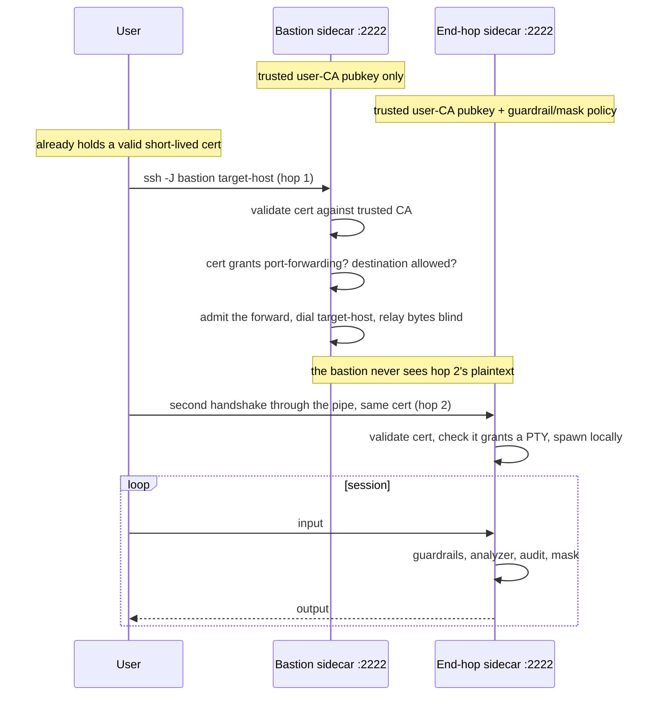
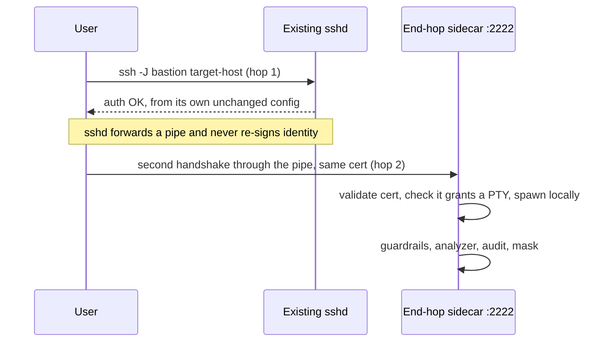
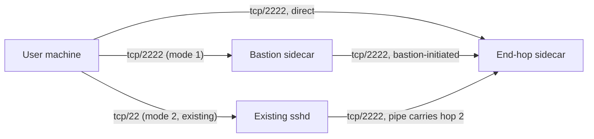

# ADR-0015: SSH terminates at the sidecar, with its endpoint in libhoop, and no guardrails on an interactive shell

- **Status:** Proposed
- **Date:** 2026-09-10
- **Author:** @sandro
- **Deciders:** —
- **Code:** [`sidecar/daemon/`](../../sidecar/daemon), [`sidecar/gate/`](../../sidecar/gate), [`sidecar/policy/`](../../sidecar/policy), [`sidecar/analyzer/`](../../sidecar/analyzer), `libhoop/v2/codec/` (new packages)
- **Related:** [ADR-0005](0005-sidecar-flow.md) (the relay flow SSH deviates from), [ADR-0009](0009-guardrails-and-masking-architecture.md) (where the rules run), [ADR-0011](0011-sidecar-config-schema.md) (the config schema the `ssh` block joins), [ADR-0013](0013-grpc-terminates-http2-in-process.md) (the first lane to terminate its own protocol, and the precedent this follows), [ADR-0014](0014-sidecar-config-hot-reload.md) (how a fleet's rules reach a running sidecar)
- **Input:** a design draft (`docs/ssh-sidecar-native-bastion.md`) and a throwaway POC that implemented it end to end. This ADR absorbs both; the draft does not need to be read alongside it.
- **Supersedes / Superseded by:** —

## Context

The sidecar is where hoop inspects traffic: it turns wire bytes into
statements, runs guardrails, the analyzer and masking over them, and writes an
audit trail. It speaks Postgres, MySQL, MSSQL, MongoDB, HTTP and gRPC. It does
not speak SSH, so the protocol most likely to carry an arbitrary command is
the one protocol with no statement-level control.

Six facts shape every option below.

**SSH is encrypted end to end, so nothing in a relay position can read it.**
Every other protocol the sidecar inspects arrives as plaintext bytes it can
decode from the middle. To see an SSH command at all, a component must *be*
one end of the SSH connection.

**SSH has no single wire-level statement boundary.** A length-prefixed
database protocol hands you one. SSH carries a one-shot command, an
interactive keystroke stream, a file-transfer subsystem, a raw TCP forward and
a signing agent over one connection, and only some of those carry inspectable
content. A statement has to be *constructed* per traffic type — with one
exception, below.

**`crypto/ssh` is `golang.org/x/crypto`, not the standard library, and the
sidecar module has exactly one dependency.** This is the constraint that
decides placement before any preference does: no SSH server, no certificate
checker and no keystroke reconstruction can live in the sidecar root at all.
The choices are libhoop, or a new nested sidecar module.

**A sidecar lane is a static relay — listen here, connect there — with one
exception, and that exception is not "no code in libhoop".** ADR-0013 made
gRPC a lane that terminates its own protocol and enters the shared decision
chain at parsed statements instead of at bytes. It registers no
`inspect.Codec`. But its HTTP/2 endpoint and protocol mechanics still ship in
`libhoop/v2/codec/grpc`; `daemon/` injects identity, policy, audit and masking
around them. "Non-codec lane" means *absent from the registry*, not *absent
from libhoop*.

**libhoop already contains an SSH proxy.** `proxy/ssh` already depends on
`golang.org/x/crypto`, dispatches channels and requests, decodes exec
commands, reconstructs typed lines from a keystroke stream (backspace, Ctrl-U,
Ctrl-W, escape-sequence skipping), and applies guardrails in both directions.
It is the **client** side — it dials the real `sshd` — so it has no
server-side handshake, which is the half this decision needs. It also treats
the file-transfer subsystem as an opaque binary stream.

**That existing proxy already gates interactive shell input, and calls it
advisory.** It line-scans typed input behind a feature flag, and its own
comment records that reconstruction "is necessarily approximate" because
history recall, tab completion and cursor movement diverge the shadow buffer
from what runs. To know when a full-screen program is on screen it watches the
alternate-screen escape sequence, not the terminal's canonical flag.

Two things are assumed out of scope and stay out of scope. **How a user's
certificate is issued** — every user is assumed to hold a valid, short-lived
certificate usable by their local `ssh` client by the time they connect.
**How that certificate is revoked or rotated.** Both are sketched under
Future work, neither is decided here. This decision starts at "a sidecar
trusts a CA public key."

## Options considered

**Where SSH terminates.**

1. **Nowhere — inspect it from a relay position, as a codec.** The shape every
   other protocol uses. Rejected on the first constraint: the bytes are
   encrypted, and no decoder placed in the middle can read them.
2. **A wrapper (`ForceCommand`) hands an already-authenticated session to the
   sidecar.** Attractive because the sidecar never touches an SSH credential
   and the host's real `sshd` keeps doing what it does well. Rejected: the
   sidecar cannot attribute a command to a principal it verified itself — it
   is told who logged in by a component it does not control — and it needs an
   install step inside every host's `sshd` configuration.
3. **The sidecar is a real SSH server at the edge.** Chosen. It authenticates
   the user itself, so every statement carries a verified principal, and it
   holds the plaintext because it is an endpoint rather than a middle.

**Where the SSH code lives.** The sidecar root is not an option, per the
dependency constraint above.

4. **A new nested sidecar module.** Follows the pattern that isolates SQLite
   and the PII detector. Rejected: SSH mechanics are not optional to an SSH
   lane, and the protocol machinery would then sit outside the module that
   already owns every other protocol's.
5. **Extend `libhoop/proxy/ssh` with a server side.** All SSH in one package.
   Rejected for now: it puts the new endpoint outside the `v2/codec` layout
   every other protocol uses, and it edits a shipping path to serve a feature
   that path does not have.
6. **A new `libhoop/v2/codec/ssh`, following the gRPC precedent.** Chosen.
   Same module as the existing SSH code, so convergence stays possible; same
   layout as every other protocol; no edit to a shipping path.

**Whether anything here is a real codec.** The file-transfer subsystem is the
one part of SSH with a framed wire format — one request at a time, naming a
path and a verb. It decodes to statements the way Postgres does. Everything
else in SSH is either already structured by the protocol (an exec command
arrives as a string) or has no boundary at all.

**Gating an interactive shell.** The POC used the terminal's canonical flag to
tell a shell prompt from a full-screen program, and correctly found it useless
— `bash` and `zsh` hold the terminal in raw mode at their own prompt, because
they do their own line editing, so the flag reads identically at a prompt and
inside `vim`. Reconstruct-and-gate on that signal is *unsound* rather than
merely noisy: keystrokes reassemble into text the user never typed, a rule
that does fire deletes what the user was editing, and Escape cannot be
forwarded so `vim` cannot be exited. Passing raw input through untouched
leaves every rule inert — the POC ran a blocked command unimpeded that way.

The alternate-screen signal already in `proxy/ssh` is better than the one the
POC measured, and it narrows that window without closing it: a program that
reads raw input without switching screens is still misread, and a user can
emit the sequence. Neither signal touches the POC's third finding — a pattern
over a command line cannot see through the shell's own expansion, so
`X=cat; $X /root/.aws/credentials` matches nothing.

## Decision

We terminate SSH at the sidecar, one per host, as a lane that owns its own
handshake.

### Two behaviours, one binary, no role key

Whether a deployment wants a bastion architecture is a topology choice the
operator makes, and **the only thing that expresses it is what a listener
admits**. The two behaviours the design talks about
are what a capability list produces, not settings to declare:

- **A bastion** admits the client-opened forward and no session capability. It
  authenticates the connection, dials the destination the client named unless a
  guardrail refuses it, and forwards bytes blind. It refuses
  a session channel because none is admitted, so there is no shell on it, and
  it never sees the plaintext of what it carries.
- **An end-hop** admits the session capabilities. It terminates the handshake,
  resolves the session, spawns the shell or command, and runs the whole
  decision chain locally.

**An end-hop is sufficient on its own.** It is a complete SSH server, so
a client may connect straight to it — `ssh target-host -p 2222`, no jump host
in the path, the end-hop exposed directly. This is the simplest deployment and
the one to reach for first; the two modes below add a middle hop for what a
middle hop centralizes, not because the end-hop needs one. See Network
reachability for what makes direct exposure defensible.

When there is a middle hop, the user's own `ssh -J` client performs two
independent handshakes over one TCP path, presenting the same certificate to
both. Nothing is re-signed in the middle, and no sidecar anywhere holds a
private signing key.

**Mode 1 — hoop's bastion in the middle.**



**Mode 2 — the host's existing `sshd` in the middle, untouched.** It keeps its
own configuration and its own trusted-CA file; the end-hop sidecar is
configured to trust the same CA. `ProxyJump` opens a pipe, and the client
authenticates through it to the sidecar with the same certificate. Neither hop
sees the other's plaintext.



**Mechanically all three topologies are the same protocol.** The end-hop
authenticates the same certificate and enforces the same chain whether it was
reached directly, through hoop's bastion, or through the host's own `sshd`;
the modes differ only in whether a middle hop exists and who operates it.
Mode 2 needs no hoop component in the middle at all, and direct exposure needs
no middle hop whatsoever.

### What the certificate decides, and what it does not

A sidecar's only standing trust decision is which CA public key(s) it accepts.
Everything else a connection may do is a signed, tamper-evident claim on the
certificate itself.

- **No certificate, or one from an untrusted CA → denied.** There is nothing
  else allowed by default.
- **Certificates only. No password authentication, ever.** A password mode
  needs something to check a secret against, and this design has nothing to
  give it. This is an exclusion, not a "not yet".
- **`permit-port-forwarding`** decides whether a certificate may jump through
  a bastion at all. Without it, a bastion refuses every forward request.
- **`permit-pty`** decides whether it may open an interactive shell at an
  end-hop. Without it, at most a non-interactive command is available.
- **`valid-before` and `source-address`**, the standard critical options, bound
  how long it is good for and where it may be presented from.
- **A caveat on all four.** `ssh-keygen` signs a user certificate with the
  standard extension set already enabled, forwarding and PTY included, so
  reading one of them as a deliberate grant only means something if the issuer
  clears the defaults and adds back what it intends. An issuer that signs with
  default options hands out certificates that grant everything, and these
  checks then pass for everyone. Issuance is out of scope here, but this is a
  requirement it inherits.

**The certificate does not name reachable destinations, and nothing about it
should.** Where a connection may be forwarded is the client's decision to make
and the server's to permit — a certificate has no standard field for a
destination, and inventing one would put network topology into a short-lived
credential, so adding a host would mean reissuing certificates. The
destination comes from the client's own request, as it does for `sshd`.

Restricting *which end-hop* a given user may reach is deliberately not
attempted, because it would protect nothing. The end-hop authenticates hop 2
itself against the same CA and applies its own capability ceiling, so reaching
a host is not accessing it — and this design already allows an end-hop to sit
on a public address, where the same host is reachable by anyone without a
bastion in the path. A per-user reachability check one hop earlier would be a
second lock on a door that is already open by design.

**An end-hop decides whether a principal may log in at all**, and it does it
the stock way: the requested login name must appear in the certificate's
principals. Trusting a CA is not by itself a grant to log in as anyone — that
check is what keeps a certificate issued for one identity from serving as
another, and it is free, because the principals list is already verified as
part of the signature.

### What goes where

**The SSH endpoint ships in libhoop, as `v2/codec/ssh`.** Server handshake,
host key, certificate validation, channel and request dispatch, capability
admission mechanics. The sidecar lane is its own server type, started beside
the relay and gRPC lanes, and it injects identity, policy, audit and masking
the way `daemon/` already does for gRPC. It registers no `inspect.Codec`,
because there are no plaintext bytes to decode from a relay position. Neither
behaviour fits the existing static-relay shape: a bastion has no fixed
upstream (the destination varies per request), and an end-hop has no upstream
at all.

**The file-transfer subsystem ships as a real decoder, `v2/codec/sftp`.** One
statement per file operation, carrying the verb and the path. Unlike the
database decoders it needs no seam in `sidecar/codec`: the seam exists to
inject the SQL classifier and to register a lane protocol, and this decoder
classifies no SQL and fronts no lane.

**The SSH operation names are defined in `v2/codec/types` and aliased in
`sidecar/inspect`**, like every other name in the wire vocabulary. They reach
operator configuration, so there must be one definition of them.

**Capability admission semantics, the gate wiring, the config schema, deny
messages and startup refusals stay in the sidecar.** Policy and the
operator-visible contract do not move.

**Certificate validation is the endpoint's own, written for this
architecture.** The contract it implements is the OpenSSH certificate format,
a public standard, so an implementation here is complete on its own and owes
nothing to any other. This is the general rule for this work: where an older
implementation of the same mechanics exists elsewhere in the codebase, it is a
**reference to copy from, never a dependency to carry forward**. Nothing in
the SSH lane imports, wraps or waits on code outside `sidecar/` and libhoop.

**Two SSH implementations now exist in libhoop, and that is a recorded debt,
not an oversight.** `proxy/ssh` keeps serving its existing consumer;
`v2/codec/ssh` serves the sidecar. Convergence is follow-up work. The cost is
bounded by the shell decision below: with no line reconstruction in v1, the
duplicated surface is channel dispatch and exec decoding, and the
safety-critical heuristic — keystroke reconstruction and its full-screen
signal — is *not* duplicated.

### How a statement is made

A one-shot command is one statement. An environment variable is one statement,
matched on its name. Each file operation is one statement, matched on its
path. Operations carry their capability as a prefix — `exec_line`, `env_set`,
`sftp_write` — so a rule scopes itself with the `operations:` field every rule
already declares, and needs no SSH-specific syntax, no separate "channel" or
"subsystem" field.

**Four rule types cannot fire on an SSH lane and are refused at load.**
`table` reads SQL relations, `http_resource` and `http_status` read an HTTP
request and response, `grpc_status` reads a gRPC one. None of them has
anything to read here, so naming one is a config error rather than a rule
that loads and never matches.

**Forwarding takes no configuration and is allowed by default — the one
exception to default-deny.** A client's forward request already carries the
host and port it wants, so a bastion needs no map to do its job: it dials what
was asked for, resolved by its own network view. Nothing is added to
`capabilities_allowed` for it either. This is `sshd`'s behaviour, defaults
included: forwarding on, destinations unrestricted, and restriction expressed
as an exception rather than an allowlist.

The cost is stated rather than hidden, because it is real and there is no
setting that softens it: a listener that admits forwarding relays to anything
it can route to, for anyone holding a certificate with the forwarding grant,
and an administrator cannot refuse a destination. Nothing in the sidecar
bounds it. What does is the network the listener sits on, the forwarding grant
on the certificate, its lifetime, and `source-address`. A deployment that
needs a destination refused has to do it with routing or a firewall, or not
admit forwarding on that listener.

**Admission is default-deny over the rest of the SSH capability surface**,
declared per listener as `capabilities_allowed` — over what this design names,
with everything it does not name refused. Forwarding is the exception just
described; every other capability has to be asked for. Not just subsystem names: a listener
that can deny file transfer by name but cannot deny agent forwarding is not
default-deny, it is default-deny-for-one-capability. Modelling each subsystem
as its own listener was also considered and rejected — a subsystem is
negotiated inside an already-open connection, so it has no address to bind.

The full surface, and what each capability can carry:

| Capability | SSH request | Content | Guardrails | Analyzer | Masking | Audit |
|---|---|---|---|---|---|---|
| `shell` | `shell` | keystroke stream, no boundary | — (see below) | — | ✅ output | full content, replayable |
| `exec` | `exec` | the whole command, one statement | ✅ | ✅ | ✅ output | full content, replayable |
| `env` | `env` | one statement per variable | ✅ on the name | — | — | metadata always |
| `sftp` | `subsystem` named `sftp` | one statement per file operation | ✅ on the path | ✅ | ✅ download only | metadata always, content optional |
| `subsystem` | any other `subsystem` | opaque | — | — | — | thin metadata |
| `local_forward` | a forward the client opens | destination only | — | — | — | thin metadata |
| `remote_forward` | a forward the client asks the server to open | bind address only | — | — | — | thin metadata |
| `pty` | terminal request | geometry and modes only | admission only | — | — | one line on the shell's record |
| `agent_forward` | signing-agent forward | opaque | admission only | — | — | event only |
| `x11` | display forward | opaque | admission only | — | — | event only |

`pty`, `agent_forward` and `x11` carry no content to inspect, but each is a
known lateral-movement or session-hijack vector, so the grant and the use are
each worth one audit line on their own.

**A capability is not a permission flag; it is whether the code answers.**
There is no forwarding switch to configure in Go. `golang.org/x/crypto/ssh`
hands a server a stream of incoming channels and a stream of connection-level
requests, and nothing more: a client-opened forward arrives as a channel of
type `direct-tcpip` whose payload names the destination, and the server either
accepts it, dials that destination and copies bytes, or rejects it. A remote
forward arrives as a connection-level request the server answers yes or no,
and a yes obliges it to open channels back. There is no equivalent of
`sshd_config`'s forwarding options to set, and no default behaviour to
override.

Two things follow. **Default-deny is structural, not a policy we remember to
apply** — an unhandled channel type must be rejected, so a capability with no
handler cannot accidentally work. And **the admission settings map one-to-one
onto the requests the endpoint answers**, which is the deeper reason a
separate role key has nothing to add: they are not a description of the
listener's behaviour, they *are* the behaviour.

The one thing that must be carried deliberately is the certificate's grants.
They are established at the handshake and read later, when a channel is
opened, so the endpoint attaches the verified facts — the forwarding and PTY
grants, the principals, the key id — to the connection at authentication time
and reads them back at admission.

**Relaying an admitted forward is a userspace copy, and a real `sshd` does the
same.** OpenSSH handles this channel type itself: it checks its own
configuration and the certificate's forwarding grant, opens the TCP connection
to the destination, and copies bytes between the channel and that socket.
There is no kernel path and no separate proxy involved. Our bastion does the
same four things — dial the destination first, so a failure becomes a refusal
with a reason instead of a channel that accepts and then dies; accept the
channel; drain the channel's own out-of-band request stream, which stalls if
ignored; then copy in both directions until either side ends and close both.
It is a blind pipe: the gate is not involved, nothing is inspected, and the
only record is the admission. Mode 2 works precisely because this is ordinary
`sshd` behaviour — jumping through a stock `sshd` asks nothing unusual of it.

### The operation vocabulary

Thirteen operations, all of them implemented and audited in the POC. The
"matches" column is the contract with whoever writes a rule: it is the text a
`pattern_match` regexp is tested against, and it differs per operation because
what a statement *is* differs per capability.

| Operation | Capability | A rule matches against | POC |
|---|---|---|---|
| `exec_line` | `exec` | the whole command, one statement | exercised — allow, deny and defer |
| `shell_line` | `shell` | one reconstructed input line | exercised, and the reason v1 ships no shell guardrails |
| `env_set` | `env` | the variable **name**, not its value | exercised — denied `LD_PRELOAD`, allowed a benign name |
| `sftp_read` | `sftp` | the path being read | exercised — denied a `.ssh` path, masked a download |
| `sftp_write` | `sftp` | the path being written | exercised — denied a write under `/etc`, refused an upload a mask rule would touch |
| `sftp_remove` | `sftp` | the path being removed | wired, not exercised |
| `sftp_rename` | `sftp` | both paths, source and target | wired |
| `sftp_mkdir` | `sftp` | the directory being created | wired |
| `sftp_rmdir` | `sftp` | the directory being removed | wired |
| `sftp_list` | `sftp` | the directory being listed | wired |
| `sftp_stat` | `sftp` | the path whose attributes are read | wired |
| `sftp_setstat` | `sftp` | the path whose attributes are changed | wired |
| `sftp_symlink` | `sftp` | both paths, link and target | wired |

Five decisions are embedded in that list, all of them from the POC:

**There is no `sftp_open`.** A client's open surfaces at the request layer as
the first read or write against the path, so those are the earliest points a
rule can act. The design could have declared one anyway; instead, naming
`sftp_open` in a rule is a **config error** — the POC refuses the file with
`unknown operation "sftp_open"` rather than loading a rule that silently never
fires.

**An unrecognized file-transfer request is denied, not passed.** The mapping
from request method to operation is exhaustive by refusal: a method with no
operation is refused, so a new method appearing in the library underneath
cannot slip through unpoliced. Fail-closed at the vocabulary, not just at the
rule.

**A two-path request is evaluated on both paths.** A rename or a symlink names
a source and a target, and a rule protecting a path must fire whichever end it
appears on.

**The verdict is reached and audited before the filesystem is touched**, which
is the same audit-before-act ordering the whole chain follows.

**Operations describe statements, and only statements.** Admitting or refusing
a capability is a separate kind of audit record with no operation on it — the
POC writes `capability agent_forward block` alongside `statement exec_line
block`, and a rule cannot scope itself to the former.

**A forward has no operation, so no rule can scope to it.** The POC audits one
as a capability event rather than a statement, and that is the right shape: a
forward carries a destination, not content, and the statement vocabulary is
for text a rule matches against. The consequence is stated under v1 — a
destination cannot be refused.

### The same surface in `sshd_config`

`capabilities_allowed` is one list where OpenSSH has a keyword per capability.
The mapping is worth stating, because it shows which parts of this design are
a rename of something operators know and which parts are genuinely new:

| Capability | `sshd_config` equivalent | Its default there |
|---|---|---|
| `shell` | none. `ForceCommand` replaces what runs; nothing refuses a shell as such | a shell is available |
| `exec` | none. Same keyword, same lack of a distinction from `shell` | a command is available |
| `env` | `AcceptEnv`, naming the variables accepted from the client; `PermitUserEnvironment` | **accepts none** |
| `sftp` | `Subsystem sftp …` declares it; `ForceCommand internal-sftp` allows only it; `ChrootDirectory` confines it | declared in the shipped config |
| `subsystem` | `Subsystem <name> <command>` | nothing available unless declared |
| `local_forward` | `AllowTcpForwarding`, `PermitOpen`, `DisableForwarding` | permitted, to any destination |
| `remote_forward` | `AllowTcpForwarding`, `PermitListen`, `GatewayPorts` | permitted, to any bind address |
| `pty` | `PermitTTY` | permitted |
| `agent_forward` | `AllowAgentForwarding` | permitted |
| `x11` | `X11Forwarding` | **denied** |

Three things fall out of that mapping.

**The capabilities this design inspects are the ones OpenSSH cannot name.**
There is no keyword separating `shell` from `exec`, and none that treats a
file operation as a statement — the closest control is `ForceCommand`, which
replaces what runs rather than judging it. That is the gap this design exists
to fill, and it is why the vocabulary for those is ours rather than borrowed.

**`AcceptEnv` is the one keyword that is already default-deny**, and it
narrows by variable *name*, which is exactly how an `env_set` guardrail
matches. Where an OpenSSH default already agrees with this design, it agrees
on the capability whose shape we also copied.

**The list is not the complete SSH surface, and should not claim to be.**
OpenSSH also governs unix-socket forwarding (`AllowStreamLocalForwarding`) and
tun-device forwarding (`PermitTunnel`), and neither has a capability here.
Both are separate channel types, so both are refused by construction — nothing
handles them, and an unhandled channel type must be rejected. That is a safe
outcome reached by accident rather than by decision, so the surface is
described as "what this design names, everything else refused" rather than as
exhaustive.

### What v1 delivers

Incomplete paths fail loudly, per the "No Hacks" rule: a capability with no
handler is a config error at load, never an admitted capability that appears
to work.

| Capability | v1 |
|---|---|
| `exec` | full — guardrails, analyzer, output masking, full-content audit |
| `sftp` | full — guardrails on the path, analyzer, download masking, per-operation audit |
| `env` | full — guardrails on the name, audit |
| `shell`, `pty` | admitted, audited in full, output masked; **no guardrails** |
| `local_forward` | full — admitted by default to any destination, relayed blind, admission audited. Nothing restricts it, and no rule can (below) |
| `remote_forward` | not delivered; the refusal is exercised, but the return path that would make it work was never built |
| `agent_forward`, `x11`, other subsystems | not delivered; no handler exists, and none was run |

Absence from `capabilities_allowed` is not an error — it is the default, and
for every capability v1 does not deliver it is the intended state. **Naming**
one of them is what fails, at load, because the config would be asking for
something v1 cannot do; refusing the request at runtime instead would leave an
operator believing a capability is on when it is not.

**No guardrails on an interactive shell in v1, and the existing advisory
control is not carried over.** libhoop's SSH proxy line-scans shell input
behind a feature flag and labels it advisory, layered under a session another
component also sees. The sidecar's promise is different: it is the enforcement
point, and its guardrails deny. A control that fires inconsistently, sitting
in the same config block as controls that hold, will be read as equivalent to
them — an operator would believe an interactive session is policed when it is
not. The better full-screen signal narrows the unsound window without closing
it, and no signal at all addresses shell expansion.

So an interactive shell is admitted by capability, recorded in full, and
masked on the way out — and a guardrail rule naming a shell-typed operation is
refused at config load, naming the reason.

**The analyzer works on an SSH lane in v1, and this is not optional.** A
missing content builder makes an `ai_analysis` rule classify nothing and match
nothing, silently — the exact quiet failure the protocol checklist warns
about. So v1 ships an SSH content builder covering commands and file
operations. It is also the only answer to the POC's third finding: a pattern
cannot see through shell expansion, and a model reading the command can.

### File transfer, the one subsystem admitted by name

Every other subsystem is admitted, or not, under the generic `subsystem`
capability. File transfer gets its own name because it is the one subsystem
every SSH stack agrees on, and its wire format frames one request at a time —
open a path, read or write through a handle, remove, rename, create or list a
directory, read attributes. That framing is what turns "the subsystem was
used" into "this path was read".

Its ten operations, what each matches against and why there is no
`sftp_open` are in the operation vocabulary above.

**Masking applies to a download only.** A file the connection reads back is
safe to rewrite in place, the same as terminal output. A file it is *writing*
is not: rewriting those bytes would silently corrupt what the user believes
they uploaded. An upload a masking rule would touch is therefore **refused**,
and nothing is written. The refusal lands when the file is closed rather than
when it is opened, because whether the content matches is only decidable once
the bytes exist — the client learns late, but the file never lands.

One rough edge to expect: a rule's message goes on the wire, and a stock
file-transfer client discards it and prints the status code's generic name.
The user learns they were refused, not why; the explanation comes from the
audit trail.

### Audit granularity

Audit is a separate axis from the other three: a capability can be worth
recording with no rule applying to it, and one can carry content that is too
large to record in full by default.

- **Full content, replayable — `shell` and `exec`.** Input and output, the way
  hoop already records an interactive session. `pty` is not a separate record;
  it contributes terminal geometry to its shell's entry.
- **Metadata always, content optional — `sftp`.** Operation, path, direction
  and byte count are recorded unconditionally. The file's bytes are optional:
  a download can be recorded like terminal output, but an upload's bytes are
  someone else's file, so full retention is opt-in.
- **Thin metadata — forwards and unrecognized subsystems.** Destination or
  bind address, duration, byte count. Never the relayed bytes: there is no
  protocol knowledge to interpret them, so recording them would produce an
  opaque blob. A bastion's own admitted forward is recorded the same way.
- **Event only — `agent_forward`, `x11`.** No content exists; the grant and
  the use are the record.
- **`env` values are recorded raw** in v1, matching how a SQL statement's
  parameters are recorded today. Masking has no response to act on here, so
  there is nothing to rewrite in flight; whether the audit trail should redact
  a secret-shaped value is left open below.

### Identity from the certificate

The same certificate that decides admission carries the principal that policy
needs downstream. The sidecar verified it, at handshake, so identity needs no
new mechanism — only a mapping, because a certificate has no field named
"email". It has a free-form key id, a principals list, and extensions.

```yaml
    ssh:
      trusted_ca: /etc/hoop-inspect/keys/hoop_ca.pub
      identity:
        subject: key_id            # unique per issued cert
        email: key_id              # where the CA writes an email there
        groups: principals         # the cert's own principals list
        attributes: [permit-pty, permit-port-forwarding]
```

Groups read the principals list, which is free to mean one thing now that no
destination claim competes for it — and it is close to the field's stock
meaning, a list of identities the holder may present. A namespaced extension
stays available for a CA that would rather keep the two separate.

The mapping fills the same session identity a Postgres or HTTP lane populates,
so it reaches Rego as the same flat context map every other protocol sends:

```json
{
  "session_id": "3f1a...",
  "principal": "alice@example.com",
  "subject": "alice@example.com",
  "email": "alice@example.com",
  "groups": "sre,oncall",
  "peer_addr": "203.0.113.7:51422",
  "connection": "prod-endpoint",
  "permit-pty": "true"
}
```

A policy written for another protocol reads an SSH session identically:

```rego
package hoop.ssh.authz

default allow = false

allow {
    "sre" in split(input.context.groups, ",")
    input.operation == "exec_line"
}
```

This resolves once per connection, at handshake, and every statement in that
connection reuses it — the way a database lane resolves a user once rather
than re-deriving it per query.

### Configuration

**Local files, and only local files, decide whether a connection is
admitted.** A sidecar deployed alone must be fully functional, so nothing at
connection time may depend on a running control plane. Where the control plane
manages a fleet, it becomes another *source* that writes these same keys —
never a participant in the handshake.

The `ssh` block joins a listener the same way the `http` and `grpc` blocks do:

```yaml
listeners:
  - name: prod-endpoint
    protocol: ssh
    listen: 0.0.0.0:2222

    ssh:
      host_key: /etc/hoop-inspect/keys/endpoint_host_key
      trusted_ca: /etc/hoop-inspect/keys/hoop_ca.pub

      # Default-deny. Absent admits nothing, not even a shell.
      capabilities_allowed: [shell, pty, exec, env, sftp]

      identity:
        subject: key_id
        groups: principals

    guardrails:
      rules:
        # pattern_match — a regexp over the statement's text. What that text
        # IS depends on the operation the rule is scoped to: a command for
        # exec_line, a variable name for env_set, a path for sftp_*.
        - name: no-preload-injection
          type: pattern_match
          pattern_regex: '^(LD_PRELOAD|LD_LIBRARY_PATH)$'
          operations: [env_set]
          message: this environment variable is not permitted

        - name: no-credential-reads
          type: pattern_match
          pattern_regex: '(cat|less|head|tail)\s+[^|;&]*(\.aws/credentials|/etc/shadow)'
          operations: [exec_line]
          message: reading credential material is not permitted

        # deny_words_list — case-insensitive substring, the blunt instrument.
        # For a word that is never acceptable, where a regexp would only add
        # somewhere to make a mistake.
        - name: no-disk-tooling
          type: deny_words_list
          words: [mkfs, fdisk, "dd if=/dev/"]
          operations: [exec_line]
          message: disk tooling is not permitted on this connection

        # operation — no text is examined; the operation alone decides. This
        # is how a read-only connection is expressed, and it cannot be
        # evaded by how a path or a command is spelled.
        - name: read-only-files
          type: operation
          operations:
            [sftp_write, sftp_remove, sftp_rename, sftp_mkdir, sftp_rmdir,
             sftp_setstat, sftp_symlink]
          message: this connection may only read files

        # pii — the detector reads the statement and the rule names classes
        # that must not appear in one. Here: a secret pasted as an argument,
        # which would otherwise reach the audit trail and the shell history.
        - name: no-secrets-as-arguments
          type: pii
          entities: [AWS_ACCESS_KEY, PRIVATE_KEY]
          operations: [exec_line]
          message: do not pass credentials on the command line

        # action: defer — record a finding and carry on, leaving the decision
        # to OPA or the analyzer. The only action other than the default,
        # which is to deny.
        - name: flag-package-installs
          type: pattern_match
          pattern_regex: '\b(apt|yum|dnf|apk|pip|npm)\s+(install|add)\b'
          operations: [exec_line]
          action: defer
          message: package installation

        # ai_analysis — the model decides, and it narrows through trigger,
        # never through operations: an empty trigger matches nothing, and a
        # wide one is a bill. Each risk level maps to allow, warn or block;
        # an unnamed level allows.
        - name: risky-commands
          type: ai_analysis
          trigger: {operations: [exec_line]}
          high: block
          medium: warn
          prompt: |
            You are classifying commands run on a production host. Anything
            that reads credential material, disables auditing, or changes
            who can log in is high risk.

    opa:
      url: http://opa:8181/v1/data/hoop/ssh/authz
      fail_open: false

    mask:
      rules:                            # one set, the whole lane
        - name: emails
          entities: [EMAIL_ADDRESS]
          strategy: mask                # length-preserving; see below
          mask_char: '*'
        - name: keys
          entities: [PRIVATE_KEY, AWS_ACCESS_KEY]
          strategy: mask
          mask_char: '*'
```

A bastion is the same block with nothing else in it. No session capabilities,
so no shell; no content policy, because there is no session to inspect; and no
forwarding configuration, because forwarding is on and unrestricted. Identity
is the whole of it:

```yaml
listeners:
  - name: prod-bastion
    protocol: ssh
    listen: 0.0.0.0:2222
    ssh:
      host_key: /etc/hoop-inspect/keys/bastion_host_key
      trusted_ca: /etc/hoop-inspect/keys/hoop_ca.pub
```

Three details are decided here rather than inherited from the POC:

- **Masking on an SSH lane must be length-preserving**, so `strategy: mask` —
  which preserves character count — is the only strategy allowed. A
  variable-length replacement desynchronizes a terminal's escape sequences and
  corrupts a full-screen program. A lane configured otherwise fails to load.
- **One masking rule set covers the whole lane.** Every content-bearing stream
  it produces — terminal output and file downloads alike — is masked by the
  same rules. The POC gave file traffic a second, nested rule set; that is
  dropped as a shape, and narrowing a rule to part of a protocol is deferred
  (see Open decisions). A flat list is what an operator writes today for every
  other protocol, and SSH does not need to be the exception on its first
  version.
- **Audit goes to the process-wide sink**, not a per-listener file. The POC
  wrote its own file per listener only because it had no sink to write to.

Masking a live terminal costs latency, and it is worth stating:
length-preserving redaction must hold the tail of the stream until a match can
be ruled out, and a shell prompt has no trailing newline, so an idle flush is
mandatory and its delay is added to interactive echo. A bound on the hold
keeps one very long line from stalling the session, and a match straddling
that bound leaks its head.

## Requirements

### Network reachability

**A middle hop is optional.** An end-hop is a complete SSH server: it
validates the certificate, admits capabilities and runs the whole decision
chain on its own. Nothing in that depends on a bastion, so the simplest
topology is a client connecting straight to it, and a deployment may expose an
end-hop directly — public address, `:2222`, no jump host anywhere.



- **An end-hop may accept inbound from anywhere, including the open
  internet.** Two decisions above are what make that defensible rather than
  reckless. It accepts **certificates only** — no password authentication
  exists to brute-force, and an unsigned or wrongly-signed key is refused at
  the handshake. And a certificate is short-lived, so a leaked one expires on
  its own. A certificate may additionally carry `source-address` to pin where
  it may be presented from, which narrows an internet-facing port back down
  without a bastion in the path.
- **Direct exposure removes the client-side problem entirely.** There is no
  `ProxyJump` block to distribute, so the one piece of client configuration
  this design cannot yet deliver is simply not needed. The certificate also
  needs no `permit-port-forwarding` grant, because nothing is being jumped
  through: `permit-pty` alone gets a shell.
- **A bastion is worth adding for what it centralizes, not because an end-hop
  needs one.** One ingress address to firewall instead of one per host, one
  place that records every destination anyone asked to reach. In exchange the
  end-hop can then be closed to everything except the bastion.
- **Bastion → every end-hop it may jump to (mode 1).** The bastion dials the
  target itself, so it needs outbound reachability to every protected host and
  name resolution for them. This is a materially larger footprint than a
  bastion that only reaches one central address, and firewall rules have to
  allow it explicitly.
- **No component needs a path back to the user's machine**, and the bastion
  needs nothing from the end-hop beyond the connection it opened.
- **Clock sync.** Certificate validation checks `valid-before`, so every
  sidecar needs a clock close enough to the issuer's — the same requirement any
  short-lived-credential system has.

### Client-side jump configuration (only when a bastion is in the path)

A directly-reached end-hop needs none of this: `ssh target-host -p 2222` is
the whole invocation. Where a bastion is deployed, the user's `ssh` client has
to be told to route through it. This is a separate step from holding a
certificate, and there is no discovery mechanism:

```
Host *.internal.hoop
    ProxyJump bastion-host
    Port 2222
```

It has to exist per bastion the user may jump through, not once globally.
Picking the wrong one for a target fails to connect rather than routing around
it. Getting this onto a user's machine is out of scope here, alongside
certificate issuance — and the two are likely delivered together.

Mode 2 adds nothing new: whatever jump configuration the existing bastion
already required is unchanged.

### Per-component local state

| Component | Needs locally |
|---|---|
| User machine | `ssh`; the certificate and its private key in an agent or a `CertificateFile`. Nothing else when the end-hop is reached directly; a `ProxyJump` entry per bastion otherwise |
| Bastion sidecar | its own host key; the trusted CA public key(s); a listen address; outbound reachability and name resolution for whatever it is meant to reach. **No target list, no per-user configuration, no content policy.** Optional — no topology requires one |
| End-hop sidecar | its own host key; the trusted CA public key(s) — the same one every other hop trusts; a listen address; a capability list admitting the session capabilities; guardrail/analyzer/mask policy; enough host privilege to spawn a session as the resolved user. **Sufficient on its own** |
| Existing `sshd` (mode 2) | unchanged, except its trusted-CA file must name the same CA, and forwarding must be enabled for the relevant users |

Host keys and trusted-CA files need the file permissions `sshd` already
requires for its own: a world-readable host key defeats server identity, and a
tampered CA file defeats deny-by-default entirely.

### Actors

| Actor | Responsibility |
|---|---|
| User, with a native `ssh` client | Connects with a plain `ssh` invocation. Already holds a valid short-lived certificate |
| Bastion sidecar (mode 1) | Authenticates hop 1, admits or denies from the certificate's own grants, refuses any shell on itself, relays bytes blind, writes one thin audit event. Holds only a public key |
| Existing `sshd` (mode 2) | Unchanged. Owns its own auth. Never talks to the sidecar |
| End-hop sidecar | Terminates hop 2, resolves the principal, spawns the session, runs guardrails, the analyzer, masking and audit against local policy |

Either way it is a long-running daemon needing a supervisor, the same as any
other sidecar deployment.

## Consequences

**Easier.** SSH sessions get the chain databases already have, with one
implementation of it. The data path is direct TCP — nothing relays it, and no
component outside the path has to be reachable for a session to run. The
smallest useful deployment is one end-hop and a trusted CA public key: no
bastion, no middle hop, no client-side routing to distribute, and nothing else
running. A bastion, or the host's own `sshd`, is something a deployment adds
when it wants one ingress point rather than something the design requires. And
the file-transfer decoder is reusable by anything in libhoop that today treats
that subsystem as opaque.

**Harder.** An end-hop reached directly puts an SSH server on a public
address, so its host key and trusted-CA file carry the same weight as a real
`sshd`'s. A bastion, where one is deployed, must reach every end-hop directly,
and the firewall has to say so. An end-hop needs enough host privilege to spawn a session as the
resolved user. Every sidecar validating a certificate needs a synchronized
clock. The sidecar is now a real SSH server, with a host key and the
operational obligations that come with one. And masking an interactive
terminal adds a measurable delay to every echo.

**Committed to.** SSH mechanics now live in a private module: a change to the
endpoint takes a libhoop release before the sidecar can use it, and the SSH
lane cannot be read or vendored without credentials for that repository. The
capability surface is the admission vocabulary and an operation prefix is how
a rule scopes itself — both reach configuration, so changing either breaks
configs. And libhoop carries two SSH implementations until they converge; a
fix to one is not a fix to the other, and nothing in the build says so.

**Revisit if** the analyzer over a one-shot command proves out well enough to
attempt a shell — that is the only path to real input control there, and it
would reopen the shell decision.

## Non-goals

- Certificate issuance, refresh and revocation. This starts at "a sidecar
  trusts a CA public key."
- Mapping a certificate principal to a local OS user at the end-hop, and
  confining a file-transfer session to a directory. Both need their own short
  spec, and an end-hop is not safe to deploy without them.
- CA rotation and distribution as an operator experience.
- Which subsystems beyond file transfer deserve a real decoder rather than
  name-only admission. That is a product judgment, made one subsystem at a
  time.

## Open decisions

- Converging `proxy/ssh` and `v2/codec/ssh` into one SSH implementation.
- **Narrowing a masking rule to part of a protocol.** v1 masks a whole lane
  with one rule set, which is coarse: file traffic and terminal output have
  little in common, and an operator may want a rule on only one of them. The
  likely shape is a scope field on the rule itself, the same way `columns`
  already narrows a rule to named result-set values and sits inert for
  protocols that name none. Deferred, not rejected — the nested per-capability
  rule set the POC used is the shape that is rejected.
- **Restricting a forward's destination.** v1 cannot: forwarding is allowed to
  anywhere the listener can route, and there is no operation for a forward, so
  no guardrail can scope to one. Refusing a destination therefore means a
  routing or firewall change outside the sidecar. Adding it needs both a
  destination operation and a decision about whether the default stays permit;
  OpenSSH's `PermitOpen` is the shape to copy if it is wanted.
- Whether an audited environment-variable value stays raw, as in v1, or is
  redacted before it reaches the trail — masking has no response to act on for
  this capability, so the audit record is the only place a secret could be
  caught.
- Where a finished session record lives and in what format, and how large a
  full-content shell record may grow before it is bounded. An interactive
  session produces far more content than a single statement.
- Whether capabilities beyond the ones a standard certificate already governs
  deserve their own per-user certificate extension, or stay governed only by
  the listener's ceiling.
- How a user's certificate is issued and how their client learns which bastion
  to route through. Likely one mechanism, sketched below.

## Future work: the control plane

Sketched at draft depth, not designed. None of it changes how a sidecar
behaves at connection time — a control plane only ever becomes another source
that writes the local configuration a standalone sidecar already reads.

**Distribution already exists.** A connected sidecar fetches its whole config
from the control plane at startup over an outbound-only authenticated call,
re-runs it every minute as a heartbeat, and applies rule-only drift without
dropping live connections (ADR-0014). SSH adds three things to that document
rather than a new channel: the trusted CA public key(s), a revocation list,
and the end-hop's policy. Each should be integrity-checked so a compromised
channel cannot inject a rogue CA, and cached to disk so a sidecar that loses
connectivity degrades to "cannot see new revocations", never to "cannot
authenticate anyone". Host keys stay local and per-host; they are the
sidecar's own identity and should not travel.

**Issuing.** The control plane operates the user CA, holds its private key
under the same custody bar as any other signing key, and issues against the
access decision it already makes for a user: a short `valid-before`,
`permit-port-forwarding` only if they may use a bastion, `permit-pty` only if
interactive access is granted, and the principals that carry their group
membership. The certificate becomes the transport for a decision already being
made, not a new decision surface.

**Revoking.** Short lifetimes are the primary mechanism and bound exposure
without any revocation infrastructure. For "cut this person off now", the
certificate checker exposes a revocation hook checked on every handshake,
against a locally cached list distributed as above. Rotating the CA itself
needs an overlap window where both the outgoing and incoming public key are
trusted, or every issued certificate breaks at once.

**User experience.** The same login that establishes a user session mints or
refreshes the certificate into the local agent, and — because issuing it
already resolved which bastions and targets that user can reach — writes the
matching `ProxyJump` blocks at the same time. That collapses the two
out-of-scope problems above into one action. Expiry surfaces as a clear
"log in again" rather than a generic SSH failure, and a background refresh
keeps an active user from ever seeing it.
