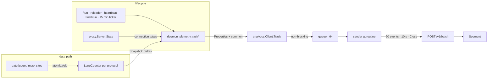

# ADR-0017: The sidecar reports usage to Segment through its own stdlib client

- **Status:** Accepted
- **Date:** 2026-09-16
- **Author:** @matheusfrancisco
- **Deciders:** @matheusfrancisco
- **Supersedes / Superseded by:** —

## Context

The gateway reports product usage to Segment through `gateway/analytics`:
a write key stamped at build time, events named as constants, properties
keyed by `org-id`, and an org-level analytics mode (`identified`,
`anonymous`, `disabled`) read from the database. Nothing equivalent exists
for the sidecar. A `hoop-inspect` process starts, serves for months and
stops, and the only trace of it is the control plane's `last_seen`, which a
standalone sidecar never writes.

Four constraints bound the answer:

- **The root module has exactly one dependency**, `github.com/hoophq/libhoop`
  (`sidecar/CLAUDE.md`). `github.com/segmentio/analytics-go` would be a
  second, for a client that is one HTTP POST.
- **`gateway/analytics` cannot be imported.** It reads `appconfig`,
  `models`, `services` and the org analytics mode, none of which exist in a
  sidecar process, and importing it would pull the gateway module into the
  sidecar's dependency graph.
- **The sidecar sits in the data path.** Anything added to the per-statement
  path is paid on every query; anything that can block, error or panic there
  is an outage. The relay must also run where `api.segment.io` is
  unreachable — air-gapped networks are a deployment target, not an edge
  case.
- **The admin `/config` endpoint already fixed the privacy line**: rule
  names but never patterns, the analyzer's host but never its prompt or
  credential, because the endpoint sits beside a read interface to every
  statement every user ran. Telemetry leaving the process must sit on the
  same side of that line, and further: not even names.

Two facts about identity shape what can be reported. A plane-connected
sidecar holds a bearer token the plane issued once; a standalone sidecar
holds nothing durable — no token, no state directory, no org.

## Options considered

1. **Reuse the gateway's Segment client.** No new code, same event
   vocabulary. Lost on the second constraint: the package is welded to the
   gateway's config and models, and the import would end the one-dependency
   invariant by a wide margin.

2. **Emit from the gateway on the sidecar handshake.** The plane already
   knows the org, honours the org's analytics mode, and holds a Segment
   client; extend the heartbeat body and let `recordRuntime` track. Free on
   the sidecar side, and a standalone sidecar — the whole install funnel,
   from a bare `hoop-inspect` run to a first config — is invisible to it.
   Kept as a complement, not the answer.

3. **A Segment sink in the audit chain.** `audit.Sink` already receives
   every statement; a sink that aggregates and posts would need no new hook
   in the gate. Lost on two counts. An `audit.Event` carries statement text,
   identity and rule name: the content that must never leave, one bug away
   from a network write. And `fail_on_audit_error` turns a failed sink write
   into a denied statement — correct for a compliance trail, a Segment outage
   refusing queries for telemetry.

4. **A nested module linking `segmentio/analytics-go`**, the pattern
   `pii/alcatraz` and `analyzer/vertex` follow. Keeps the root clean and
   costs a module directory, a `replace` in every consumer's `go.mod`, and
   an injection seam through `daemon`, for a dependency whose useful surface
   is `POST /v1/batch` with basic auth.

5. **A stdlib client in the root, with a two-method hook in the gate.**
   Eighty lines of `net/http` and `encoding/json`. The gate gets a
   `Metrics` interface (`Statement(denied bool)`, `Masked(values int)`) as
   a sibling of `Audit` in `gate.Config`; the daemon assembles properties
   from counts it already computes for `/config`.

## Decision

We will report sidecar usage to Segment through `sidecar/analytics`, a
stdlib-only client in the root module, fed by the daemon and by a counting
hook in the gate. Specifically:

- **Six events, named as constants** in `sidecar/analytics/events.go`,
  following the gateway's `hoop-<noun>-<verb>` convention with a `sidecar-`
  prefix: `first-run`, `started`, `config-applied`, `usage`, `stopped`,
  `license-expired`. `Track` takes the `Event` type, not a string, so a
  name cannot be invented at a call site.

- **Counts and shape, never content.** Properties are assembled in one
  place, `sidecar/daemon/analytics.go`, from the resolved `lane`, the
  `Config`, the license verdict and the reload outcome. No statement text,
  identity subject, rule name or pattern, prompt, token, listener or
  upstream address. The `/config` endpoint reports rule names; this reports
  their count. A property that names something an operator wrote does not
  land.

- **The data path pays one atomic increment.** `gate.judge` and the three
  masking sites call `Metrics`; the implementation is a per-protocol
  `LaneCounter` of `atomic.Int64`s. Nothing on the statement path
  allocates, locks, logs or does I/O for analytics. Events are emitted
  from lifecycle points only — `Run`, the reloader, the heartbeat,
  `FirstRun` — and a fifteen-minute ticker for usage deltas.

- **Telemetry cannot fail the relay.** `Track` never blocks: a bounded
  queue drops the newest and reports the drop count on the next event that
  gets through. `send` discards every error; request and client are
  bounded at five seconds. `Close` gives up at three. The sender goroutine
  recovers from any panic and dies alone. A `Track` after `Close` drops
  rather than sending on a closed channel. All four are pinned by tests
  against a refused port, a non-resolving name, a black-hole server and a
  panicking transport.

- **The write key is stamped at build time**, `-X
  github.com/hoophq/hoop/sidecar/analytics.writeKey`, from the same
  `SEGMENT_API_KEY` the gateway uses. A build without it — `go build` from
  the tree, the compose stack's image — sends nothing. **The operator
  switches it off with `HOOP_SIDECAR_ANALYTICS=off`**; there is no config
  key, so a document pushed by a control plane cannot turn it back on.
  `Run` logs `usage analytics enabled` when, and only when, it will send.

- **Identity is the token hash or nothing.** `sidecar-id` is
  `sha256(control-plane token)` when a plane is configured, giving one
  profile per install across restarts without the token leaving the
  process. A standalone sidecar gets a random id per process, and a
  dashboard reads its restarts as new installs — the honest reading of a
  process nothing ties to its predecessor.

- **The audit chain is untouched.** Same events, same sinks, same
  `fail_on_audit_error` semantics, same `/api/*` query surface. `Metrics`
  is a second consumer of a fact the gate already established, not a
  second reader of the audit trail.

## Flow



Three places an event is dropped, none where it blocks or errors: the queue
is full, the client is closed, or the POST fails. A drop is counted and
rides as `dropped-events` on the next event that gets through.

Every event carries the same common block, added by the client:

```json
{
  "version": "1.152.0",
  "entrypoint": "hoop",
  "os": "linux",
  "arch": "amd64",
  "sidecar-id": "9f2c…",
  "control-plane-connected": true
}
```

`entrypoint` is `hoop` (`hoop start sidecar`), `hoop-inspect` (the
standalone binary) or `embedded` (a caller of `daemon.Run`). The examples
below show only the event's own properties.

## Events

**`hoop-sidecar-first-run`** — a bare invocation served the default
redirect page. Emitted when the page stops, so it carries how long the URL
stayed up.

```json
{"deprecated-alias": false, "port": "15321", "port-fell-back": false, "duration-seconds": 41}
```

**`hoop-sidecar-started`** — every lane built, about to serve. Boot facts
plus the config shape.

```json
{
  "config-source": "control_plane",
  "config-format": "yaml",
  "deprecated-alias": false,
  "deprecations-count": 0,
  "control-plane-imported": true,
  "file-listeners-ignored": false,
  "license-state": "valid",
  "license-required": true,
  "detector-attached": true,
  "pii-configured": true,

  "lane-count": 3,
  "protocols": {"postgres": 2, "http": 1},
  "lanes-enforcing": 2,
  "lanes-observing": 1,
  "lanes-with-rules": 3,
  "guardrail-rules-total": 7,
  "lanes-with-opa": 1,
  "lanes-masking": 2,
  "mask-rules-total": 4,
  "lanes-with-analyzer": 1,
  "analyzer-provider": "vertex",
  "analyzer-model": "gemini-2.5-flash",
  "analyzer-send": "redacted",
  "analyzer-fail-open": true,
  "analyzer-custom-prompt": false,
  "lanes-capture-body": 0,
  "lanes-identity-header": 1,
  "lanes-upstream-tls": 2,
  "lanes-downstream-tls": 0,
  "audit-sinks": ["jsonl", "query"],
  "audit-async": true,
  "fail-on-audit-error": true,
  "admin-enabled": true,
  "log-level": "info"
}
```

`config-source` is `file`, `control_plane`, or `control_plane_disk` when the
plane delegated the document to the local file.

**`hoop-sidecar-config-applied`** — a heartbeat delivered a changed document
and the reloader acted on it. Silent for unchanged and retry outcomes. The
config shape block above is attached when the outcome is `applied`.

```json
{"config-generation": 4, "outcome": "applied", "lanes-swapped": 1, "lanes-kept": 2, "lane-count": 3, "…": "shape"}
{"config-generation": 4, "outcome": "restart-required", "lanes-swapped": 0, "lanes-kept": 0}
{"config-generation": 4, "outcome": "refused", "lanes-swapped": 0, "lanes-kept": 0}
```

**`hoop-sidecar-usage`** — counters since the previous usage event, every
fifteen minutes and once at shutdown. `by-protocol` is keyed by protocol,
never by lane.

```json
{
  "interval-seconds": 900,
  "uptime-seconds": 86400,
  "connections-total": 412,
  "connections-active": 9,
  "connections-denied": 3,
  "statements-total": 18250,
  "statements-denied": 17,
  "statements-masked": 1204,
  "heartbeat-failures": 0,
  "by-protocol": {
    "postgres": {"statements": 17900, "denied": 15, "masked": 1204},
    "http": {"statements": 350, "denied": 2, "masked": 0}
  }
}
```

**`hoop-sidecar-stopped`** — `Run` is returning. The final usage window
goes out as its own `hoop-sidecar-usage` just before.

```json
{"reason": "signal", "uptime-seconds": 86412, "reloads-applied": 4, "reloads-restart-required": 1, "reloads-refused": 0}
```

`reason` is `signal`, `listener-failed` or `license-expired`.

**`hoop-sidecar-license-expired`** — the term ended under a config the
free tier refuses; the process stops for it, and `stopped` follows with
`reason: license-expired`.

```json
{"guardrail-rules-total": 7, "mask-rules-total": 4, "uptime-seconds": 2592000}
```

## Consequences

Easier: the install funnel is visible for the first time — a bare
`hoop-inspect` run emits `first-run`, a config that loads emits `started`
with its shape, a plane import shows as `control-plane-imported`. A dashboard
reads per-protocol statement volume, deny and mask rates, and which
features (OPA, masking, analyzer, observe mode) a fleet actually runs. Adding
an event is a constant, a `track*` method assembling counts, and one call at
the place the fact becomes true.

Harder: two Segment clients in one repository, by design. They share a write
key and a naming convention, nothing else; a change to how the gateway
identifies or groups users does not reach the sidecar, and should not. The
per-protocol counter keys on `ListenerConfig.Protocol`, so two lanes
speaking postgres are one row — per-lane usage is deliberately not
reportable, because lane names are operator data.

Committed to: the privacy line as a review rule, not a test. No test can
prove a property is not content; `daemon/analytics.go` is the one file to
read on every change to it. Also committed to the env var as the sole
runtime switch: a config key would put the decision in a document the
control plane owns.

Not covered, and left on the table: a denial breakdown by rule *kind*
(operation, regex, pii, opa, analyzer) needs a `Source` on `policy.Verdict`
that the rules, OPA and analyzer evaluators would all have to set — a
policy change with its own tests. Analyzer call and failure counts need the
daemon to retain the evaluators it builds into each lane's chain, which it
does not today. Option 2 — the plane emitting on the handshake with the
org id and the org's analytics mode — remains the right way to attribute a
managed sidecar to a customer, and would land beside this rather than
replace it.

Revisit if a customer with a plane-connected sidecar needs their org's
`disabled` analytics mode honoured on the sidecar side. Today the plane's
mode governs what the plane emits; the sidecar's env var governs the
sidecar. Honouring the org mode remotely means the handshake response
carrying it, which is the versioning problem ADR-0016 describes.
