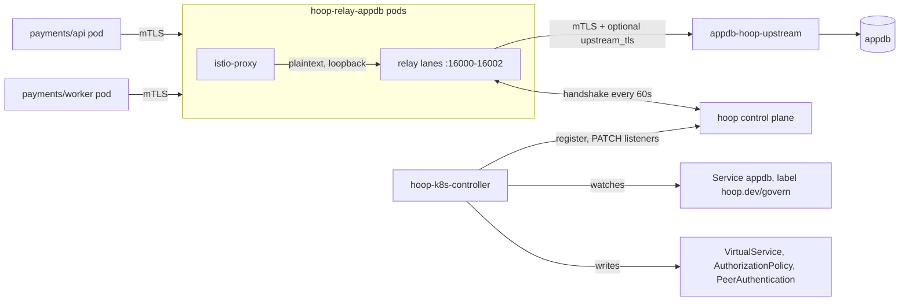

# ADR-0022: Govern Kubernetes databases through Istio-routed sidecar relays

- **Status:** Proposed
- **Date:** 2026-09-28
- **Author:** @matheusfrancisco
- **Deciders:** TBD
- **Code:** [`deploy/helm-chart/chart/sidecar/`](../../deploy/helm-chart/chart/sidecar/), [`sidecar/daemon/controlplane.go`](../../sidecar/daemon/controlplane.go), [`gateway/api/sidecar/`](../../gateway/api/sidecar/), [`gateway/models/sidecars.go`](../../gateway/models/sidecars.go)
- **Related:** ADR-0005 (sidecar flow), ADR-0013 (control plane mode), ADR-0014 (hot reload), ADR-0016 (plane license), ADR-0017 (rules composed on read), [`deploy/docker-compose/envoy-stack`](../../deploy/docker-compose/envoy-stack/)
- **Supersedes / Superseded by:** none

## TL;DR

- A customer labels a database Service. A controller in their cluster
  registers a relay with the control plane, deploys it, and writes the Istio
  objects that send that database's traffic through it.
- **Kubernetes owns topology. The control plane owns rules.** That split is
  the ADR-0014 boundary: topology edits restart a relay, rule edits reload in
  place.
- One relay Deployment per governed database. One lane per (caller workload,
  database), so a database lane names its caller.
- Istio `AuthorizationPolicy` on the database admits the relay's principal
  alone. A bypass probe proves it before the controller reports `Governed`.
- A dead relay fails closed.

## Context

You run services and databases in Kubernetes with Istio in sidecar mode. You
want hoop to inspect, audit and mask database and API traffic without editing
each app, and you want one place to write the rules.

### What exists today

| Piece | Where | Relevant fact |
|---|---|---|
| Relay | `sidecar/daemon` | Lanes for postgres, mysql, mssql, mongodb, clickhouse, http/1.x, grpc, spanner, ssh. Needs plaintext on its listener. |
| Chart | `deploy/helm-chart/chart/sidecar` | One Deployment, `replicas: 1` default, admin on 19000, `laneServices`, `controlPlane.url` and `controlPlane.token`. |
| Registration | `POST /api/sidecars` | Admin role and an enterprise license. Returns an `hsc_` token once. |
| Config delivery | `POST /api/sidecars/handshake` | At start and every minute. The plane owns the running document. |
| Rule delivery | ADR-0017 | Rule rows bound to `(sidecar_id, listener_name)`, composed into the document on each handshake. |
| Hot reload | ADR-0014 | Rule drift swaps in place. Listener drift logs `restart to apply it` and keeps the old config. |
| Dry run | `guardrails.mode: observe` | Evaluates every rule, allows the statement, records `would_deny`. |
| Topology proof | `envoy-stack` | Envoy in front, relay as an ordinary upstream. Istio runs that same shape. |

### Constraints

1. **Plaintext at the listener.** The relay terminates client TLS on
   postgres, clickhouse, grpc and spanner (`downstream_tls`). MySQL clients
   on `ssl-mode=PREFERRED` fall back to plaintext because the relay strips
   `CLIENT_SSL`. MongoDB clients need `directConnection=true`
   (`sidecar/README.md:1858`). Mesh mTLS covers the wire between pods.
2. **A listener change restarts the process.** A restart drops the relay's
   open connections (ADR-0014).
3. **Database lanes carry no caller identity.** `identity_header` works on
   http, grpc and spanner. A postgres lane knows the database user.
4. **A route does not enforce anything.** A VirtualService steers traffic
   addressed to a host. A pod that dials the database pod IP, or a second
   Service, skips it.
5. **The relay sits in the data path.** Its outage is the database's outage
   for every routed caller.
6. **One sidecar row per registration.** `RecordSidecarHandshake`
   (`gateway/models/sidecars.go:321`) overwrites `last_seen_at` and
   `applied_revision`. Two replicas on one token overwrite each other.
7. **The plane needs an enterprise license.** Registration, handshake and
   configuration routes carry `EnterpriseLicenseOnly`
   (`gateway/api/server.go:292-336`).

### Unknowns

- The share of customers whose apps force TLS to the database inside the
  driver. Those callers need a config change (see the protocol table).
- Istio ambient mode. ztunnel enforces L4 `AuthorizationPolicy`, and routing
  needs a waypoint. This ADR targets sidecar mode.

## Options considered

A divergent pass produced 30 candidates under five frames (regulator,
attacker, on-call, remove-the-assumption, biology). The ones below survived
scoring or lost for a reason worth keeping.

### A. Relay placement

1. **Inject the relay into every client pod** (mutating webhook). Per-pod
   identity comes free. It loses: N relays, iptables exclusions for the
   relay's own egress, and every listener change restarts app pods.
2. **One shared relay pool per cluster.** Fewest pods. It loses: a new lane
   anywhere is listener drift, so one team's label restarts the pool and
   drops every other team's connections.
3. **Codecs as an Envoy WASM or dynamic module in the waypoint.** Nothing new
   to deploy. It loses: the codecs are Go in libhoop, and masking re-frames
   rows. This is a product rewrite.
4. **Tap or mirror, audit only.** No latency, no outage risk. It loses deny
   and masking, the two things customers buy.
5. **One relay Deployment per governed database.** Chosen. A restart touches
   one database.

### B. Caller identity on database lanes

1. **Mint a database user per workload from its SPIFFE ID.** Strong. It
   loses: hoop would manage credentials inside customer databases.
2. **Carry the peer principal from Envoy to the relay** (PROXY protocol v2
   TLVs through an `EnvoyFilter`). Needs relay code and a filter Istio does
   not render. Deferred.
3. **One lane per (caller principal, database)**, with an
   `AuthorizationPolicy` on each lane port. Chosen. No relay change: the lane
   name is the caller.

### C. Rule home

1. **A `StatementPolicy` CRD compiled into a `load_from_disk` ConfigMap.**
   GitOps fits it. It loses: a second rule vocabulary and a second authority.
   ADR-0017 declined the first, and the relay refuses to merge the second.
2. **Rules as annotations.** Trap. Annotations carry no schema, cap at
   256 KiB per object, and hand rule edits to anyone with namespace edit.
3. **The plane owns rules, Kubernetes owns topology.** Chosen.

### D. Relay failure

1. **Fail open to the database** through an Envoy fallback cluster. It loses:
   an attacker who evicts the relay pod gets a clean path.
2. **The plane closes the database on a stale heartbeat.** Trap. A plane
   outage would close every governed database.
3. **Fail closed at the mesh, with replicas and a PodDisruptionBudget.**
   Chosen.

### E. Listener changes

1. **Blue/green relay pair with a VirtualService weight split.** It loses for
   database lanes: Istio TCP weights move new connections, and pooled clients
   (HikariCP, pgbouncer) stay on the old colour until max lifetime. The drain
   either waits without bound or kills transactions.
2. **Rolling update of the relay Deployment.** Chosen. Same connection loss
   as blue/green for pooled clients, and no second Deployment.

## Decision

We will ship a Kubernetes integration built from three parts: a label the
customer sets, a controller that runs in their cluster, and the control plane
they already have.



### 1. Opt-in: a label on the database Service

```yaml
apiVersion: v1
kind: Service
metadata:
  name: appdb
  namespace: payments
  labels:
    hoop.dev/govern: "true"
  annotations:
    hoop.dev/protocol: postgres                      # lane protocol
    hoop.dev/callers: payments/api,payments/worker   # namespace/serviceaccount
    hoop.dev/upstream-tls: "true"                     # relay dials the DB over TLS
```

The controller ignores a Service without the label. A `ServiceEntry` for a
managed database (RDS, Cloud SQL) takes the same label and annotations.
Removing the label makes the controller delete the relay and the Istio
objects for that database. It keeps the plane registration, so the rule
bindings survive a relabel. That removal is the break-glass, and it shows up
in the cluster's audit log and in git.

### 2. Objects the controller writes per governed database

| Object | Name | Job |
|---|---|---|
| Sidecar registration | `k8s-<cluster>-<namespace>-<service>` | `POST /api/sidecars`. The token goes into the Secret below. |
| Secret | `hoop-relay-appdb-token` | `HOOP_SIDECAR_TOKEN` for the relay pods. |
| Deployment | `hoop-relay-appdb` | Relay pods. `replicas: 2`, pod anti-affinity. |
| PodDisruptionBudget | `hoop-relay-appdb` | `minAvailable: 1`. |
| Service | `hoop-relay-appdb` | One port per lane, named `tcp-<lane>` so Istio skips protocol sniffing (MySQL greets first). |
| Service | `appdb-hoop-upstream` | Same selector as `appdb`. The relay dials this host, so the VirtualService on `appdb` never matches the relay's own egress. |
| VirtualService | host `appdb` | One TCP route per caller, then a catch-all route. |
| AuthorizationPolicy | on the relay | Lane port N admits caller principal N. The catch-all port admits any mesh principal, so labelling a database breaks no undeclared caller. |
| AuthorizationPolicy | on the database workload | Admits the relay's principal on the database port. |
| PeerAuthentication | on the database workload | `STRICT`, so a pod outside the mesh cannot reach it in plaintext. |

Routing and authorization split the work. `sourceLabels` picks the lane.
The principal check on the lane port decides if the caller may use it. A pod
that copies another workload's labels lands on that lane port and the relay's
Envoy refuses it.

`hoop.dev/callers` names ServiceAccounts, because the principal is the
identity Istio proves. The controller reads the pod template labels of each
workload that runs as that ServiceAccount and writes one `match` entry per
label set. A caller whose labels and ServiceAccount disagree gets refused at
the lane port, and the controller emits an Event naming it.

```yaml
apiVersion: networking.istio.io/v1
kind: VirtualService
metadata:
  name: appdb-hoop
  namespace: payments
spec:
  hosts: [appdb.payments.svc.cluster.local]
  tcp:
    - match: [{sourceLabels: {app: api}, sourceNamespace: payments, port: 5432}]
      route: [{destination: {host: hoop-relay-appdb.payments.svc.cluster.local, port: {number: 16001}}}]
    - match: [{sourceLabels: {app: worker}, sourceNamespace: payments, port: 5432}]
      route: [{destination: {host: hoop-relay-appdb.payments.svc.cluster.local, port: {number: 16002}}}]
    - match: [{port: 5432}]   # every other caller: inspected, identity unknown
      route: [{destination: {host: hoop-relay-appdb.payments.svc.cluster.local, port: {number: 16000}}}]
---
apiVersion: security.istio.io/v1
kind: AuthorizationPolicy
metadata:
  name: appdb-relay-only
  namespace: payments
spec:
  selector: {matchLabels: {app: appdb}}
  action: ALLOW
  rules:
    - from: [{source: {principals: ["cluster.local/ns/payments/sa/hoop-relay-appdb"]}}]
      to: [{operation: {ports: ["5432"]}}]
```

### 3. Listener document the controller writes

The controller owns the `listeners` key of the sidecar's stored document. It
writes through `PATCH /api/sidecars/:nameOrID`, which updates the keys present
and leaves the rest. Rules for a managed sidecar go through ADR-0017
bindings. A rule block an admin types into a stored listener gets
overwritten on the next reconcile, and the plane UI should say so on managed
sidecars.

```yaml
listeners:
  - name: appdb-from-unknown
    protocol: postgres
    listen: 0.0.0.0:16000
    upstream: appdb-hoop-upstream.payments.svc.cluster.local:5432
    upstream_tls: {}
  - name: appdb-from-payments-api
    protocol: postgres
    listen: 0.0.0.0:16001
    upstream: appdb-hoop-upstream.payments.svc.cluster.local:5432
    upstream_tls: {}
  - name: appdb-from-payments-worker
    protocol: postgres
    listen: 0.0.0.0:16002
    upstream: appdb-hoop-upstream.payments.svc.cluster.local:5432
    upstream_tls: {}
```

The registration call (`POST /api/sidecars`) carries the first document:
these listeners, `admin.listen: 0.0.0.0:19000` for the probes, and
`guardrails.mode: observe`. A document with no listeners would stop the relay
at boot. After registration the admin owns every key except `listeners`.
Promoting to `enforce` is rule drift and reloads in place.

Port numbers stay stable. The controller keeps the lane table on the relay
Service as an annotation. A reordered caller list changes no port, and a
removed caller frees its port without renumbering the others. Any other
behaviour turns a no-op reconcile into a restart.

### 4. Authoring and reading rules

- **Author** in the control plane: the guardrail, data masking and analyzer
  pages, bound to `(sidecar, listener)` per ADR-0017. A binding on
  `appdb-from-payments-api` is a rule for that caller. A binding with an
  empty listener covers the whole database.
- **Apply:** the next heartbeat delivers it within a minute. Open
  connections finish under the rules they started with.
- **Check delivery:** the plane shows `applied_revision` and `last_outcome`
  for each sidecar (see Consequences for the replica caveat).
- **Read the evidence:** the audit sink in the sidecar document, and the
  relay admin API. `kubectl -n payments port-forward svc/hoop-relay-appdb
  19000` reaches `/config`, `/stats`, `/events` and `/api/sessions`.
- **GitOps teams** keep `load_from_disk`. The controller skips a sidecar in
  that mode and reports `Unmanaged`, so two writers never share one document.

### 5. Protocol handling

The controller reads `hoop.dev/protocol` and acts as follows.

| Protocol | Controller action | Caller needs |
|---|---|---|
| postgres | Route. Adds `downstream_tls` with a cert-manager certificate for `appdb.<ns>.svc` when `hoop.dev/client-tls: "true"`. | `sslmode` up to `require`. `verify-full` needs the relay's CA in the app trust store. |
| mysql | Route. | `ssl-mode=PREFERRED` or `DISABLED`. `REQUIRED` fails at connect. |
| clickhouse | Route, `downstream_tls` on request. | Nothing. |
| mongodb | Route. | `directConnection=true`. A client that follows the replica-set `hello` dials member hosts, and the database `AuthorizationPolicy` refuses it. The bypass fails loud. |
| mssql | Route for TDS 7.x. Status `Unsupported` for TDS 8.0 strict in this version. | `Encrypt=false` or login-only encryption. |
| http, grpc | Route. `hoop.dev/grpc-descriptors` sets the lane's descriptor set, a restart-class field. | Plain HTTP or h2c to the mesh. |
| spanner, ssh, Kubernetes API | Status `Unsupported`. Spanner callers dial Google APIs, and ssh and Kubernetes API sessions start from a person. | Out of scope. |
| redis, kafka, oracle, cassandra | Status `Unsupported`. No codec. | Out of scope. |

The controller writes its verdict to the Service as annotation
`hoop.dev/status` and emits a Kubernetes Event on each change.

### 6. Coverage proof

`Routed` means the VirtualService exists. `Governed` means an in-mesh pod
cannot skip it, and the controller must prove that. After each
reconcile, and on each change to an `AuthorizationPolicy`,
`PeerAuthentication` or `ServiceEntry` in the database namespace, it runs a
probe Job with three checks:

| Check | Runs as | Dials | Pass |
|---|---|---|---|
| Positive control | relay ServiceAccount | `appdb-hoop-upstream:5432` | Protocol greeting arrives (the Postgres `S`/`N` reply, the MySQL server greeting, the Mongo `hello` answer). |
| In-mesh bypass | `hoop-bypass-probe` ServiceAccount | database pod IP | Envoy resets before any server byte. |
| Plaintext bypass | pod with injection off | database pod IP | Connection refused or reset. |

The probe judges by protocol bytes. A timeout or a DNS failure reads
`Unknown`, and the status stays below `Governed`. The status reads
`Governed` while all three checks pass and the relay's heartbeat is live.

A `ServiceEntry` backend has no Envoy in front of the database, so an
in-mesh deny proves nothing about its IP. Such a database stays `Routed`
until the customer confirms a database-side allowlist (security group, Cloud
SQL authorized networks) admits the egress gateway alone, through annotation
`hoop.dev/network-allowlist: confirmed`.

### 7. Failure behaviour

- **Relay down:** the VirtualService points at a Service with no ready
  endpoints, and the caller's connection fails. Fail closed.
- **Listener change** (new caller, new port, new protocol): the controller
  patches the listeners, then bumps a pod-template annotation with the new
  document revision. The Deployment rolls with `maxUnavailable: 0`. New pods
  boot with the new document from the handshake. Old pods get `SIGTERM`, and
  the relay closes every live connection at once
  (`sidecar/proxy/proxy.go:401`). Pooled clients reconnect to the new pods.
  A `preStop` sleep gives Istio time to drop the old endpoint first, so new
  connections stop landing on a closing pod.
- **Rule change:** hot reload, no pod change.
- **Plane unreachable:** relays keep serving the last document they loaded.
  A relay pod that starts during the outage fails its first handshake and
  exits (`sidecar/README.md:299`). With two replicas and the
  PodDisruptionBudget, the surviving pod keeps serving while the new one
  crash-loops.

### 8. The controller

- **Runs** in the customer cluster as `hoop-k8s-controller`, installed by a new
  chart `deploy/helm-chart/chart/k8s-controller`.
- **Talks outbound** to the plane, as relays do. The plane holds no
  Kubernetes credential.
- **Needs** a control plane API key that may call `POST` and `PATCH
  /api/sidecars`. Those routes carry `AdminOnlyAccessRole` today, so V1 needs
  an admin key in the cluster.
- **Needs** Kubernetes RBAC: watch Services and ServiceEntries; manage
  Deployments, Services, Secrets and PodDisruptionBudgets in relay
  namespaces; manage VirtualServices, AuthorizationPolicies and
  PeerAuthentications in labelled namespaces; create probe Jobs.
- **Lives** in a nested module, `sidecar/kubernetes`, beside the six nested
  modules that already isolate heavy dependencies. `client-go` and the Istio
  client stay out of the root module. `make test-sidecar` walks every
  `go.mod` under `sidecar/`, so CI covers it with no Makefile change.
- **Core** is a pure reconcile function: labelled Services plus the previous
  lane table in, relay listeners and Istio objects out. Golden-file tests
  pin it with no cluster.

### 9. Delivery phases

| Phase | Ships | Proves |
|---|---|---|
| 0 | A recipe in `deploy/helm-chart/chart/sidecar/README.md`: the chart plus hand-written Istio objects for one Postgres database, run on kind with Istio. | The topology, the routing loop fix, the probe checks by hand. |
| 1 | The controller for postgres, mysql, clickhouse, http, grpc. Status annotation, Events, probe Job. | Label to `Governed` with no manual step. |
| 2 | mongodb and mssql handling, coverage shown in the plane UI, ambient mode. | Each needs its own follow-up decision. |

## Consequences

### Easier

- A platform team governs a database with one label plus the `protocol` and
  `callers` annotations. No app redeploys for callers on default TLS
  settings.
- Every rule surface from ADR-0017 works per caller on database lanes, with
  no relay change.
- An auditor gets probe results for each database as evidence that traffic
  "goes through hoop".

### Harder

- **Adding a caller restarts that database's relay.** The relay closes open
  connections on `SIGTERM` with no drain, so pooled connections to that
  database reconnect. Other databases see nothing. A graceful drain in the
  relay is a follow-up.
- **Listener count grows with callers.** Ten callers on one database means
  eleven lanes and eleven ports.
- **An admin API key lives in the customer cluster.** Anyone who reads the
  controller's Secret can administer the org's sidecars. A scoped key role
  is a follow-up.
- **Replicas share one sidecar row.** During a rollout the plane shows
  whichever replica reported last. Per-instance heartbeat state is a
  follow-up; until then, read `applied_revision` after the rollout settles.

### Committed to

- Every `hoop.dev/*` label and annotation in this ADR becomes a public
  contract. Renaming one breaks customer manifests.
- The controller writes `listeners`, and `guardrails.mode: observe` once at
  registration. It never edits a rule key after that. A later change that
  lets it write rules needs a new ADR.
- No change to the gateway↔agent contract. No new packet type or spec key.

### Revisit if

- Customers run ambient mode by default. The routing half then moves to a
  waypoint, and the lane-per-caller scheme needs a new test.
- Pooled clients make relay restarts too costly. That points at listener
  hot-add inside the relay, which ADR-0014 rejected for its complexity.
- Most target databases sit outside the mesh (RDS, Cloud SQL). The coverage
  proof then rests on customer network config, and an egress gateway design
  needs its own ADR.

### Verification plan

Phase 0 runs on kind with Istio in sidecar mode and the `envoy-stack`
Postgres fixture: a caller on the api lane gets a masked `SELECT`, a
`DELETE` meets the guardrail, a pod with a copied `app: api` label gets a
reset on port 16001, a pod dialling the database pod IP gets a reset, and
deleting a relay pod leaves the second replica serving.
