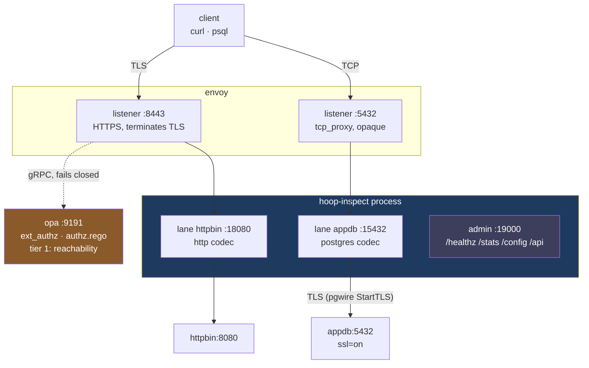
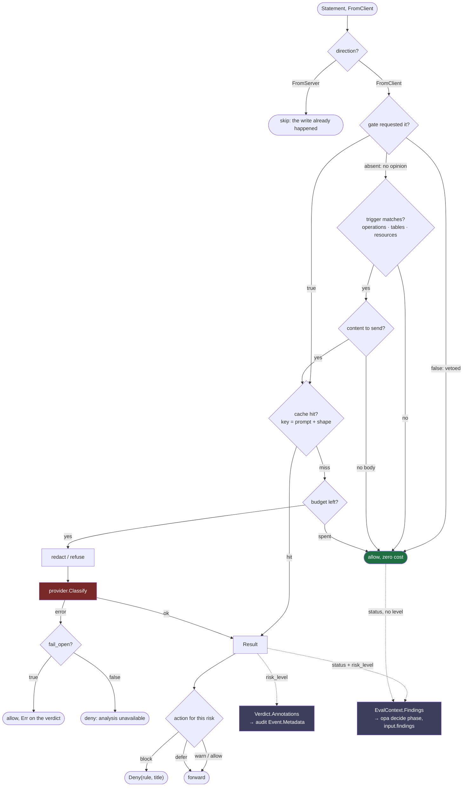
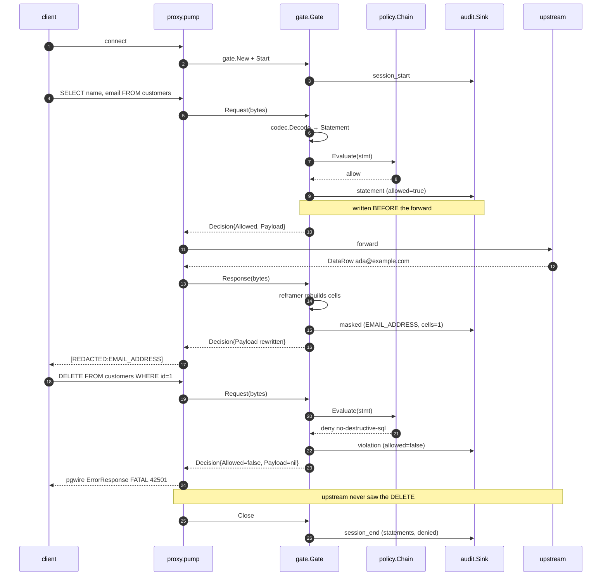
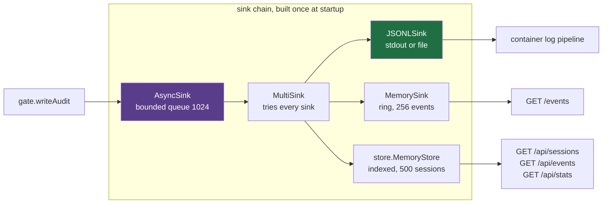

# How a request flows through hoop-inspect

- **Status:** Current as of 2026-08-10
- **Version:** hoop-inspect 0.1.0
- **Code:** [`hoopinspect/`](../../hoopinspect), [`deploy/docker-compose/envoy-stack/`](../../deploy/docker-compose/envoy-stack)
- **Run it:** [Running the whole thing](#running-the-whole-thing), below

This traces one connection from the client through Envoy, through the
hoop-inspect sidecar, to the upstream and back. Read it to find out where a
policy denial happens, why postgres masking takes a different path from HTTP
masking, what an AI risk verdict costs and how it is kept from costing more,
how a local rule hands its match to a Rego policy instead of denying, and
which knob in `config.yaml` controls which line of code.

Every command below runs against the compose stack in
[`deploy/docker-compose/envoy-stack/`](../../deploy/docker-compose/envoy-stack), and
every output is copied from a real run.

## Running the whole thing

Install `docker`, `curl`, `openssl` and `python3`. Then:

```bash
cd deploy/docker-compose/envoy-stack
./run.sh          # cert, sidecar image, compose up. First run takes a minute.
./demo.sh         # walks every lane and prints the audit trail
```

`run.sh` mints a self-signed cert for Envoy, builds `hoop-inspect:local` from
`../../../hoopinspect`, and brings up six containers. No control-plane
database, no API calls: the sidecar reads one YAML file.

```bash
./run.sh --rebuild   # after changing the hoopinspect library
./run.sh down        # tear down, including volumes
```

### Ports

| Port | Serves | Reach it from |
|---|---|---|
| 8443 | Envoy HTTPS → httpbin lane | host |
| 5433 | Envoy TCP → appdb lane | host |
| 19000 | sidecar admin: health, stats, config, audit | host |
| 9901 | Envoy admin | host |

Inside the compose network that postgres listener is `envoy:5432`. The host
publishes it on 5433, because a laptop usually has something on 5432 already.
That is why `demo.sh` runs psql from the `client` container against port 5432
while a host-side psql would use 5433.

### Check it came up

```bash
curl -s localhost:19000/healthz                  # ok
curl -s localhost:19000/config | python3 -m json.tool
```

### Walk the tiers by hand

`demo.sh` runs all of this in order. Run the pieces yourself to see one thing
at a time.

**Tier 1, reachability.** OPA answers who reaches httpbin, and nothing about
the request beyond that.

```bash
curl -sk https://localhost:8443/json -H 'X-Hoop-User: alice' -o /dev/null -w '%{http_code}\n'
curl -sk https://localhost:8443/json -H 'X-Hoop-User: bob'   -o /dev/null -w '%{http_code}\n'
curl -sk https://localhost:8443/json -o /dev/null -w '%{http_code}\n'
```

```
200     alice is granted httpbin
403     bob is not
401     no identity header at all
```

**Tier 2, postgres.** Set a shell alias first, since every psql line reuses it:

```bash
PG="docker compose exec -T client env PGPASSWORD=apppass PGSSLMODE=disable \
  psql -h envoy -p 5432 -U appuser -d appdb"
```

A destructive statement never reaches the database:

```bash
$PG -c 'DELETE FROM customers WHERE id = 1;'
```

```
FATAL:  destructive statements are not permitted on appdb
```

That is a real pgwire `ErrorResponse` carrying the message an operator wrote in
`config.yaml`, so the developer reads it in psql instead of watching a socket
drop. Envoy forwarded the same bytes as opaque TCP and consulted nobody.

A national id in the query text gets the same treatment, from the `pii` rule
both lanes inherit:

```bash
$PG -tAc "SELECT name FROM customers WHERE cpf = '111.444.777-35';"
```

```
FATAL:  do not put a taxpayer id in a query; it lands in the database's own logs
```

Masking rewrites the result set coming back:

```bash
$PG -c 'SELECT name, email, ssn, iban FROM customers LIMIT 2;'
```

```
     name     |          email           |     ssn     |          iban
--------------+--------------------------+-------------+------------------------
 Ada Lovelace | [REDACTED:EMAIL_ADDRESS] | ***-**-6789 | ******************5432
 Grace Hopper | [REDACTED:EMAIL_ADDRESS] | ***-**-4321 | ******************3000
```

**Tier 2, HTTP.** Two request denials and one response denial:

```bash
curl -sk https://localhost:8443/admin/users -H 'X-Hoop-User: alice' -w '\n%{http_code}\n'
curl -sk https://localhost:8443/anything/users/12345/orders/98765 \
     -H 'X-Hoop-User: alice' -w '\n%{http_code}\n'
curl -sk https://localhost:8443/status/503 -H 'X-Hoop-User: alice' -w '\n%{http_code}\n'
```

All three return 403 with the rule's own message. The third is the one no
`ext_authz` configuration can produce: hoop-inspect read a 503 the upstream
already sent and suppressed it.

HTTP masking works on an opaque body:

```bash
curl -sk -X POST https://localhost:8443/anything -H 'X-Hoop-User: alice' \
  -H 'Content-Type: application/json' \
  -d '{"email":"ada@example.com","ssn":"555-12-3456","card":"4111111111111111",
       "cpf":"111.444.777-35","iban":"GB82WEST12345698765432"}'
```

```
"card":  "************1111"
"cpf":   "[REDACTED:BR_CPF]"
"email": "[REDACTED:EMAIL_ADDRESS]"
"iban":  "******************5432"
"ssn":   "***-**-3456"
```

### Read the evidence

```bash
curl -s localhost:19000/stats | python3 -m json.tool
```

```json
{"listeners": [
  {"name": "appdb",   "addr": "[::]:15432", "active": 0, "total": 18, "denied": 7},
  {"name": "httpbin", "addr": "[::]:18080", "active": 0, "total": 16, "denied": 7}
], "version": "0.1.0"}
```

```bash
curl -s 'localhost:19000/api/sessions?limit=1' | python3 -m json.tool
docker compose logs hoop-inspect | ./hoopinspect/read-audit.py
```

A session row carries the counts a list view needs without opening every event:

```json
{"id": "45edf2c8…", "principal": "anonymous", "protocol": "http",
 "connection": "httpbin", "duration_ms": 5003,
 "statement_count": 2, "denied_count": 0, "masked_count": 2, "verdict": "clean"}
```

### When something looks wrong

| Symptom | Check |
|---|---|
| `demo.sh` exits "not healthy" | `docker compose ps`, then `docker compose logs hoop-inspect` |
| A rule you wrote never fires | `curl -s localhost:19000/config` and read the lane's resolved `rules` |
| Masking leaves a value alone | The detector may refuse it. Add a column rule, or a pattern rule for a placeholder. |
| The sidecar refuses to start | It prints every config problem at once, each naming its lane |
| Changed the library, nothing moved | `./run.sh --rebuild` |
| psql says SSL is required | Set `PGSSLMODE=disable`. Nothing terminates TLS on that lane. |

## The two tiers

Envoy owns TLS and the network path. OPA answers reachability. hoop-inspect
reads the payload.



Envoy calls OPA on the HTTPS lane only. The postgres lane has no filter to
attach a policy hook to, so those bytes reach the sidecar unexamined.

The stack runs no hoop gateway and no hoop agent. The sidecar carries
tier 2 alone: the `hoopinspect` library running as a process.

Envoy sees less on each lane going down the table.

| Lane | Envoy port | Envoy sees | OPA consulted |
|---|---|---|---|
| HTTPS → httpbin | 8443 | method, path, headers, bounded body | yes, `ext_authz` |
| postgres → appdb | 5433 | a byte count | no, it has no pgwire parser |

On HTTP, `ext_authz` handles request-side authorization well, and claiming
otherwise loses a technical review. The gap sits elsewhere: `ext_authz` decides
before Envoy calls the upstream, so no ext_authz configuration can read a
response status or a response body. On postgres the gap is wider. Envoy
forwards bytes it cannot parse, so OPA never receives a statement to judge.

## One process, one lane per Envoy cluster

`hoop-inspect` serves one listener per Envoy cluster. Each listener resolves its
own rules, its own masking and its own OPA endpoint.

```
envoy :8443 ──cluster hoop_inspect_http──> :18080  lane "httpbin"   http
envoy :5432 ──cluster hoop_inspect_pg────> :15432  lane "appdb"     postgres
                                                   └─ one process
```

Each lane binds a TCP port or a unix socket, chosen by its `network` field.
TCP is the default and what the diagram above shows; the same two lanes over
sockets are in [Transport: TCP or unix socket](#transport-tcp-or-unix-socket),
below.

The top-level `policy:` and `mask:` blocks in `config.yaml` set defaults. A
listener overrides them:

| Field | Merge | Reason |
|---|---|---|
| `policy.rules` | concatenate, listener first | Every rule denies and the first match wins, so concatenation cannot change the allow/deny outcome. Order picks which message the user reads. |
| `policy.opa` | replace | One lane has one decision endpoint. |
| `policy.enforce` | replace | A lane rolling out behind an enforcing default has to be able to say observe-only. |
| `mask` | replace | A rule owns an entity type. Concatenating two lists leaves two rules competing for one entity. |

`sidecar.buildLanes` resolves the merge once at startup and reports every broken
lane in one run. Ask the running process what it resolved:

```bash
curl -s localhost:19000/config | python3 -m json.tool
```

```json
{"lanes": [
  {"name": "appdb", "protocol": "postgres", "enforcing": true,
   "rules": ["no-destructive-sql", "no-cpf-in-query"], "masking": true},
  {"name": "httpbin", "protocol": "http", "enforcing": true,
   "rules": ["no-admin-api", "no-internal-ids", "no-upstream-5xx",
             "no-cpf-in-query"], "masking": true}
]}
```

Both lanes inherited `no-cpf-in-query` from the top level. Neither inherited the
other's rules. Reading `config.yaml` alone will not tell you that, which is why
the endpoint exists.

## Inside one connection

`proxy.Server.handle` accepts a socket, builds per-connection state, and starts
two goroutines that pump in opposite directions through one Gate.

```
accept
  ├─ session.New(proto, Identity{PeerAddr})
  ├─ gate.New(sess, cfg)   two Inspectors, one per direction
  ├─ g.Start(ctx)          records the session even if it issues no statement
  ├─ dialUpstream()
  │
  ├─ go pump(client → upstream, FromClient) ─┐
  └─ go pump(upstream → client, FromServer) ─┘  first to finish closes the peer
```

Two Inspectors, because a codec reassembles messages across reads. Feeding both
halves of a duplex stream into one reassembly buffer corrupts both.

`pump` reads 32 KiB at a time and hands every chunk to the Gate before anything
reaches the far side:

```
src.Read(buf) ──> n bytes
      ↓
d := g.Request(ctx, buf[:n])        or g.Response for FromServer
      ↓
├─ d.Allowed == false ─→ DenyWriter.Deny(proto, msg) ─→ write frame ─→ return
│                        pgwire 'E' FATAL 42501  |  HTTP 403 + X-Hoop-Denied
│                        always to the CLIENT, whichever direction denied
│
└─ d.Allowed == true  ─→ dst.Write(d.Payload)
```

A re-framing codec holds rows back until their result set ends, so `pump`
defers a `FlushResponse` on the server direction. Skipping that flush drops the
tail of a client's output, and the user reads it as a truncated result rather
than as a masking bug.

## Transport: TCP or unix socket

`proxy.Server.Serve` calls `net.Listen(cfg.Network, cfg.Listen)`, and the
listener's type is the whole of the difference. Everything downstream of
`Accept` takes a `net.Conn` and never asks what produced it, so policy,
masking, audit and upstream TLS are identical either way.

```
config                     proxy.Server                  what binds
─────────────────────────  ────────────────────────────  ─────────────────────
listen: 0.0.0.0:15432      Network "" defaults to "tcp"  a port
network: unix              net.Listen("unix", path)      a filesystem socket
listen: /run/.../pg.sock
```

The default lives in `proxy.NewServer`: an empty `Network` becomes `tcp`, so a
config written before the field existed keeps working. `sidecar` validation
accepts only `tcp` or `unix` and names the lane on anything else.

Over sockets the topology is the same picture with two edges relabelled:

```
envoy :8443 ──cluster hoop_inspect_http──> /run/hoop-inspect/http.sock
envoy :5432 ──cluster hoop_inspect_pg────> /run/hoop-inspect/pg.sock
```

On the Envoy side that is a `pipe:` endpoint instead of a `socket_address:`,
and the cluster becomes `STATIC` rather than `STRICT_DNS`, because a path is
not a name to resolve:

```yaml
- name: hoop_inspect_pg
  type: STATIC
  load_assignment:
    endpoints:
      - lb_endpoints:
          - endpoint:
              address:
                pipe: { path: /run/hoop-inspect/pg.sock }
```

### Reading which transport a lane bound

`GET /stats` reports the post-bind address, so it describes what happened
rather than what the file asked for:

```json
{"listeners": [
  {"name": "appdb",   "addr": "/run/hoop-inspect/pg.sock"},
  {"name": "httpbin", "addr": "/run/hoop-inspect/http.sock"}
]}
```

A path is unix, a `host:port` is TCP. The startup log carries the same fact as
an explicit `network` field, and for a socket lane `ls -l` shows the leading
`s` of a socket inode.

### The two failure modes worth knowing

**A permission error on connect is nearly silent.** `connect()` on a unix
socket needs write permission on the socket file, not read. Go creates a
listening socket at `0777 &^ umask`, and the default 022 clears the group-write
bit a peer with a different uid depends on. Envoy then reports `flags=UF` and
increments `upstream_cx_connect_fail` while still calling the cluster healthy,
because the endpoint resolved fine. Nothing in either log names permissions.

**A stale socket blocks a restart.** Go unlinks on an orderly close, so this
only follows a SIGKILL, an OOM kill or `docker kill`. `proxy.reclaimStaleSocket`
runs before `net.Listen`: it dials the path first, unlinks a socket nothing
answers on, and refuses to touch one that answers. Without the dial the reclaim
would let a second relay steal a live socket, and the two would split a client's
connections at random.

Both are exercised by `deploy/docker-compose/envoy-stack/uds/`, which runs the
relay with Envoy's gid and `umask 0002` for exactly this reason.

## Inside the Gate

`gate.inspect` runs four steps per chunk, and the order carries weight.


Auditing before the forward costs a write on the hot path. It buys the property
that a crash between the two cannot lose the record of the statement that caused
it. Reverse the order and you lose exactly the row you need.

`Decision.Payload` aliases the input when nothing changed, so a clean payload
allocates nothing.

## Inside the Inspector

A codec registers a factory, not an instance. Two connections sharing one
stateful codec would corrupt each other's reassembly buffer, and one tenant's
SQL would surface in another tenant's audit trail.

```
                  hoopinspect.Register(factory)   from codec init()
                            ↓
 hoopinspect.New(Postgres) ─┴─> Inspector{codec, buf, maxBuffer 8 MiB}
                                     │
                                     ↓ codec.Decode
   ┌─── codec/postgres ────────────────────────────────┐
   │  skipHandshake()   startup packet, SSLRequest     │
   │  tag 'Q' Query ──> splitSimpleQuery()             │
   │                      └─ lexer.Split(q, Postgres)  │
   │  tag 'P' Parse ──> parseMessage()                 │
   │  everything else → skip by length                 │
   └──────────────────────┬────────────────────────────┘
                          ↓
              AnalyzeSQL(text, Postgres)   one pass, typed tokens,
                          │                labelled region stack
                          ↓
   Statement{Protocol, Direction, Text, Operation, Effects,
             Relations, Tables, Database, HTTP *HTTPDetail, Metadata}
```

Three details in that path decide real verdicts.

`splitSimpleQuery` splits on semicolons, because `SELECT 1; DROP TABLE users`
arrives as one `Q` message. A decoder that classified by leading verb would
report a harmless select and wave the DROP through. It now delegates to
`lexer.Split`, and the codec's own splitter left with its `skipQuoted` and
`dollarTag` helpers. That splitter was a second, weaker lexer living beside the
real one: it cut `SELECT E'a\';b'; DELETE FROM customers` at the semicolon
inside the escape-string literal, and the DELETE became a fragment nobody
classified.

`AnalyzeSQL` runs one pass of typed tokens over a labelled region stack. The
label is the whole difference from the paren-depth integer it replaced: depth 1
cannot tell a CTE body from a function argument list, and a region that knows
its paren was opened by `AS` inside a `WITH` can. Each region carries the verb
that governs relation attribution inside it, so
`WITH d AS (DELETE FROM customers) SELECT count(*) FROM d` reports `Effects` of
delete and select, `Relations` of `{customers, write}`, and an `Operation` of
`delete`. `Operation` is the most consequential effect rather than the leading
verb, because a policy asking "may this run" is asking about the effect
(`hoopinspect/sqlmeta.go:18-21`).

That same pass sets `Complete`, which reports whether it understood the whole
statement. A false one arrives as `Operation: unknown` with the reason in
`Metadata["sql.incomplete"]`. That pair is the fail-closed signal: a rule naming
`unknown` refuses what the scanner could not read, and one that does not name it
has accepted the risk in writing.

A literal's content never reaches a token, so `SELECT 'DROP TABLE customers'`
classifies as `select`. Prefer `type: operation` over `deny_words_list` for that
reason: the word list denies the harmless one.

## Checking the scanner against PostgreSQL

`hoopinspect/lexer/conformance/` is a separate Go module that parses every
fixture with PostgreSQL's own grammar and compares. It is separate because the
root module ships zero dependencies, test dependencies included:
`cd hoopinspect && go build ./... && cat go.mod` still shows no requires and no
`go.sum`, and nothing the root builds can import the harness. It reaches
libpg_query through `wasilibs/go-pgquery` rather than `pganalyze/pg_query_go`
directly, because the pganalyze module is cgo, and a conformance suite that runs
only where a C toolchain is configured is a suite that stops running. wasilibs
compiles the same grammar to WebAssembly and runs it under wazero, so
`CGO_ENABLED=0` works and the suite rides in the same CI job as the wasip1
build.

The assertion is asymmetric. For every fixture, `oracle_test.go` requires:

> EITHER the scanner's write-set equals PostgreSQL's write-set, OR the scanner
> reported `Complete=false`.

The second clause is the soundness contract. `Complete=false` fails the caller
closed, so a scanner that admits defeat has behaved correctly and the suite
counts it as a concession. The suite refuses one thing: a confident, different
answer. `Complete=true` beside a write-set PostgreSQL disagrees with means a
policy guarding a relation did not see a write to it. So the suite asserts the
scanner is never wrong, never that it is as precise as PostgreSQL, and a suite
demanding the second would be demanding a second PostgreSQL.

Only write-sets are compared. Read-sets differ for a legitimate reason:
PostgreSQL's raw parse tree sees `FROM d` as a `RangeVar`, because CTE
resolution happens after parsing, while the scanner knows a `WITH` bound the
name. Both are right about what they can see, and neither difference can let a
write through.

| Corpus | Measured |
|---|---|
| 74 hand-written fixtures: CTE, DML shapes, DDL, ORM output, regressions | 72 exact, 2 conceded, 0 wrong |
| PostgreSQL 17.5's own regression suite | 144/224 files usable, 20,391 statements, 20,240 complete (99.3%) |
| `FuzzAnalyze` | 4.2M execs, zero findings |

The 151 concessions on the regression corpus are 94 PREPARE, 36 CALL, 18 DO and
3 `CREATE RULE ... DO INSTEAD (stmt; stmt)`, where a semicolon inside
parentheses closes a region the scanner is still standing in. Every one of them
fails closed. The 80 rejected files are psql scripts and deliberate syntax
errors PostgreSQL will not parse either, so there is no ground truth to split
them on.

The oracle covers the PostgreSQL dialect. The MSSQL dialect has none, because
no credible Go T-SQL parser exists to check it against, so that lane runs the
scanner permanently and its `[dbo].[customers]` quoting, doubled-bracket escape
included, is pinned by `lexer_test.go` rather than by a grammar.

```bash
cd hoopinspect/lexer/conformance
CGO_ENABLED=0 go test ./... -count=1
```

## Policy

Evaluators compose through `policy.Chain`, in ascending order of cost, so a
statement an earlier one already forbids never pays for a later one.

```
Statement ──> policy.Chain{ Rules, OPA(gate), analyzer.Evaluator, OPA(decide) }
                            │      │          │                   │
                            │      │          │                   └─> reads input.findings
                            │      │          │                        and rules on them
                            │      │          └─> POST to an LLM provider
                            │      │               ~100ms-2s, costs money
                            │      │               fails OPEN by default
                            │      └─> POST /v1/data/…  input.phase = "gate"
                            │           allow + {"request": {"ai_analysis": true}}
                            ↓
             first match wins for DENIALS; a deferring rule records
             a Finding and evaluation continues
             deny_words_list · pattern_match · operation · table
             http_resource · http_status · pii
```

An HTTP rule never matches a SQL statement, so one mixed rule set cannot deny
the wrong protocol.

The `pii` rule type dispatches at the rule-set level rather than per rule,
because the Scanner belongs to `Rules` and not to any single `Rule`.

`Chain` short-circuits on the first denial, which is the whole reason the
ordering is written down: the free local rules run first, then OPA at roughly
two milliseconds, then the analyzer at hundreds. A `DELETE` a local
`type: operation` rule already refuses never reaches a model.

`Rules` and every OPA phase fail closed. An unreachable OPA, a 500, or an
undefined decide-phase decision denies. Set `fail_open: true` where availability
outranks enforcement. The analyzer inverts that default, and
[Risk analysis](#risk-analysis-the-ai-session-analyzer) explains why.

### The producer channel

`policy.EvalContext` threads facts between the evaluators in one `Chain` run. A
producer writes a `policy.Finding`, a later evaluator reads it, and that hop is
the whole of the arrangement: nothing in `EvalContext` knows what a producer is.
It exists because the evaluator that establishes a fact and the evaluator that
decides what the fact means are usually not the same one. A scanner knows which
entity classes a statement carries; whether that is allowed depends on the
actor, the hour and the table, and that belongs in one policy rather than
scattered across YAML.

```go
type Finding struct {
    Source string         // "pii", "deny_words_list", "ai_analysis"
    Rule   string
    Status string         // ok | cached | skipped | unavailable | error
    Reason string         // always present, never omitempty
    Values map[string]any // producer-owned
}
```

`Answered()` is true for `ok` and `cached` alone. Every other status means the
producer established nothing, and a policy reading `values` without checking
`Status` first reads an outage, a spent budget and a trigger miss all as "found
nothing". Not-answered MUST fail closed.

`Reason` carries no `omitempty` on purpose. An undefined reference makes a whole
Rego rule undefined, so `sprintf("...", [f.reason])` inside a fail-closed rule
would delete the rule when the key is absent, and the statement it was written
to refuse then sails through. One empty string per finding in a decision log is
the cheaper problem.

`Values` holds facts ABOUT the statement and never content FROM it. A policy
engine's decision log is a copy of everything sent to it, so "this statement
carries a taxpayer id" belongs there and the id does not.

### `action: defer`

Every rule type can report its match instead of denying it.

```yaml
- name: cpf
  type: pii
  entities: [BR_CPF]
  action: defer      # report a finding; a policy decides what it means
```

The matching stays in the local engine: microseconds, no network, a regex it
already compiled. Only the determination moves to Rego. Rewriting
`deny_words_list` as Rego over `input.statement` would duplicate the matcher;
deferring keeps one matcher and one decision-maker.

First match wins still governs DENIALS. A deferring rule records and evaluation
continues, so a later hard rule still denies and the policy sees every match.

Findings key by rule TYPE, not by rule name. Several rules of one type fold into
one finding, `values.rules` carries the union of the matching names, and list
values union rather than overwrite, so a second `pii` rule matching one entity
class cannot hide the first rule's three. Only `pii` contributes a fact Rego
cannot compute for itself, `values.entities`. `deny_words_list` adds
`values.words`, because which of several words fired is not recoverable from
`input.statement` without reimplementing the matcher. Operation, table and the
HTTP pair match on fields Rego already reads off `input`, so for them the match
itself is the finding. A matched pattern's TEXT is never reported.

### Two-phase OPA

`policy.opa.gate: true` adds a decision BEFORE the producers, so the policy
answers "is this worth a model call" while the answer is still free. Without it,
a lane whose rules defer calls the model first and OPA second, and a statement
Rego would have refused has already been paid for.

| Lane | Chain |
|---|---|
| `gate: true` | `[rules, opa(gate), producers…, opa(decide)]` |
| something defers, no gate | `[rules, producers…, opa(decide)]` |
| neither | `[rules, opa]` |

Both calls hit the same URL and carry `input.phase`, `gate` or `decide`, so a
policy ignoring the field answers both identically and turning the gate on costs
one round trip rather than a rewrite. The gate answers with a decision and a
request:

```json
{"allow": true, "request": {"ai_analysis": true}}
```

True runs a producer its own configuration would have skipped, false vetoes one
it would have run, and an absent key leaves the configuration in charge. The
request is recorded even when the gate denies, so a policy that both refuses a
statement and requests a producer gets both halves honored.

An UNDEFINED gate decision ALLOWS and requests nothing, even under
`fail_open: false`. A gate is an optimization over a policy someone already
wrote, so making its absence deny would mean adding a two-phase lane blocks
every statement until the Rego author writes a second rule they never asked for.
The decide phase keeps the normal fail-closed reading of undefined.

### The input document

`phase`, `findings`, `effects` and `relations` are additive. A single-call lane
with no producers sends a byte-identical document to the one it sent before.

```json
{"input": {
  "operation": "delete", "tables": ["customers"],
  "effects": ["delete", "select"],
  "relations": [{"name": "customers", "access": "write"}],
  "phase": "decide",
  "findings": {
    "pii": {"rule": "no-cpf", "status": "ok", "reason": "",
            "values": {"entities": ["BR_CPF"], "rules": ["no-cpf"]}},
    "ai_analysis": {"rule": "risky-writes", "status": "ok", "reason": "",
            "values": {"risk_level": "high"}}
  }
}}
```

Write new rules against `effects` and `relations`, which say what `operation`
and `tables` could not:

```rego
some r in input.relations
r.access == "write"
r.name == "customers"
```

`operation` stays the worst single effect and `tables` stays the flattened
names, so a rule keyed on either still fires.

A single-call lane sends no `phase` at all, so Rego reading
`input.phase == "decide"` is UNDEFINED there and `fail_open: false` denies every
statement on that lane. The idiom that survives both arrangements:

```rego
phase := object.get(input, "phase", "decide")
```

`input.context` carries the session: `principal`, `session_id` and `connection`,
plus `subject`, `email`, `groups`, `peer_addr`, `upstream` and `correlation_id`
where the identity supplies them (`hoopinspect/session/session.go:174-206`). The
gate seeds them onto the evaluation context per statement rather than stamping
them on the client, because one `OPAClient` is shared by every connection on a
lane and a chain may hold two of them. Copying the client per statement to
stamp an actor on it scales with neither.

## Risk analysis: the AI session analyzer

A `type: ai_analysis` rule sends a statement to a language model and acts on
the risk it reports. It is the only evaluator that leaves the process, costs
money per statement and can take a second, so most of its design is about not
doing that.



Every green path is one that never opened a socket. On a lane fronting an ORM
those are the overwhelming majority.

### The three cost controls

| Control | What it does | Why it is not optional |
|---|---|---|
| `trigger` | Only statements naming these operations, tables or resources are classified | An empty trigger classifies NOTHING and is a startup error. The failure mode of the opposite default is an invoice, not an exception. |
| cache | Keys on the statement SHAPE, not its bytes | `WHERE id = 1` and `WHERE id = 2` are one verdict. Also more correct: the shape is what is risky, not the parameter. |
| `max_calls` | Process-lifetime budget, then fall through | A backstop against a pathological workload. Falling through allows, because the local rules and OPA already ran. |

The cache key is `fingerprint(system_prompt) + ":" + shape`. Including the
prompt matters: without it a reworded prompt keeps serving verdicts the old
one produced until the TTL expires, and an operator watching for their change
to take effect sees nothing for fifteen minutes.

`sqlCacheKey` strips string and numeric literals from the already-lowercased,
whitespace-normalized text. `httpCacheKey` uses `HTTPDetail.Resource`, which
the codec has already collapsed, so `/users/12345/orders` and
`/users/67890/orders` are one entry.

### Requests only

`classify` returns immediately on `FromServer`. By the time a response comes
back a write has already executed, so a verdict cannot prevent anything, and
read-side exposure is masking's job, which is cheaper and already runs.

### Why this one fails open

`policy`'s package doc says both evaluators fail closed and there is no third
mode. The analyzer is the third, and it defaults the other way.

`OPAClient` depends on a service you run, usually on the same host. The
analyzer depends on a third-party API over the public internet. Fail closed
there and a vendor's outage refuses every `UPDATE` on the lane: you have
turned "we could not score this statement" into "the database is down", which
is a larger incident than the one the classifier was guarding against.

Failing open still reports. The verdict keeps `OPAClient.failure`'s exact
shape, `Denied: false` with `Err` set, so `policy.Chain` accumulates the error
rather than discarding it, and the audit record shows the analyzer could not
answer:

```go
func (e *Evaluator) failure(err error) policy.Verdict {
	if e.cfg.FailOpen {
		return policy.Verdict{Err: err}          // forwards, but Err travels
	}
	return policy.Verdict{Denied: true, Message: "risk analysis unavailable; denying", ...}
}
```

Set `fail_open: false` where the classification is a compliance requirement.

### What leaves the process

`send` decides, and the detector that already runs for masking does the work:

| `send` | Behavior |
|---|---|
| `raw` | the statement as written |
| `redacted` | detected entities are named, their values withheld |
| `refuse` | a statement containing a detected entity is denied locally, no call |

`redacted` and `refuse` are refused at startup without a `pii` section,
because a mode that cannot do what its name says is worse than one that is
off. A relay whose pitch is keeping taxpayer ids out of the database's own
query log must not post them to a model vendor.

HTTP headers never reach the model, even ones a lane allowlisted for policy.
An allowlist that is safe for a local rule is not safe to hand a third party,
and the header anyone would want here is the one that must never leave.

### The prompt, and the half of it you cannot change

The system prompt is two parts with different owners:

```
BuildSystemPrompt(guidance) = guidance-or-default  +  promptContract
                              ─────────────────────    ──────────────
                              yours, replaceable       ours, always appended
```

`analyzer.prompt` sets the guidance process-wide; a rule's own `prompt:` beats
it. Precedence is rule → analyzer → built-in.

`analyzer.prompt` reaches **every lane**, HTTP included, so protocol-specific
wording belongs on a rule. Guidance reading "you are classifying SQL against a
customer database" follows an HTTP statement to the model and has it reasoning
about `DROP` while it looks at a JSON body. The built-in guidance carries
separate high-risk examples for SQL and for HTTP for this reason.

The contract is unexported and appended after whatever you write. It carries
two instructions, and both are load-bearing:

- **Call exactly one of the three risk tools.** The risk level IS which tool
the model chose, which is what makes it an enum rather than a parsing problem.
Lose this and the model answers in prose, nothing maps, and every statement
fails classification, which under `fail_open: true` allows everything.
- **Never quote a literal value from the statement.** The verdict reaches an
audit record, and `audit.SinkOptions` redaction fingerprints `Statement` and
`HTTP.Body` but never touches `Event.Metadata`. A title repeating the
identifier it objected to has published that identifier, through a channel
that bypasses the operator's `redact_statements` setting.

Neither can be removed by configuration. Both failures raise no error: the
classifier keeps answering, worse and leakier, so neither belongs in a config
file.

### Where the verdict goes

`policy.Verdict` has nowhere to put a risk level, and widening `Denied` into a
severity would touch every evaluator to serve one. So the level travels beside
the decision, on two side channels with different readers:

```
Denied      ──> proxy.pump            forward or deny. The decision.
Annotations ──> gate copies onto      risk_level, risk_action. The AUDIT
                audit.Event.Metadata  channel: flat strings, one fixed
                                      vocabulary, copied verbatim.
Findings    ──> EvalContext, read by  status and values.risk_level. The
                opa(decide) as        POLICY channel: structured, and
                input.findings        the producer owns what it holds.
```

Keeping the two apart is what stops the trail's shape from dictating what a
policy can be told. The audit keys are the analyzer's own vocabulary and keep
the specific word: `ai_status` reports `budget_exhausted` or `refused`. The
finding maps both onto the generic `unavailable` and carries the word in
`reason`, so a policy branches on five statuses instead of on every reason a
producer will ever have.

`Chain` merges annotations on every hop, denial or not, and that "or not" is
the point: a high-risk statement running under `high: warn` forwards, and its
risk still has to reach the record. Otherwise observe-only mode, the whole
reason `warn` exists, reports clean until something gets blocked.

A lane may carry several `ai_analysis` rules, each its own evaluator emitting
the same two keys, so the merge is **highest-wins rather than last-wins**. The
audit record carries one `risk_level` and the session rollup keeps the maximum
across statements, so letting a rule that rated a statement low overwrite one
that rated it high would understate the whole session.

The level and its action move as a **pair**. Merging the two keys
independently produces `{high, allow}` out of a `high: warn` rule and a `low:
allow` one, a mapping no rule configured. `policy.mergeAnnotations` owns both
rules, and the keys live in `policy` rather than `analyzer` because `Chain`
has to merge them and cannot import its own callers.

The finding folds under its own rules, which the analyzer owns rather than
`Chain`: the most degraded status wins, so a second rule that succeeded cannot
hide the first one's outage, and among equally answered ones the highest risk
wins. A degraded fold carries NO level, whichever order the rules ran in,
because `Answered()` false has to mean there is nothing there to read. The
level survives on the annotation channel, so the audit record still shows the
high while the policy is told this source could not finish.

`Metadata["risk_level"]` is read by `store.MemoryStore.applyEvent` and the
SQLite store, which keep a session's HIGHEST risk (`riskRank`, a severity
comparison rather than a lexical one) and surface it as
`SessionRecord.RiskLevel` and `Stats.ByRisk`. That rollup shipped before any
producer existed; its doc comment predicted a plugin would write the key.

The annotation vocabulary is two keys. Model prose does not go there.

### The HTTP lane needs `capture_body`

`codec/http` exposes nothing by default, no bodies and no headers, and the
registry factory takes no arguments, so every lane in the process shared one
zero-value `Options` and no lane could see a request body.
`gate.Config.CodecFactory` is the seam that fixes it, nil meaning the
registry, and a lane opts in:

```yaml
  - name: api
    protocol: http
    http:
      capture_body: true
      max_body_bytes: 8192
      headers: [Content-Type]      # authorization is refused at startup
```

Without it the analyzer sees `POST /anything` and no payload. A request with
no body is skipped rather than classified, so a forgotten flag shows up as an
analyzer that never fires rather than as an error.

### Providers

Providers register themselves the way codecs do, and for the same reason: the
root module has zero dependencies, and one provider needs one.

```
analyzer            (0 deps)  contract + registry, declares Provider
  ├─ anthropic      (0 deps)  net/http + encoding/json
  ├─ openai         (0 deps)  net/http + encoding/json, also Azure and compatibles
  └─ vertex         (nested)  golang.org/x/oauth2
```

Claude on Vertex is the Anthropic Messages API with two transport changes: the
model moves into the URL and auth becomes an OAuth bearer, with
`anthropic_version: vertex-2023-10-16` in the body. So `analyzer/vertex`
imports `anthropic.BuildRequest` and `anthropic.ParseResponse` rather than
carrying a second copy of the encoder to drift.

Vertex mints its bearer from a service account and refreshes it before expiry.
The `oauth2.TokenSource` is built once under a `sync.Once`, because it caches
internally: building one per request would mint one per request. `-validate`
mints a single token so a bad key, a missing `roles/aiplatform.user` binding
or a skewed clock fails the config check rather than the first risky
statement.

Prefer Application Default Credentials and omit `credentials_file`. Under GKE
Workload Identity there is then no credential on disk at all, which is a
stronger answer than any file-permission check.

### The credential

The config names a path, never material. `analyzer.ReadSecretFile` refuses a
file readable by group or other, the way `ssh` refuses a private key, and
reports the mode because the usual cause is an unreviewed ConfigMap default.

It returns an `analyzer.Secret`, whose `String`, `GoString`, `MarshalJSON` and
`LogValue` all return `[REDACTED]`. One type closes `%v`, `%+v`, a debug
endpoint's `json.Marshal` and a structured log line at once, so a field added
beside it later cannot leak by forgetting a tag.

`/config` reports the endpoint HOST and `custom_prompt: true`, never the path,
the query string or the prompt text. An endpoint URL carrying userinfo or a
query string is refused at startup: that view sits beside a read interface to
the audit trail, and `laneView.OPA` already publishes a full URL, so the leak
shape is real rather than hypothetical.

### Actions, including the one that is refused

| Action | Effect |
|---|---|
| `allow` | forward; the verdict is still recorded |
| `warn` | forward and record the risk. Observe-only for one tier of one rule |
| `block` | deny, with the model's title in the protocol's error frame |
| `defer` | forward and hand the decision to a decide-phase OPA reading `input.findings.ai_analysis.values.risk_level` |
| `require_review` | **refused at startup** |

An unset level defaults to `allow`, so an operator opts into blocking a tier
by naming it.

`defer` moves "high risk means block" out of a line of YAML and into the Rego
an InfoSec team already owns. The analyzer still classifies, still caches and
still reports; the mapping from level to outcome is the only part that leaves.
A rule deferring a level on a lane with no `policy.opa.url` is refused at
startup, because deferring to a decision that does not exist allows everything,
which is the opposite of what the operator asked for.

`require_review` is declared in the enum and refused by name. Declaring it
keeps the schema stable for when a review backend lands. Refusing it stops an
operator from shipping a config that reads as a human-approval gate and
forwards every statement. The gateway's inline path degrades the equivalent
action to `warn` with no error, which is the failure this refusal exists to
avoid. A decide-phase policy can express a review decision today, since Rego
returns whatever shape its author wants; the missing piece is underneath the
policy layer, and [Known limits](#known-limits) says what it is.

## Masking, and why postgres needed a second mechanism

Masking runs on responses only. Rewriting a request would change the statement
the upstream executes, which is a correctness change wearing a privacy label.

The gate picks a mechanism per protocol:

```
FromServer bytes
   ↓
├─ codec implements Reframer? ──> maskByReframing()
│                                  codec rebuilds every frame around
│                                  the new values
│
└─ substitutionSafe(proto)?   ──> maskBySubstitution()
                                   rewrite in place, then correct
                                   Content-Length
```

HTTP declares its body length in a header, so the gate substitutes bytes and
calls `retagContentLength`. Leave that header stale and the client reads exactly
the old count and stops mid-document, which looks like a corrupt upstream.

Postgres length-prefixes every row and every column. Substituting
`ada@example.com` (15 bytes) with `[REDACTED:EMAIL_ADDRESS]` (24 bytes)
desynchronizes psql on the next message, and the user sees "lost synchronization
with server". The postgres codec implements `Reframer` and rebuilds the
`DataRow` frames around the masked values instead
(`hoopinspect/codec/postgres/rewrite.go`).

`gate.MaskSupported` asks the codec whether it can carry masking rather than
listing protocols by name. A codec offering neither mechanism gets its `mask`
section refused at startup. Accepting a mask config that can never fire is the
failure that ends with an unmasked SSN in a screenshot.

## Where alcatraz plugs in

The root module ships zero dependencies. A detection engine worth having carries
recognizers for dozens of national identifier formats, so it lives in a nested
module behind two interfaces the root already declares.

```
                  ┌─ mask.Detector    { Entities(), Find(entity, data) }
alcatraz.Detector ┤                        ↓ response masking
  (one value)     └─ policy.Scanner   { ScanText(text) []string }
                                           ↓ request guardrails
```

```
hoopinspect        (0 deps) ──declares interfaces──┐
config/yaml        (1 dep)  gopkg.in/yaml.v3       │
pii/alcatraz       (2 deps) ───────────────────────┘ implements both
cmd                         ──> sidecar.Main(version, det, yaml.Load)
```

One binary ships: `hoop-inspect`, built from the nested `cmd` module, which is
the only place the plugin dependencies are linked. The zero-dependency claim
covers the library, and anyone embedding `hoopinspect` in their own process
still pays no dependency cost.

`ScanText` returns entity names and never values. A denial travels into an audit
record, and a message quoting the identifier it denied has published that
identifier.

## Two kinds of masking rule

The postgres lane in `config.yaml` uses both, and the contrast explains when to
reach for each.

```yaml
mask:
  rules:
    - {name: ssn-column, columns: [ssn], strategy: partial, keep_last: 4}
    - {name: emails, entity: EMAIL_ADDRESS, strategy: redact}
```

A **column rule** masks by position. It works only where the protocol names its
values, and there it beats detection outright, because the column does not care
what the value looks like.

An **entity rule** masks by detection, and it applies anywhere, including inside
an opaque HTTP body.

The seeded `ssn` column holds `123-45-6789`, and alcatraz refuses it: the
detector rejects sequential digit runs as obvious test fixtures. The entity
rule skips that cell and the column rule masks it anyway.

Both lanes see the same value and disagree, which makes the difference
observable:

```
postgres  SELECT ssn FROM customers   →  ***-**-6789   column rule caught it
HTTP      POST {"x":"123-45-6789"}    →  123-45-6789   no detection, no column
```

A validating detector cuts false positives on ordinary numeric ids and declines
the placeholders. A column rule covers the gap wherever the protocol gives you a
name to key on. On an opaque HTTP body it gives you nothing, so add a pattern
rule there if placeholders matter.

## Naming your entities

`pii.entities` is required, and `config.yaml` lists five of the 45 alcatraz
supports. Turning on every recognizer rewrites ordinary numeric columns:

```
{"order_id":457555462,"customer_id":123456781}
  → both masked as US_SSN
```

Nine digits in a legal range is a valid SSN as far as any detector can tell,
because SSNs carry no checksum. Measured over random nine-digit business ids,
`US_SSN` fires on roughly a third. `alcatraz.Noisy` records the offenders with
their rates, and `AllEntities()` exists for a caller who has read it.

Card, CPF and IBAN carry real checksums (Luhn, mod-11, ISO 7064), so those three
leave lookalike ids alone.

## What the config refuses at startup

Every check reports together rather than one per restart. They share a shape:
each one refuses a config that would LOAD, evaluate and not do what it says.

| Config | Result |
|---|---|
| `mask.enabled` on a codec that can carry neither mechanism | refused, naming the lane |
| A `pii` rule naming an entity absent from `pii.entities` | refused, naming the entity |
| A key typo, in YAML or JSON | refused by `DisallowUnknownFields` |
| A bad regex in any lane's rules | refused, naming the lane |
| An `action` the schema does not name | refused: a rule takes empty or `defer`, a risk level takes `allow`, `warn`, `block` or `defer` |
| `action: defer` on a lane with no `policy.opa.url` | refused: a finding nobody reads matches and then allows |
| Any `action` on an `ai_analysis` rule | refused: that type defers per risk level through `high`, `medium` and `low` |
| An `access` other than `read` or `write` on a table rule | refused: empty means either |
| `policy.opa.gate: true` on a lane with no `ai_analysis` rule | refused: the extra decision would gate nothing |
| An `ai_analysis` rule with no `analyzer` section | refused, naming the lane |
| An `ai_analysis` rule with no `trigger` | refused: it would classify nothing, unless `policy.opa.gate` is on and the policy decides what gets classified |
| An `ai_analysis` rule naming no action for any risk level | refused: every verdict would allow |
| `require_review` as an action | refused: this build cannot hold a statement |
| `analyzer.provider` the binary does not link | refused, listing what it does link |
| A credential file readable by group or other | refused, reporting the mode |
| `send: redacted` or `refuse` with no `pii` section | refused: nothing to detect with |
| An analyzer endpoint with userinfo or a query string | refused: `/config` would publish it |
| An `ai_analysis` rule on an HTTP lane without `http.capture_body` | refused: every request would be skipped |
| A negative `max_calls`, `cache.size`, `cache.ttl_sec` or `max_output_tokens` | refused: a negative silently reads as "off" |
| An `http` block on a non-HTTP lane | refused, naming the lane |
| `authorization`, `cookie` or `proxy-authorization` in an HTTP header allowlist | refused, naming the header |
| A Vertex credential that cannot mint a token | refused, distinguishing parse, mint and IAM failures |

The `pii` check matters more than it looks. `matchesPII` intersects what the
scanner reported with what the rule listed, so a rule naming an entity the
engine never looks for loads without error, evaluates without error, and
matches nothing. An operator then believes a guardrail is running when it
allows through everything they wrote it to stop.

The two `defer` checks are the same argument. A rule that matches, reports a
finding and hands it to nobody reads as enforcement in the config file and
allows in production, and the gap is invisible from either side alone: the rule
is well-formed, and the missing `policy.opa.url` is three keys away.

Every analyzer check above is the same argument applied to a control that also
costs money. A rule with no trigger, a tier with no action and an unlinked
provider all produce a lane that looks classified and is not.

## Config syntax

YAML and JSON both work, and the file extension picks the parser. The YAML path
transcodes to JSON and reuses the same decoder, so one schema serves both
syntaxes and `DisallowUnknownFields` still fires.

YAML earns its place through anchors, which let several lanes share one rule
block:

```yaml
x-readonly: &readonly
  - name: no-writes
    type: operation
    operations: [insert, update, delete, drop, truncate]
    message: this credential is read-only

listeners:
  - {name: replica-a, ..., policy: {rules: *readonly}}
  - {name: replica-b, ..., policy: {rules: *readonly}}
```

Keys starting `x-` drop before validation, so an anchor block does not need a
matching config field.

Check a change without starting anything:

```bash
cd hoopinspect/cmd && go run . -validate \
  -config ../../deploy/docker-compose/envoy-stack/hoopinspect/config.yaml
```

```
config OK: 2 listener(s)
  appdb            postgres  enforcing 2 rule(s) + masking
  httpbin          http      enforcing 4 rule(s) + masking
```

## Audit

Six event kinds, one write path, three sinks. This is the part a compliance
reviewer reads, so it is worth knowing exactly when each record appears and
what it costs.

### When each event fires



That sequence is copied from a real run. Two psql commands against the stack
produce exactly these records:

```
session_start
statement   select   SELECT name, email FROM customers LIMIT 1
masked      masked=EMAIL_ADDRESS  cells=1
session_end

session_start
violation   delete   DELETE FROM customers WHERE id=1   rule=no-destructive-sql
session_end
```

### The six kinds

| Kind | Fires | Carries |
|---|---|---|
| `session_start` | connection accepted | principal, protocol, connection |
| `statement` | each inspected statement | text, operation, tables, `allowed=true` |
| `violation` | a denied statement | same, plus `rule` and `message` |
| `masked` | response data rewritten | entity names and a count, never values |
| `error` | transport or upstream failure | the error text |
| `session_end` | connection closed | duration, statement and denial totals |

A classified statement additionally carries
`metadata.risk_level` and `metadata.risk_action`, on `statement` and
`violation` alike, because a high-risk statement running under `warn` is
forwarded and still has to appear in the record.

A denial writes `violation` instead of `statement`, and the duplication is
deliberate: a security team selects `kind=violation` without scanning every
statement anyone ever ran.

`session_start` fires even for a connection that issues nothing, so an
abandoned session leaves a trace. Without it, a client that connects and
disappears is invisible.

### Where the events go



`buildAudit` puts the JSONL sink first, and `MultiSink` attempts every sink
regardless of what an earlier one returned. The durable record therefore
survives a failure in the in-memory ring or the query store.

`AsyncSink` wraps the whole chain, so a slow disk queues rather than blocking
the user's query. The queue is bounded, and a full queue returns
`ErrQueueFull` rather than growing without limit. Two knobs decide what that
error means:

| Setting | A dropped audit write | Use when |
|---|---|---|
| `fail_closed: false` (default) | statement proceeds, error logged | availability outranks the trail |
| `fail_closed: true` | statement denied, "audit trail unavailable" | the trail is a compliance requirement |

The default is the uncomfortable one and it is chosen on purpose. Flip it where
proving who did what matters more than staying up.

### Ordering, and why it costs a write

`gate.inspect` writes the audit record before returning the Decision that lets
`pump` forward the bytes. A crash between those two points loses nothing,
because the record already left. Reverse the order and the one statement you
lose is the one that crashed the process, which is the record an incident
review needs most.

The same ordering is why `session_start` precedes the upstream dial. A
connection that fails to reach the database still leaves `session_start` and an
`error`, so a reviewer can tell a rejected connection from one that never
happened.

### Reading it back

```bash
curl -s localhost:19000/api/sessions | python3 -m json.tool
curl -s localhost:19000/stats        | python3 -m json.tool
docker compose logs hoop-inspect | ./hoopinspect/read-audit.py
```

`read-audit.py` asserts the trail contains no value that masking removed.
Recording a masked value in the clear has un-masked it, and the check catches a
regression in the masking path from the audit side.

Both in-memory sinks drop their oldest entry when full and report the drop
count, so a reader can tell a partial window from a complete one. The JSONL
stream stays the record of truth.

The admin listener binds separately from the data path. It serves a read
interface to every statement every user ran, so it belongs behind whatever
already gates audit access, and the data ports must never serve it.

## Identity

A postgres session records the `user` the client named in its StartupMessage
(`proxy.negotiateDownstream` → `startupUser`). Every other lane records
`principal: anonymous`, because the plumbing runs end to end and nobody fills
it.

`session.Identity` carries a Subject, and `proxy.Config.IdentityFn` is the seam a
deployment fills from a verified JWT, an mTLS peer cert or a credential token
(`hoopinspect/proxy/proxy.go:86-93`). A listener exposes it as
`identity_header`, and the current implementation contributes only the peer
address: extracting a header there would mean buffering ahead of the relay, and
identity for HTTP belongs in the gate where the request is already parsed.

Filling it is one function rather than an architecture change, and `X-Hoop-User`
already rides on every request that reaches the sidecar. Until someone writes
that function, a Rego policy keyed on `input.context.principal` reads
`anonymous` from every lane that does not negotiate pgwire.

## Known limits

- **Three codecs ship: postgres, http and mssql.** MySQL and MongoDB came out
  to keep the surface small. The compose stack exercises postgres and http end
  to end; the TDS codec ships because Envoy has no TDS filter of any kind, so
  that protocol is otherwise unpoliced by an Envoy and OPA layer. It implements
  `Reframer` the way the postgres codec does (`codec/mssql/rewrite.go`), so an
  mssql lane inspects, denies and masks. Adding a fourth means a new
  `codec/<name>` package and nothing else.
- **`Relations` is best effort, and it says so.** A one-pass scanner over a
  labelled region stack, not a SQL grammar, which is the ceiling Envoy's own
  docs acknowledge for `postgres_proxy`. Each entry carries `access: read` or
  `write`, so "nothing writes to customers" is a rule you can now write and
  `INSERT INTO staging SELECT * FROM customers` stops tripping it. A scan that
  cannot finish sets `Complete` false, reports `Operation` as `unknown` and
  names the construct in `Metadata["sql.incomplete"]`. Three cases are a
  permanent ceiling no parser lifts, PostgreSQL's own included: `DO $$…$$`
  interprets its body at runtime, `CALL` and `EXECUTE` keep theirs in the
  catalog or in an earlier message, and a function call inside a SELECT list
  can do whatever the function does. The first two report `Complete=false`; the
  third does not, because flagging every `SELECT count(*)` would leave the flag
  meaning nothing. So `operations: [unknown, other]` is a permanent posture
  rather than a stopgap. Set `require_table_match: true` on rules protecting
  something critical and accept the false positives.
- **`CALL` and `EXECUTE` no longer classify as `call`.** They report `unknown`
  with a reason, so a rule written `operations: [call]` stops matching and needs
  `unknown` instead. It is one of two behavior changes an existing config can
  notice; `ClassifySQL` keeps its signature and no exported symbol was removed.
- **PII detection is neither sound nor complete.** A checksum-verified
  identifier holds up. Everything else is a pattern. Detecting a name column
  needs NER, which this module does not wire, and a caller can split a value
  across two responses. Masking raises the cost of accidental exposure without
  replacing "do not grant access to that table".
- **HTTP/1.x only for stream decoding.** HTTP/2 and HTTP/3 framing belongs to
  whatever terminated the connection, and by then it holds a `*http.Request`, so
  call `InspectRequest`.
- **Plaintext only, with one exception.** A client negotiating TLS to the
  server leaves nothing to parse, and termination stays the caller's problem,
  which in this topology means Envoy's. TDS is the exception, because it has a
  mode where the caller cannot help: PRELOGIN's `ENCRYPT_OFF` encrypts the
  first LOGIN7 packet and leaves every statement in the clear (MS-TDS 3.2.5.3),
  and go-mssqldb negotiates it by default. `codec/mssql/encrypted.go` walks
  that region by TLS record framing and inspects the plaintext after it.
  Statements from such a session carry `mssql.login_encrypted`.
- **The relay now refuses a fully encrypted MSSQL session.** The pass-through
  above stays bounded and opens only during login. For ciphertext before the
  login, after plaintext resumed, or past the bound, the codec returns
  `ErrStreamUnsafe` and the gate denies. Call this the second behavior change
  an existing deployment can notice: an `ENCRYPT_ON` lane reaching the relay
  with nothing terminating in front used to connect and run uninspected, and
  now fails with a message naming the missing terminator. We chose that on
  purpose. Forwarding a session whose every statement escapes classification,
  masking and audit hides the gap from the operator. Breaking the lane tells
  them.
- **Statements are not transactions.** Each one gets its own verdict, and no
  cross-statement session state exists.
- **A slow classification can outlive the upstream's idle budget.**
  `proxy.handle` dials the upstream on accept and then holds the request while
  the gate classifies. An upstream with a short keep-alive, gunicorn defaults
  to two seconds, hangs up before a three-second model call returns, and the
  client reads an empty reply. Raise the upstream's idle timeout above the
  analyzer's p99. The cache hides this after the first call for a given
  statement shape, so it presents as a rare first-request failure.
- **A model can refuse to classify.** The reply carries
  `stop_reason: refusal` and no content, the relay reports
  "model refused to classify this statement", and under `fail_open: true` the
  statement is allowed. Refusals observed so far are deterministic per input:
  one phrasing refuses every time while another expressing the same risk
  classifies fine. Watch the audit trail for them during an observe-only
  rollout before trusting a model.
- **A risk verdict is a model's opinion, sampled once.** The same statement can
  classify differently on two runs, and the cache freezes whichever answer came
  first for its TTL. Use `ai_analysis` for the statements no rule can describe;
  keep the ones you can describe in a `type: operation` or `type: table` rule,
  which is free, deterministic and immune to a vendor outage.
- **The analyzer classifies requests only.** A response verdict cannot prevent
  a write that already ran, so read-side exposure stays masking's job.
- **No human-review action in the relay.** `require_review` is declared and
  refused at startup. A decide-phase policy can express a review decision today,
  since Rego returns whatever shape its author wants, so the blocker sits below
  the policy layer: holding a pgwire connection open while a person reads the
  statement needs a review backend, a notice channel so psql explains why it is
  hanging, and cancellation the `policy.Evaluator` interface cannot carry.
- **No SSH lane.** hoopinspect ships no SSH codec. The argument that lane made
  still holds: Envoy ships no SSH filter at any fidelity, so every service
  reached over SSH sits unpoliced by the Envoy and OPA layer.

## What the stack shows

1. hoop deploys behind Envoy as a plain upstream with zero Envoy extensions. No
   ext_proc, no WASM, no custom filter. Compose config and one YAML file.
2. Reachability policy stays in OPA. hoop does not ask to own tier 1.
3. The tier-2 gap follows from how each layer is built. Envoy forwards postgres
   bytes it cannot parse, and `ext_authz` decides before the upstream runs, so
   the response stays out of its reach. hoop-inspect reads both directions,
   denies on content, masks in both, and records the statement whichever way
   the verdict goes.
