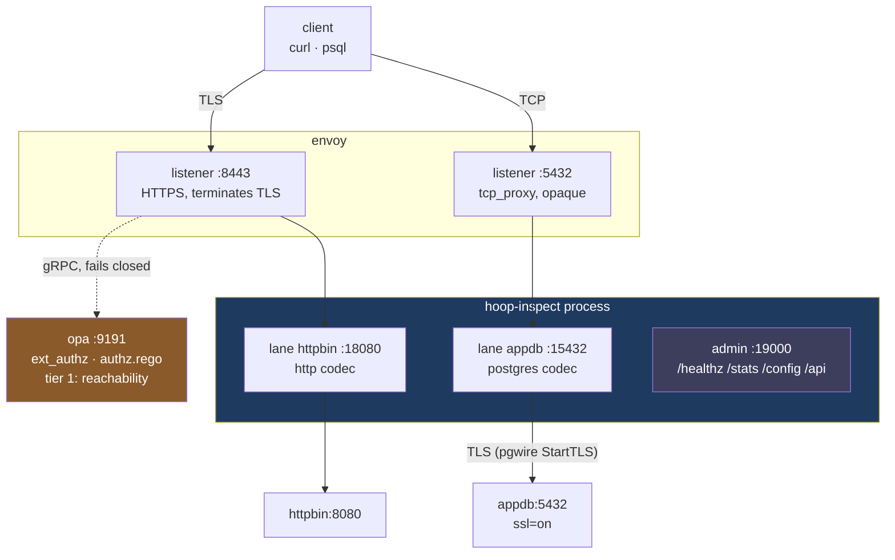
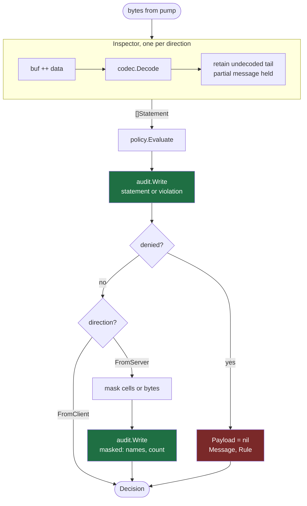
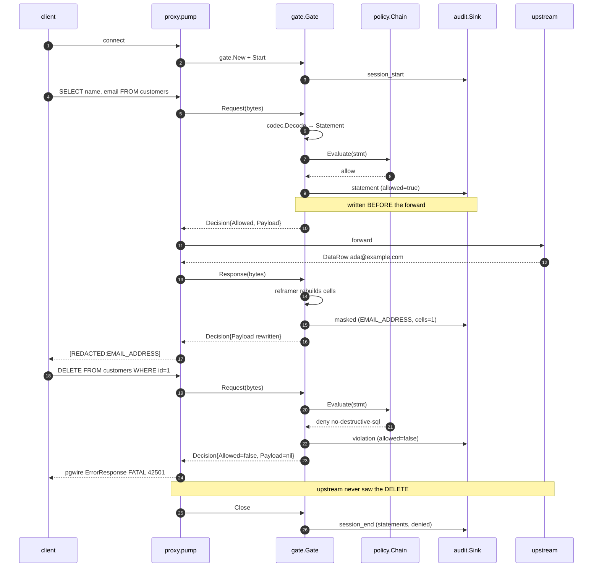
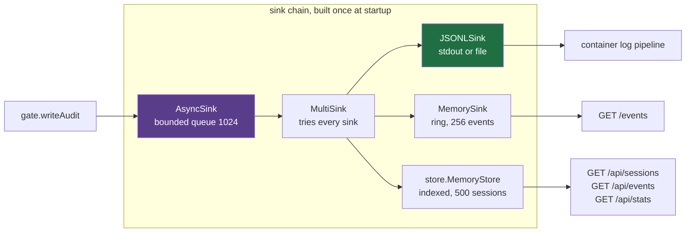

# How a request flows through hoop-inspect

- **Status:** Current as of 2026-07-30
- **Code:** [`hoopinspect/`](../hoopinspect), [`deploy/docker-compose/envoy-poc/`](../deploy/docker-compose/envoy-poc)
- **Run it:** [Running the whole thing](#running-the-whole-thing), below

This traces one connection from the client through Envoy, through the
hoop-inspect sidecar, to the upstream and back. Read it to find out where a
policy denial happens, why postgres masking takes a different path from HTTP
masking, and which knob in `config.yaml` controls which line of code.

Every command below runs against the compose stack in
[`deploy/docker-compose/envoy-poc/`](../deploy/docker-compose/envoy-poc), and
every output is copied from a real run.

## Running the whole thing

Install `docker`, `curl`, `openssl` and `python3`. Then:

```bash
cd deploy/docker-compose/envoy-poc
./run.sh          # cert, sidecar image, compose up. First run takes a minute.
./demo.sh         # walks every lane and prints the audit trail
```

`run.sh` mints a self-signed cert for Envoy, builds `hoop-inspect:local` from
`../../../hoopinspect`, and brings up six containers. No control-plane
database, no API calls: the sidecar reads one YAML file.

```bash
./run.sh --rebuild   # after changing the hoopinspect library
./run.sh down        # tear down, including volumes
```

### Ports

| Port | Serves | Reach it from |
|---|---|---|
| 8443 | Envoy HTTPS → httpbin lane | host |
| 5433 | Envoy TCP → appdb lane | host |
| 19000 | sidecar admin: health, stats, config, audit | host |
| 9901 | Envoy admin | host |

Inside the compose network that postgres listener is `envoy:5432`. The host
publishes it on 5433, because a laptop usually has something on 5432 already.
That is why `demo.sh` runs psql from the `client` container against port 5432
while a host-side psql would use 5433.

### Check it came up

```bash
curl -s localhost:19000/healthz                  # ok
curl -s localhost:19000/config | python3 -m json.tool
```

### Walk the tiers by hand

`demo.sh` runs all of this in order. Run the pieces yourself to see one thing
at a time.

**Tier 1, reachability.** OPA answers who reaches httpbin, and nothing about
the request beyond that.

```bash
curl -sk https://localhost:8443/json -H 'X-Hoop-User: alice' -o /dev/null -w '%{http_code}\n'
curl -sk https://localhost:8443/json -H 'X-Hoop-User: bob'   -o /dev/null -w '%{http_code}\n'
curl -sk https://localhost:8443/json -o /dev/null -w '%{http_code}\n'
```

```
200     alice is granted httpbin
403     bob is not
401     no identity header at all
```

**Tier 2, postgres.** Set a shell alias first, since every psql line reuses it:

```bash
PG="docker compose exec -T client env PGPASSWORD=apppass PGSSLMODE=disable \
  psql -h envoy -p 5432 -U appuser -d appdb"
```

A destructive statement never reaches the database:

```bash
$PG -c 'DELETE FROM customers WHERE id = 1;'
```

```
FATAL:  destructive statements are not permitted on appdb
```

That is a real pgwire `ErrorResponse` carrying the message an operator wrote in
`config.yaml`, so the developer reads it in psql instead of watching a socket
drop. Envoy forwarded the same bytes as opaque TCP and consulted nobody.

A national id in the query text gets the same treatment, from the `pii` rule
both lanes inherit:

```bash
$PG -tAc "SELECT name FROM customers WHERE cpf = '111.444.777-35';"
```

```
FATAL:  do not put a taxpayer id in a query; it lands in the database's own logs
```

Masking rewrites the result set coming back:

```bash
$PG -c 'SELECT name, email, ssn, iban FROM customers LIMIT 2;'
```

```
     name     |          email           |     ssn     |          iban
--------------+--------------------------+-------------+------------------------
 Ada Lovelace | [REDACTED:EMAIL_ADDRESS] | ***-**-6789 | ******************5432
 Grace Hopper | [REDACTED:EMAIL_ADDRESS] | ***-**-4321 | ******************3000
```

**Tier 2, HTTP.** Two request denials and one response denial:

```bash
curl -sk https://localhost:8443/admin/users -H 'X-Hoop-User: alice' -w '\n%{http_code}\n'
curl -sk https://localhost:8443/anything/users/12345/orders/98765 \
     -H 'X-Hoop-User: alice' -w '\n%{http_code}\n'
curl -sk https://localhost:8443/status/503 -H 'X-Hoop-User: alice' -w '\n%{http_code}\n'
```

All three return 403 with the rule's own message. The third is the one no
`ext_authz` configuration can produce: hoop-inspect read a 503 the upstream
already sent and suppressed it.

HTTP masking works on an opaque body:

```bash
curl -sk -X POST https://localhost:8443/anything -H 'X-Hoop-User: alice' \
  -H 'Content-Type: application/json' \
  -d '{"email":"ada@example.com","ssn":"555-12-3456","card":"4111111111111111",
       "cpf":"111.444.777-35","iban":"GB82WEST12345698765432"}'
```

```
"card":  "************1111"
"cpf":   "[REDACTED:BR_CPF]"
"email": "[REDACTED:EMAIL_ADDRESS]"
"iban":  "******************5432"
"ssn":   "***-**-3456"
```

### Read the evidence

```bash
curl -s localhost:19000/stats | python3 -m json.tool
```

```json
{"listeners": [
  {"name": "appdb",   "addr": "[::]:15432", "active": 0, "total": 18, "denied": 7},
  {"name": "httpbin", "addr": "[::]:18080", "active": 0, "total": 16, "denied": 7}
], "version": "poc"}
```

```bash
curl -s 'localhost:19000/api/sessions?limit=1' | python3 -m json.tool
docker compose logs hoop-inspect | ./hoopinspect/read-audit.py
```

A session row carries the counts a list view needs without opening every event:

```json
{"id": "45edf2c8…", "principal": "anonymous", "protocol": "http",
 "connection": "httpbin", "duration_ms": 5003,
 "statement_count": 2, "denied_count": 0, "masked_count": 2, "verdict": "clean"}
```

### When something looks wrong

| Symptom | Check |
|---|---|
| `demo.sh` exits "not healthy" | `docker compose ps`, then `docker compose logs hoop-inspect` |
| A rule you wrote never fires | `curl -s localhost:19000/config` and read the lane's resolved `rules` |
| Masking leaves a value alone | The detector may refuse it. Add a column rule, or a pattern rule for a placeholder. |
| The sidecar refuses to start | It prints every config problem at once, each naming its lane |
| Changed the library, nothing moved | `./run.sh --rebuild` |
| psql says SSL is required | Set `PGSSLMODE=disable`. Nothing terminates TLS on that lane. |

## The two tiers

Envoy owns TLS and the network path. OPA answers reachability. hoop-inspect
reads the payload.



Envoy calls OPA on the HTTPS lane only. The postgres lane has no filter to
attach a policy hook to, so those bytes reach the sidecar unexamined.

The POC stack runs no hoop gateway and no hoop agent. The sidecar carries
tier 2 alone: the `hoopinspect` library running as a process.

Envoy sees less on each lane going down the table.

| Lane | Envoy port | Envoy sees | OPA consulted |
|---|---|---|---|
| HTTPS → httpbin | 8443 | method, path, headers, bounded body | yes, `ext_authz` |
| postgres → appdb | 5433 | a byte count | no, it has no pgwire parser |

On HTTP, `ext_authz` handles request-side authorization well, and claiming
otherwise loses a technical review. The gap sits elsewhere: `ext_authz` decides
before Envoy calls the upstream, so no ext_authz configuration can read a
response status or a response body. On postgres the gap is wider. Envoy
forwards bytes it cannot parse, so OPA never receives a statement to judge.

## One process, one lane per Envoy cluster

`hoop-inspect` serves one listener per Envoy cluster. Each listener resolves its
own rules, its own masking and its own OPA endpoint.

```
envoy :8443 ──cluster hoop_inspect_http──> :18080  lane "httpbin"   http
envoy :5432 ──cluster hoop_inspect_pg────> :15432  lane "appdb"     postgres
                                                   └─ one process
```

The top-level `policy:` and `mask:` blocks in `config.yaml` set defaults. A
listener overrides them:

| Field | Merge | Reason |
|---|---|---|
| `policy.rules` | concatenate, listener first | Every rule denies and the first match wins, so concatenation cannot change the allow/deny outcome. Order picks which message the user reads. |
| `policy.opa` | replace | One lane has one decision endpoint. |
| `policy.enforce` | replace | A lane rolling out behind an enforcing default has to be able to say observe-only. |
| `mask` | replace | A rule owns an entity type. Concatenating two lists leaves two rules competing for one entity. |

`sidecar.buildLanes` resolves the merge once at startup and reports every broken
lane in one run. Ask the running process what it resolved:

```bash
curl -s localhost:19000/config | python3 -m json.tool
```

```json
{"lanes": [
  {"name": "appdb", "protocol": "postgres", "enforcing": true,
   "rules": ["no-destructive-sql", "no-cpf-in-query"], "masking": true},
  {"name": "httpbin", "protocol": "http", "enforcing": true,
   "rules": ["no-admin-api", "no-internal-ids", "no-upstream-5xx",
             "no-cpf-in-query"], "masking": true}
]}
```

Both lanes inherited `no-cpf-in-query` from the top level. Neither inherited the
other's rules. Reading `config.yaml` alone will not tell you that, which is why
the endpoint exists.

## Inside one connection

`proxy.Server.handle` accepts a socket, builds per-connection state, and starts
two goroutines that pump in opposite directions through one Gate.

```
accept
  ├─ session.New(proto, Identity{PeerAddr})
  ├─ gate.New(sess, cfg)   two Inspectors, one per direction
  ├─ g.Start(ctx)          records the session even if it issues no statement
  ├─ dialUpstream()
  │
  ├─ go pump(client → upstream, FromClient) ─┐
  └─ go pump(upstream → client, FromServer) ─┘  first to finish closes the peer
```

Two Inspectors, because a codec reassembles messages across reads. Feeding both
halves of a duplex stream into one reassembly buffer corrupts both.

`pump` reads 32 KiB at a time and hands every chunk to the Gate before anything
reaches the far side:

```
src.Read(buf) ──> n bytes
      ↓
d := g.Request(ctx, buf[:n])        or g.Response for FromServer
      ↓
├─ d.Allowed == false ─→ DenyWriter.Deny(proto, msg) ─→ write frame ─→ return
│                        pgwire 'E' FATAL 42501  |  HTTP 403 + X-Hoop-Denied
│                        always to the CLIENT, whichever direction denied
│
└─ d.Allowed == true  ─→ dst.Write(d.Payload)
```

A re-framing codec holds rows back until their result set ends, so `pump`
defers a `FlushResponse` on the server direction. Skipping that flush drops the
tail of a client's output, and the user reads it as a truncated result rather
than as a masking bug.

## Inside the Gate

`gate.inspect` runs four steps per chunk, and the order carries weight.



Auditing before the forward costs a write on the hot path. It buys the property
that a crash between the two cannot lose the record of the statement that caused
it. Reverse the order and you lose exactly the row you need.

`Decision.Payload` aliases the input when nothing changed, so a clean payload
allocates nothing.

## Inside the Inspector

A codec registers a factory, not an instance. Two connections sharing one
stateful codec would corrupt each other's reassembly buffer, and one tenant's
SQL would surface in another tenant's audit trail.

```
                  hoopinspect.Register(factory)   from codec init()
                            ↓
 hoopinspect.New(Postgres) ─┴─> Inspector{codec, buf, maxBuffer 8 MiB}
                                     │
                                     ↓ codec.Decode
   ┌─── codec/postgres ──────────────────────────────────┐
   │  skipHandshake()   startup packet, SSLRequest        │
   │  tag 'Q' Query ──> splitSimpleQuery()                │
   │  tag 'P' Parse ──> parseMessage()                    │
   │  everything else → skip by length                    │
   └──────────────────────┬───────────────────────────────┘
                          ↓
                ClassifySQL(text)   strips comments and string
                          │         literals first
                          ↓
   Statement{Protocol, Direction, Text, Operation, Tables,
             Database, HTTP *HTTPDetail, Metadata}
```

Two details in that path decide real verdicts.

`splitSimpleQuery` splits on semicolons, because `SELECT 1; DROP TABLE users`
arrives as one `Q` message. A decoder that classified by leading verb would
report a harmless select and wave the DROP through.

`ClassifySQL` strips comments and string literals before it looks for a verb, so
`SELECT 'DROP TABLE customers'` classifies as `select`. Prefer `type: operation`
over `deny_words_list` for that reason: the word list denies the harmless one.

## Policy

Two evaluators compose through `policy.Chain`, local rules first, so a
statement the local set already forbids never costs a network round trip.

```
Statement ──> policy.Chain{ Rules, OPAClient }
                   │           │
                   │           └─> POST /v1/data/…
                   │                {"input":{protocol, operation, tables,
                   │                          http{…}, context{user}}}
                   │                fails closed by default
                   ↓
             first match wins
             deny_words_list · pattern_match · operation · table
             http_resource · http_status · pii
```

An HTTP rule never matches a SQL statement, so one mixed rule set cannot deny
the wrong protocol.

The `pii` rule type dispatches at the rule-set level rather than per rule,
because the Scanner belongs to `Rules` and not to any single `Rule`.

Both evaluators fail closed. An unreachable OPA, a 500, or an undefined decision
denies. Set `fail_open: true` where availability outranks enforcement.

## Masking, and why postgres needed a second mechanism

Masking runs on responses only. Rewriting a request would change the statement
the upstream executes, which is a correctness change wearing a privacy label.

The gate picks a mechanism per protocol:

```
FromServer bytes
   ↓
├─ codec implements Reframer? ──> maskByReframing()
│                                  codec rebuilds every frame around
│                                  the new values
│
└─ substitutionSafe(proto)?   ──> maskBySubstitution()
                                   rewrite in place, then correct
                                   Content-Length
```

HTTP declares its body length in a header, so the gate substitutes bytes and
calls `retagContentLength`. Leave that header stale and the client reads exactly
the old count and stops mid-document, which looks like a corrupt upstream.

Postgres length-prefixes every row and every column. Substituting
`ada@example.com` (15 bytes) with `[REDACTED:EMAIL_ADDRESS]` (24 bytes)
desynchronizes psql on the next message, and the user sees "lost synchronization
with server". The postgres codec implements `Reframer` and rebuilds the
`DataRow` frames around the masked values instead
(`hoopinspect/codec/postgres/rewrite.go`).

`gate.MaskSupported` asks the codec whether it can carry masking rather than
listing protocols by name. A codec offering neither mechanism gets its `mask`
section refused at startup. Accepting a mask config that can never fire is the
failure that ends with an unmasked SSN in a screenshot.

## Where alcatraz plugs in

The root module ships zero dependencies. A detection engine worth having carries
recognizers for dozens of national identifier formats, so it lives in a nested
module behind two interfaces the root already declares.

```
                  ┌─ mask.Detector    { Entities(), Find(entity, data) }
alcatraz.Detector ┤                        ↓ response masking
  (one value)     └─ policy.Scanner   { ScanText(text) []string }
                                           ↓ request guardrails
```

```
hoopinspect        (0 deps) ──declares interfaces──┐
config/yaml        (1 dep)  gopkg.in/yaml.v3       │
pii/alcatraz       (2 deps) ───────────────────────┘ implements both
cmd                         ──> sidecar.Main(version, det, yaml.Load)
```

One binary ships: `hoop-inspect`, built from the nested `cmd` module, which is
the only place the plugin dependencies are linked. The zero-dependency claim
covers the library, and anyone embedding `hoopinspect` in their own process
still pays no dependency cost.

`ScanText` returns entity names and never values. A denial travels into an audit
record, and a message quoting the identifier it denied has published that
identifier.

## Two kinds of masking rule

The postgres lane in `config.yaml` uses both, and the contrast explains when to
reach for each.

```yaml
mask:
  rules:
    - {name: ssn-column, columns: [ssn], strategy: partial, keep_last: 4}
    - {name: emails, entity: EMAIL_ADDRESS, strategy: redact}
```

A **column rule** masks by position. It works only where the protocol names its
values, and there it beats detection outright, because the column does not care
what the value looks like.

An **entity rule** masks by detection, and it applies anywhere, including inside
an opaque HTTP body.

The seeded `ssn` column holds `123-45-6789`, and alcatraz refuses it: the
detector rejects sequential digit runs as obvious test fixtures. The entity
rule skips that cell and the column rule masks it anyway.

Both lanes see the same value and disagree, which makes the difference
observable:

```
postgres  SELECT ssn FROM customers   →  ***-**-6789   column rule caught it
HTTP      POST {"x":"123-45-6789"}    →  123-45-6789   no detection, no column
```

A validating detector cuts false positives on ordinary numeric ids and declines
the placeholders. A column rule covers the gap wherever the protocol gives you a
name to key on. On an opaque HTTP body it gives you nothing, so add a pattern
rule there if placeholders matter.

## Naming your entities

`pii.entities` is required, and `config.yaml` lists five of the 45 alcatraz
supports. Turning on every recognizer rewrites ordinary numeric columns:

```
{"order_id":457555462,"customer_id":123456781}
  → both masked as US_SSN
```

Nine digits in a legal range is a valid SSN as far as any detector can tell,
because SSNs carry no checksum. Measured over random nine-digit business ids,
`US_SSN` fires on roughly a third. `alcatraz.Noisy` records the offenders with
their rates, and `AllEntities()` exists for a caller who has read it.

Card, CPF and IBAN carry real checksums (Luhn, mod-11, ISO 7064), so those three
leave lookalike ids alone.

## What the config refuses at startup

Four checks, all reported together rather than one per restart:

| Config | Result |
|---|---|
| `mask.enabled` on a codec that can carry neither mechanism | refused, naming the lane |
| A `pii` rule naming an entity absent from `pii.entities` | refused, naming the entity |
| A key typo, in YAML or JSON | refused by `DisallowUnknownFields` |
| A bad regex in any lane's rules | refused, naming the lane |

The `pii` check matters more than it looks. `matchesPII` intersects what the
scanner reported with what the rule listed, so a rule naming an entity the
engine never looks for loads without error, evaluates without error, and
matches nothing. An operator then believes a guardrail is running when it
allows through everything they wrote it to stop.

## Config syntax

YAML and JSON both work, and the file extension picks the parser. The YAML path
transcodes to JSON and reuses the same decoder, so one schema serves both
syntaxes and `DisallowUnknownFields` still fires.

YAML earns its place through anchors, which let several lanes share one rule
block:

```yaml
x-readonly: &readonly
  - name: no-writes
    type: operation
    operations: [insert, update, delete, drop, truncate]
    message: this credential is read-only

listeners:
  - {name: replica-a, ..., policy: {rules: *readonly}}
  - {name: replica-b, ..., policy: {rules: *readonly}}
```

Keys starting `x-` drop before validation, so an anchor block does not need a
matching config field.

Check a change without starting anything:

```bash
cd hoopinspect/cmd && go run . -validate \
  -config ../../deploy/docker-compose/envoy-poc/hoopinspect/config.yaml
```

```
config OK: 2 listener(s)
  appdb            postgres  enforcing 2 rule(s) + masking
  httpbin          http      enforcing 4 rule(s) + masking
```

## Audit

Six event kinds, one write path, three sinks. This is the part a compliance
reviewer reads, so it is worth knowing exactly when each record appears and
what it costs.

### When each event fires



That sequence is copied from a real run. Two psql commands against the POC
produce exactly these records:

```
session_start
statement   select   SELECT name, email FROM customers LIMIT 1
masked      masked=EMAIL_ADDRESS  cells=1
session_end

session_start
violation   delete   DELETE FROM customers WHERE id=1   rule=no-destructive-sql
session_end
```

### The six kinds

| Kind | Fires | Carries |
|---|---|---|
| `session_start` | connection accepted | principal, protocol, connection |
| `statement` | each inspected statement | text, operation, tables, `allowed=true` |
| `violation` | a denied statement | same, plus `rule` and `message` |
| `masked` | response data rewritten | entity names and a count, never values |
| `error` | transport or upstream failure | the error text |
| `session_end` | connection closed | duration, statement and denial totals |

A denial writes `violation` instead of `statement`, and the duplication is
deliberate: a security team selects `kind=violation` without scanning every
statement anyone ever ran.

`session_start` fires even for a connection that issues nothing, so an
abandoned session leaves a trace. Without it, a client that connects and
disappears is invisible.

### Where the events go



`buildAudit` puts the JSONL sink first, and `MultiSink` attempts every sink
regardless of what an earlier one returned. The durable record therefore
survives a failure in the in-memory ring or the query store.

`AsyncSink` wraps the whole chain, so a slow disk queues rather than blocking
the user's query. The queue is bounded, and a full queue returns
`ErrQueueFull` rather than growing without limit. Two knobs decide what that
error means:

| Setting | A dropped audit write | Use when |
|---|---|---|
| `fail_closed: false` (default) | statement proceeds, error logged | availability outranks the trail |
| `fail_closed: true` | statement denied, "audit trail unavailable" | the trail is a compliance requirement |

The default is the uncomfortable one and it is chosen on purpose. Flip it where
proving who did what matters more than staying up.

### Ordering, and why it costs a write

`gate.inspect` writes the audit record before returning the Decision that lets
`pump` forward the bytes. A crash between those two points loses nothing,
because the record already left. Reverse the order and the one statement you
lose is the one that crashed the process, which is the record an incident
review needs most.

The same ordering is why `session_start` precedes the upstream dial. A
connection that fails to reach the database still leaves `session_start` and an
`error`, so a reviewer can tell a rejected connection from one that never
happened.

### Reading it back

```bash
curl -s localhost:19000/api/sessions | python3 -m json.tool
curl -s localhost:19000/stats        | python3 -m json.tool
docker compose logs hoop-inspect | ./hoopinspect/read-audit.py
```

`read-audit.py` asserts the trail contains no value that masking removed.
Recording a masked value in the clear has un-masked it, and the check catches a
regression in the masking path from the audit side.

Both in-memory sinks drop their oldest entry when full and report the drop
count, so a reader can tell a partial window from a complete one. The JSONL
stream stays the record of truth.

The admin listener binds separately from the data path. It serves a read
interface to every statement every user ran, so it belongs behind whatever
already gates audit access, and the data ports must never serve it.

## Identity

Every session in the POC records `principal: anonymous`. The plumbing runs end
to end and nobody fills it.

`session.Identity` carries a Subject, and `proxy.Config.IdentityFn` is the seam a
deployment fills from a verified JWT, an mTLS peer cert or a credential token
(`hoopinspect/proxy/proxy.go:86-93`). A listener exposes it as
`identity_header`, and the current implementation contributes only the peer
address: extracting a header there would mean buffering ahead of the relay, and
identity for HTTP belongs in the gate where the request is already parsed.

Filling it is one function rather than an architecture change, and `X-Hoop-User`
already rides on every request that reaches the sidecar. Until someone writes
that function, a Rego policy keyed on `input.context.user` reads `anonymous` from
every lane.

## Known limits

- **Two codecs ship: postgres and http.** MySQL, MSSQL and MongoDB came out to
  keep the surface to what the stack exercises end to end. Adding one means a
  new `codec/<name>` package and nothing else.
- **`Tables` is best effort.** A lexer, not a SQL grammar, which is the ceiling
  Envoy's own docs acknowledge for `postgres_proxy`. Empty means "could not
  determine" and never "touches nothing". Set `require_table_match: true` on
  rules protecting something critical and accept the false positives.
- **PII detection is neither sound nor complete.** A checksum-verified
  identifier holds up. Everything else is a pattern. Detecting a name column
  needs NER, which this module does not wire, and a caller can split a value
  across two responses. Masking raises the cost of accidental exposure without
  replacing "do not grant access to that table".
- **HTTP/1.x only for stream decoding.** HTTP/2 and HTTP/3 framing belongs to
  whatever terminated the connection, and by then it holds a `*http.Request`, so
  call `InspectRequest`.
- **Plaintext only.** A client negotiating TLS to the server leaves nothing to
  parse. Termination stays the caller's problem, which in this topology means
  Envoy's.
- **Statements are not transactions.** Each one gets its own verdict, and no
  cross-statement session state exists.
- **No SSH lane.** hoopinspect ships no SSH codec. The argument that lane made
  still holds: Envoy ships no SSH filter at any fidelity, so every service
  reached over SSH sits unpoliced by the Envoy and OPA layer.

## What the POC demonstrates

1. hoop deploys behind Envoy as a plain upstream with zero Envoy extensions. No
   ext_proc, no WASM, no custom filter. Compose config and one YAML file.
2. Reachability policy stays in OPA. hoop does not ask to own tier 1.
3. The tier-2 gap follows from how each layer is built. Envoy forwards postgres
   bytes it cannot parse, and `ext_authz` decides before the upstream runs, so
   the response stays out of its reach. hoop-inspect reads both directions,
   denies on content, masks in both, and records the statement whichever way
   the verdict goes.
