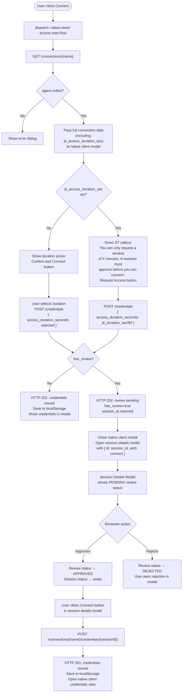

# POC: JIT Access Request Integration with Native Client Credentials

**Status:** Proof of Concept
**Branch:** `claude/review-branch-analysis-CDjdL`

---

## Overview

This document describes the investigation, decisions, and implementation of two UX improvements that integrate the **Just-In-Time (JIT) Access Request** feature with the **Native Client Credentials** flow.

### Problems Addressed

1. **Time-select confusion with JIT rules** — when a connection has a JIT access request rule, the admin has already defined the allowed access window. Showing the user a duration picker is misleading because the user cannot freely choose a different window.

2. **No feedback after requesting credentials with review** — when `POST /credentials` returned `has_review: true`, the modal was silently closed and the session data was loaded into state but nothing was shown to the user. There was no visual confirmation that the request was submitted and was pending review.

---

## System Components

| Layer | Component | Role |
|---|---|---|
| Backend (Go) | `gateway/api/connections/connections.go` | Serves `GET /connections/{name}` |
| Backend (Go) | `gateway/api/connections/connection_credentials.go` | Handles credential requests and review creation |
| Backend (Go) | `gateway/models/access_request_rules.go` | AccessRequestRule model and queries |
| Backend (Go) | `gateway/api/openapi/types.go` | API contract types |
| Database | `private.access_request_rules` | JIT rule definitions |
| Database | `private.connection_credentials` | Issued credentials with session linkage |
| Frontend (ClojureScript) | `native_client_access/events.cljs` | Re-frame events for the credentials flow |
| Frontend (ClojureScript) | `native_client_access/main.cljs` | Native client modal UI component |
| Frontend (ClojureScript) | `audit/views/session_details.cljs` | Session details modal used for review feedback |

---

## Investigation Notes

### How Access Request Rules Work

`AccessRequestRule` is stored in `private.access_request_rules`. Each rule has:
- `access_type`: `"jit"` (time-based) or `"command"` (content-based)
- `connection_names`: array of connection names this rule applies to
- `access_max_duration`: maximum (and intended fixed) duration in seconds for a JIT session
- `reviewers_groups`: which groups can approve
- `approval_required_groups`: which groups require approval to request access
- `force_approval_groups`: which groups can bypass reviewers

When `POST /connections/{name}/credentials` is called, `checkConnectionRequiresReview()` queries for a `jit` rule matching the connection. If found (or if the connection has legacy OSS reviewers), a `Review` record is created and the endpoint returns HTTP 202 with `has_review: true`, `session_id`, and `review_id` — but no credentials.

### How Credentials Are Issued

There are two paths:

**Path A (no review):** `POST /connections/{name}/credentials` → HTTP 201 with credentials directly.

**Path B (review required):**
1. `POST /connections/{name}/credentials` → HTTP 202, `has_review: true`
2. Reviewer approves the review
3. `POST /connections/{name}/credentials/{sessionID}` → HTTP 201 with credentials

For Path B the `AccessDurationSec` stored in the review comes from `req.AccessDurationSec` (what the user sent), **not** from the rule's `AccessMaxDuration`. This is a design gap noted below.

### Key Discovery: `access_max_duration` Lives on the Rule, Not the Connection Response

The `GET /connections/{name}` endpoint did not previously expose whether a JIT rule existed for a connection. The `Connection` model has its own `access_max_duration` field (for OSS-style connection-level config), which is separate from the enterprise `AccessRequestRule.access_max_duration`.

To know if JIT is active before making a credentials request, the frontend needed the rule's duration. Since the connection GET handler already uses `storagev2.ParseContext(c)` (which carries `OrgID`), the fix was to query the rule there and attach it as `jit_access_duration_sec` in the response.

### Why the Frontend Needs to Know Before the Credentials Request

The duration picker in the native client modal (`configure-session-view`) is rendered **before** the `POST /credentials` call. If we only discover JIT is active from the 202 response, we've already let the user select a misleading duration.

The solution is to surface `jit_access_duration_sec` during the agent status check (which fetches `GET /connections/{name}`), so the modal can be rendered with the correct UI from the start.

---

## Architecture: Complete JIT Native Client Flow



---

## Changes Made

### 1. DB Migration fix (`000065`)

`ADD CONSTRAINT IF NOT EXISTS` is not valid PostgreSQL syntax. Removed the `IF NOT EXISTS` guard since migrations run exactly once.

```sql
-- Before (broken)
ALTER TABLE connection_credentials ADD CONSTRAINT IF NOT EXISTS uq_credentials_session_id UNIQUE (org_id, session_id);

-- After
ALTER TABLE connection_credentials ADD CONSTRAINT uq_credentials_session_id UNIQUE (org_id, session_id);
```

### 2. Backend: Expose JIT duration on connection GET

**File:** `gateway/api/openapi/types.go`

Added field to `Connection`:
```go
// JitAccessDurationSec is the fixed access duration in seconds enforced by a JIT
// access request rule. When set, the user cannot choose a custom duration.
JitAccessDurationSec *int `json:"jit_access_duration_sec,omitempty" example:"1800"`
```

**File:** `gateway/api/connections/connections.go`

In the `Get` handler, after fetching the connection, query the JIT rule:
```go
apiConn := toOpenApi(conn)
if orgID, err := uuid.Parse(ctx.OrgID); err == nil {
    if rule, _ := models.GetAccessRequestRuleByResourceNameAndAccessType(
        models.DB, orgID, conn.Name, "jit",
    ); rule != nil {
        apiConn.JitAccessDurationSec = rule.AccessMaxDuration
    }
}
c.JSON(http.StatusOK, apiConn)
```

### 3. Frontend: Pass connection data to the modal

**File:** `native_client_access/events.cljs`

Changed `native-client-access->agent-status-check-success` to pass the full `response` map (instead of just `connection-name`) to `native-client-access-main/main`. The component already supported either a string or a map — `(:name response)` extracts the name.

### 4. Frontend: JIT notice in configure-session-view

**File:** `native_client_access/main.cljs`

`configure-session-view` now receives a `jit-duration-sec` argument. When non-nil:
- Subtitle changes to explain review is required
- The duration selector is replaced by a blue `Callout` with the fixed window
- The button label changes from "Confirm and Connect" to "Request Access"
- The dispatched duration is `(/ jit-duration-sec 60)` (converting seconds → minutes for the existing event contract)

### 5. Frontend: Open session details modal on review

**File:** `native_client_access/events.cljs`

When `has_review` is true in `native-client-access->request-success`, instead of just loading session data silently, now:
1. Closes the native client modal
2. After 100 ms opens the session details modal with `{:id session_id :verb "connect"}`
3. The session details modal loads the review status and shows the PENDING state with the "Connect" button that fires once approved

---

## Data Flow: State Involved

| Key in re-frame DB | What it holds |
|---|---|
| `:native-client-access :requesting-connections` | Set of connection names currently awaiting a credentials response |
| `:native-client-access :sessions {conn-name}` | Active credential data (also persisted to `localStorage`) |
| `:audit->session-details` | Session + review data shown in the session details modal |

---

## Known Limitations / Future Work

1. **Duration cap not enforced server-side** — `AccessMaxDuration` on the `AccessRequestRule` is currently surfaced to the frontend as a fixed value, but the backend does not enforce that `req.AccessDurationSec <= rule.AccessMaxDuration`. A future improvement should add this validation in `CreateConnectionCredentials`.

2. **No automatic polling after review approval** — the session details modal does not auto-refresh when the review is approved. The user must keep the modal open; reviewers can approve asynchronously (e.g. via Slack notification). A polling mechanism or webhook push would improve the UX.

3. **`jit_access_duration_sec` on all connection GETs** — the JIT rule query is now executed on every `GET /connections/{name}` call, including admin pages that don't need it. This is a minor N+1 concern; for now the query is indexed and fast, but it could be moved behind a query parameter or a dedicated endpoint.

4. **OSS reviewers vs enterprise JIT rules** — the code handles both legacy `conn.Reviewers` (OSS) and enterprise `AccessRequestRule`. The `jit_access_duration_sec` field is only populated for enterprise rules. OSS-style reviewers still show the duration picker, which may be confusing. Unifying the two paths is future work.
