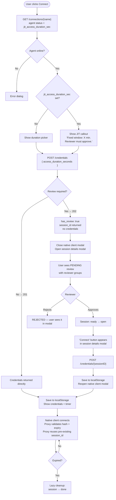

# POC: Session Creation and JIT Review on Native Client Credentials

**Status:** Proof of Concept
**Branch:** `claude/review-branch-analysis-CDjdL`

---

## Context and Problem

The native client credentials endpoint (`POST /connections/{name}/credentials`) and the credential validation on each proxy daemon already existed before this branch. A native client (DBeaver, `psql`, a local SSH client, etc.) could already request short-lived credentials and connect directly.

Two gaps remained:

### Gap 1 — Sessions were created too late

Before this branch, no session record was created at credential request time. Sessions were only created **proxy-side**, when a native client actually opened a connection and the proxy daemon processed incoming traffic. This meant:

- There was no audit trail for the access request itself — only for the moment the client connected.
- There was no hook point to require approval *before* issuing credentials.
- If a connection had `Reviewers` configured, the endpoint simply returned HTTP 400 — reviews were unsupported for native clients.

### Gap 2 — No JIT review in the credential flow

The JIT access request system (`AccessRequestRule` with `access_type = "jit"`) was already used for CLI/runbook sessions. Native client credential requests had no equivalent — there was no way to require reviewer approval before credentials were released.

### What this branch does

1. Creates a **session record upfront**, at `POST /credentials` time, before any credential is issued.
2. Stores `session_id` on the credential itself, so the proxy daemons reuse the pre-existing session instead of creating a new one.
3. Adds a **JIT review gate**: if a rule matches the connection, the endpoint returns HTTP 202 with no credentials; a new `POST /credentials/{sessionID}` endpoint resumes the request after approval.
4. Adds a **frontend review flow**: the session details modal surfaces the pending review state and a "Connect" button that triggers the resume call once approved.
5. Adds the **JIT notice in the native client modal**: when a connection has a fixed JIT window, the duration picker is replaced by an informational callout.

---

## Before vs After

| | Before | After |
|---|---|---|
| Session creation | Proxy-side, on first client command | At credential request time (`POST /credentials`) |
| `session_id` on credential | Not present | Stored, used by proxy to reuse session |
| Reviewers on connection | Returns HTTP 400 | Supported — creates a Review record, returns 202 |
| JIT access rules | Not evaluated | Checked via `AccessRequestRule` table |
| Resume endpoint | Did not exist | `POST /credentials/{sessionID}` |
| Frontend: review pending | Not handled | Opens session details modal with review status |
| Frontend: duration picker | Always shown | Replaced by callout when JIT rule is active |

---

## Flow



---

## Session Lifecycle

The session record created at `POST /credentials` time goes through the following states:

```
POST /credentials (review required)
        │
        ▼
     "ready"  ──── reviewer approves ────►  "open"
                                               │
                                               │ native client connects and uses credentials
                                               │
                                               ▼
                                            "done"  ◄── expire_at reached (lazy cleanup)
```

Without review, the session goes directly to `"open"` when the credential is issued.

The proxy daemons no longer create sessions — they read `session_id` from the matched credential and carry it as context for the audit trail.

---

## What Triggers a Review

`checkConnectionRequiresReview()` is called on every `POST /credentials`. It checks in order:

1. **OSS reviewers** — `len(conn.Reviewers) > 0`
   Previously returned HTTP 400; now creates a review.
2. **Enterprise JIT rule** — `AccessRequestRule` where `access_type = "jit"` and `connection_names` contains the connection name.

If either condition is true, a `Review` record is created (status = PENDING) and HTTP 202 is returned.

---

## API

### `POST /connections/{nameOrID}/credentials`

**Request:**
```json
{ "access_duration_seconds": 1800 }
```

**201 — credentials issued directly:**
```json
{
  "id": "cred-uuid",
  "session_id": "sess-uuid",
  "connection_name": "my-postgres",
  "connection_subtype": "postgres",
  "has_review": false,
  "expire_at": "2025-08-25T13:30:00Z",
  "connection_credentials": {
    "hostname": "0.0.0.0",
    "port": "5432",
    "username": "pg_<32 hex chars>",
    "password": "hoop",
    "database_name": "postgres",
    "connection_string": "postgres://pg_<key>:hoop@0.0.0.0:5432/postgres?sslmode=require"
  }
}
```

**202 — review pending, no credentials:**
```json
{
  "session_id": "sess-uuid",
  "connection_name": "my-postgres",
  "connection_subtype": "postgres",
  "has_review": true,
  "review_id": "review-uuid",
  "expire_at": "2025-08-25T13:15:00Z"
}
```

---

### `POST /connections/{nameOrID}/credentials/{sessionID}` _(new)_

Resumes a credentials request after review approval.

| Status | Meaning |
|---|---|
| 201 | Credentials issued |
| 202 | Review still pending |
| 403 | Review was rejected |
| 410 | Session/credentials expired |

---

### `GET /connections/{nameOrID}` _(extended)_

Now includes `jit_access_duration_sec` (seconds) when a JIT rule exists for the connection. Used by the frontend to replace the duration picker with a fixed-window notice.

---

## Proxy Changes

Each proxy daemon was modified to extract `session_id` from the validated credential and carry it as the session context. Previously, proxies created a new session when a client connected; now they reuse the session that was created upfront at credential request time.

| Proxy | Change |
|---|---|
| `postgresproxy` | Reads `session_id` from credential context |
| `sshproxy` | Carries `session_id` in SSH connection extensions; sets duration from `expire_at` |
| `httpproxy` | Reads `session_id` from credential; negative auth cache (24h TTL) for invalid tokens |
| `ssmproxy` | Reads `session_id` for WebSocket session correlation |
| `rdp/irongw` + `broker/protocol_rdp` | Passes `session_id` through to the RDP broker |

---

## Audit Plugin Change

The audit plugin's `closeSession()` was modified to check `isCredentialOwnedSession()` before closing. If a session has an active (non-expired) credential linked to it, the plugin skips the close — the session lifecycle is owned by the credential expiry, not by the client disconnect.

Without this change, disconnecting a native client would close the session even though the credential was still valid and could be reused.

---

## Database Migration (`000065`)

```sql
ALTER TABLE connection_credentials ADD COLUMN IF NOT EXISTS session_id text;
ALTER TABLE connection_credentials ADD CONSTRAINT uq_credentials_session_id UNIQUE (org_id, session_id);
```

The unique constraint enforces one active credential per session.

**Note:** `ADD CONSTRAINT IF NOT EXISTS` is not valid PostgreSQL syntax. The `IF NOT EXISTS` guard was removed since migrations run exactly once.

---

## Frontend Changes

### Native client modal (`native_client_access/main.cljs`)

- `configure-session-view` now receives `jit-duration-sec`. When set, the duration picker is replaced by a blue callout: _"This resource has just-in-time access review enabled. You can only request a window of **X minutes**. A reviewer must approve before you can connect."_ The button label changes to "Request Access".
- The `main` component extracts `jit_access_duration_sec` from the connection response map passed in from the agent status check.

### Events (`native_client_access/events.cljs`)

- `native-client-access->agent-status-check-success` now passes the full connection response (not just the name) to `main`, making `jit_access_duration_sec` available.
- `native-client-access->request-success` handles the `has_review` case: closes the native client modal and opens the session details modal with the returned `session_id`.
- `native-client-access->resume-credentials` calls `POST /credentials/{sessionID}` after approval.
- `native-client-access->resume-success` saves credentials to localStorage and reopens the native client credentials view.

### Session details (`audit/views/session_details.cljs`)

For sessions with `verb = "connect"`, a new section was added below the session metadata that renders one of three states:

| State | Display |
|---|---|
| Credentials expired | "Your credentials have expired." |
| Valid credentials in localStorage | "Credentials valid for X minutes." + "View credentials" button |
| Approved but no credentials yet | "Your access has been approved." + "Connect" button |

The "Connect" button dispatches `native-client-access->resume-credentials`.

---

## Known Limitations

1. **Duration cap not enforced server-side** — `access_max_duration` from the JIT rule is surfaced to the frontend as a fixed value, but the backend does not validate that `req.AccessDurationSec <= rule.AccessMaxDuration`. Needs server-side enforcement.

2. **No polling after review approval** — the session details modal does not auto-refresh. The user must keep the modal open or reopen it after the reviewer approves.

3. **`jit_access_duration_sec` queried on every `GET /connections/{name}`** — minor N+1 concern. Acceptable at this scale given the query is indexed.

4. **OSS reviewers and JIT rules differ in UX** — OSS `Connection.Reviewers` trigger a review but the frontend's JIT callout only shows when a `jit_access_duration_sec` is present (enterprise rule). The duration picker is shown for OSS reviewer flows.
