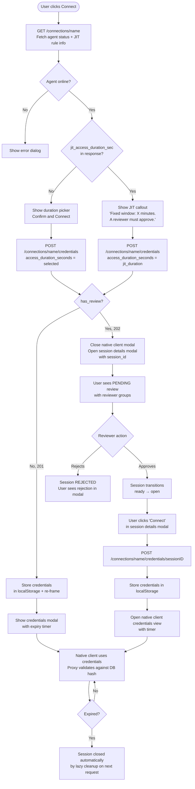

# POC: Native Client Credentials with JIT Review

**Status:** Proof of Concept
**Branch:** `claude/review-branch-analysis-CDjdL`

---

## Context and Goal

Before this feature, Hoop users could only connect to resources (databases, SSH servers, Kubernetes clusters, etc.) through the Hoop CLI or web terminal — both of which proxy traffic through the Hoop gateway. There was no way to obtain credentials that a **native client** (DBeaver, TablePlus, a local `psql`, etc.) could use directly.

The goal of this POC is to introduce a credential issuance system that:

1. Issues short-lived, per-session credentials for native clients.
2. Integrates with the existing review/approval system — a JIT access request rule can require human approval before credentials are released.
3. Tracks every credential request as an audited session, maintaining the audit trail Hoop already provides.
4. Exposes a full frontend flow: from clicking "Connect" to seeing the credentials (and waiting for review when required).

---

## High-Level Architecture

```
┌─────────────────────────────────────────────────────────────────┐
│                        User (Browser)                            │
│  1. clicks Connect   2. sees JIT notice     3. waits / connects │
└────────────┬────────────────┬─────────────────────┬─────────────┘
             │                │                     │
             ▼                ▼                     ▼
   ┌──────────────┐   ┌──────────────┐    ┌──────────────────────┐
   │  GET         │   │  POST        │    │  POST                │
   │  /connections│   │  /credentials│    │  /credentials        │
   │  /{name}     │   │              │    │  /{sessionID}        │
   └──────┬───────┘   └──────┬───────┘    └──────────┬───────────┘
          │                  │                        │
          │ jit_access_       │ 201 (direct)          │ 201 (after
          │ duration_sec      │ 202 (pending review)  │  approval)
          │                  │                        │
          ▼                  ▼                        ▼
   ┌──────────────────────────────────────────────────────────────┐
   │                  Gateway (Go)                                 │
   │  - Creates Session (audit trail)                             │
   │  - Checks JIT rule (AccessRequestRule table)                 │
   │  - Generates type-specific secret key                        │
   │  - Stores SHA256 hash of key                                 │
   │  - Creates Review record if required                         │
   └──────────────────────────────────────────────────────────────┘
             │                                        │
             ▼                                        ▼
   ┌──────────────────┐                   ┌───────────────────────┐
   │  connection_     │                   │  proxy daemons        │
   │  credentials     │                   │  (postgres, ssh, rdp, │
   │  table           │◄──── validates ───│  httpproxy, ssm)      │
   │  (hash, exp, sid)│                   └───────────────────────┘
   └──────────────────┘
```

---

## Investigation Notes

### Starting Point: What Already Existed

The codebase already had:

- **Review system** (`private.reviews` table, review groups, PENDING/APPROVED/REJECTED states)
- **AccessRequestRule** model (`private.access_request_rules`) for enterprise JIT rules — with `access_type`, `connection_names`, `reviewers_groups`, and `access_max_duration`
- **Session model** (`private.sessions`) tracking every CLI/web interaction with verb, status, user, and timestamps
- **Proxy daemons** for each protocol type (postgres, ssh, rdp, http-proxy, aws-ssm) that authenticate via the Hoop agent

What was missing: a way to issue temporary credentials that these proxy daemons could validate independently, without going through the full CLI flow.

### Core Problem: How to Authenticate a Native Client

Each proxy daemon needs to authenticate the connecting native client. The decision was to use a **short-lived random secret key** (32 bytes, hex-encoded), with a type prefix (e.g. `pg_`, `ssh_`, `rdp_`) for routing, hashed with SHA-256 before being stored. The plaintext key is returned once in the API response and never stored.

Each protocol injects the key differently:

| Protocol | How the key is used |
|---|---|
| PostgreSQL | As the **username** in the connection string |
| SSH | As the **password** in SSH auth |
| RDP | In a form POST body to `/rdpproxy/client` |
| HTTP Proxy / Kubernetes | As the **Authorization header** or `hoop_proxy_token` cookie |
| AWS SSM | The credential UUID is used as the AWS Access Key ID; the key (first 40 chars) as the Secret Access Key |

### Session–Credential Linkage

A key design question was: how does the audit system know that a native client session is active? The answer was to link `connection_credentials` to `sessions` via a new `session_id` column. This allows the audit plugin to skip closing a session when the native client disconnects — the session stays `open` until the credential expires.

A DB migration (`000065`) adds this column with a `UNIQUE (org_id, session_id)` constraint, enforcing exactly one active credential per session.

### JIT Review Integration

The existing review system was already in place but was wired only to CLI/runbook sessions. The integration here:

1. `checkConnectionRequiresReview()` is called on every `POST /credentials` — it checks both legacy `Connection.Reviewers` (OSS) and enterprise `AccessRequestRule` (JIT type).
2. If review is required, a `Review` record is created and HTTP 202 is returned with `has_review: true`, `session_id`, and `review_id` — but **no credentials**.
3. After approval, `POST /credentials/{sessionID}` is called to retrieve the actual credentials.

### What the Frontend Needed

Before this feature, the native client modal only handled an immediate credential response. Three gaps needed filling:

1. **The user could select any duration**, even when a JIT rule had already defined a fixed window. The fix: surface `jit_access_duration_sec` on `GET /connections/{name}` so the modal can show a notice instead of the picker.
2. **After a 202 response, nothing was shown.** The modal was closed silently. The fix: open the session details modal with the `session_id`, giving the user visibility into the pending review and the "Connect" button once approved.
3. **The session details modal needed a "Connect" button** for verb=`connect` sessions that are in `ready` state (approved but credentials not yet issued). This was wired to `native-client-access->resume-credentials`.

---

## Full Request Flow



---

## API Reference

### POST `/connections/{nameOrID}/credentials`

Requests credentials for a connection. Creates an audited session.

**Request body:**
```json
{ "access_duration_seconds": 1800 }
```

**Response 201** — credentials issued immediately:
```json
{
  "id": "cred-uuid",
  "session_id": "sess-uuid",
  "connection_name": "my-postgres",
  "connection_type": "database",
  "connection_subtype": "postgres",
  "has_review": false,
  "expire_at": "2025-08-25T13:30:00Z",
  "created_at": "2025-08-25T13:00:00Z",
  "connection_credentials": {
    "hostname": "0.0.0.0",
    "port": "5432",
    "username": "pg_<32 random hex chars>",
    "password": "hoop",
    "database_name": "postgres",
    "connection_string": "postgres://pg_<key>:hoop@0.0.0.0:5432/postgres?sslmode=require"
  }
}
```

**Response 202** — review required, no credentials yet:
```json
{
  "session_id": "sess-uuid",
  "connection_name": "my-postgres",
  "connection_type": "database",
  "connection_subtype": "postgres",
  "has_review": true,
  "review_id": "review-uuid",
  "expire_at": "2025-08-25T13:15:00Z",
  "created_at": "2025-08-25T13:00:00Z"
}
```

---

### POST `/connections/{nameOrID}/credentials/{sessionID}`

Resumes a credentials request after review approval.

**Response 201** — same shape as above with credentials present.

**Response 202** — review still pending.

**Response 403** — review was rejected.

**Response 410** — credentials have expired.

---

### GET `/connections/{nameOrID}` (extended)

Now includes `jit_access_duration_sec` when a JIT access request rule exists for the connection.

```json
{
  "name": "my-postgres",
  "jit_access_duration_sec": 1800,
  ...
}
```

---

## Credential Shapes by Protocol

| Protocol | Field | Secret key placement |
|---|---|---|
| PostgreSQL | `username` | `pg_<hex>` — used as postgres username |
| SSH | `password` | raw secret key — used as SSH password |
| RDP | `username` | raw secret key — posted to `/rdpproxy/client` |
| HTTP Proxy | `proxy_token` | raw secret key — `Authorization: Bearer <key>` or cookie |
| Kubernetes | `proxy_token` | same as HTTP Proxy |
| AWS SSM | `aws_access_key_id` / `aws_secret_access_key` | credential UUID → access key ID; key[:40] → secret |

---

## Components Changed

### Backend

#### `gateway/api/connections/connection_credentials.go`
The main handler file. Two new handler functions:

- **`CreateConnectionCredentials`** — validates the connection, creates a session for the audit trail, calls `checkConnectionRequiresReview()`, generates and stores a hashed secret key, returns 201 or 202.
- **`ResumeConnectionCredentials`** — validates that the session belongs to the caller, checks review status, re-issues or rotates credentials for an already-approved session.
- **`checkConnectionRequiresReview()`** — checks both OSS reviewers and enterprise JIT rules. Returns the matched `AccessRequestRule` if found.
- **`createConnectionCredentialsReview()`** — creates the `Review` record linked to the session.
- **`generateSecretKey()`** — generates a type-prefixed random key and its SHA-256 hash.
- **`buildConnectionCredentialsResponse()`** — assembles the type-specific credential object from the raw key.

#### `gateway/models/connection_credentials.go`
- New model: `ConnectionCredentials` — stores `id`, `org_id`, `connection_type`, `secret_key_hash`, `session_id`, `expire_at`.
- **`GetValidConnectionCredentialsBySecretKey()`** — used by all proxy daemons to validate an incoming secret key. Checks type, hash match, and expiry.
- **`CloseExpiredCredentialSessions()`** — lazy cleanup: finds all credentials where `expire_at < NOW()` and `session_id IS NOT NULL`, sets the linked session to `done`, clears `session_id`.

#### `gateway/models/session.go`
- **`SetSessionCredentialsExpireAt()`** — stores `credentials_expire_at` in session metadata so the frontend can display a validity countdown.
- **`UpdateSessionStatus()`** — transitions session status (ready → open, open → done, etc.).

#### `gateway/transport/plugins/audit/audit.go`
- **`isCredentialOwnedSession()`** — queries whether a session has an active (non-expired) credential linked to it.
- Modified `closeSession()` — skips closing the session if `isCredentialOwnedSession()` returns true. This prevents the audit plugin from ending credential-managed sessions when the native client disconnects; the session lives as long as the credential is valid.

#### Proxy daemons
Each proxy daemon was modified to call `models.GetValidConnectionCredentialsBySecretKey()` and handle credential-based auth alongside the existing agent-based auth:

- **`postgresproxy.go`** — validates the postgres username as a hashed secret key.
- **`sshproxy.go`** — validates the SSH password, carries `session_id` in SSH connection extensions, sets context duration from `expire_at`.
- **`httpproxy.go`** — validates the Authorization header token, with a 24-hour negative auth cache for invalid tokens.
- **`ssmproxy/ssm.go`** — derives credential UUID from AWS Access Key ID format, validates and extracts session.
- **`rdp/irongw.go`** and **`rdp/rdp.go`** — validates the RDP form POST body credential.
- **`broker/protocol_rdp.go`** — passes `session_id` from credential to the RDP broker for audit correlation.

#### `gateway/api/openapi/types.go`
- Added `ConnectionCredentialsRequest`, `ConnectionCredentialsResponse` types.
- Added `JitAccessDurationSec *int` to `Connection` response type.

#### `gateway/api/server.go`
- Registered two new routes:
  - `POST /connections/:nameOrID/credentials`
  - `POST /connections/:nameOrID/credentials/:sessionID`

#### `rootfs/app/migrations/000065_add_session_id_to_connection_credentials`
```sql
ALTER TABLE connection_credentials ADD COLUMN IF NOT EXISTS session_id text;
ALTER TABLE connection_credentials ADD CONSTRAINT uq_credentials_session_id UNIQUE (org_id, session_id);
```

### Frontend

#### `webapp/src/webapp/connections/native_client_access/main.cljs`
- New `format-duration-sec` helper — converts seconds to human-readable string.
- `configure-session-view` updated to accept `jit-duration-sec`:
  - When set: renders a blue callout with the fixed window and a "Request Access" button.
  - When nil: renders the existing duration picker with "Confirm and Connect".
- `main` component updated to extract `jit_access_duration_sec` from the connection response map and thread it through.
- `connection-established-view` — renders type-specific credential fields (postgres, SSH, RDP, HTTP proxy, AWS SSM) with an expiry countdown timer.

#### `webapp/src/webapp/connections/native_client_access/events.cljs`
- `native-client-access->agent-status-check-success` — now passes the full connection response (not just name) to `main`, making `jit_access_duration_sec` available in the modal.
- `native-client-access->request-success` — updated for the `has_review` path: closes the native client modal, then opens the **session details modal** with the returned `session_id`, giving the user immediate visual feedback on the pending review.
- `native-client-access->resume-credentials` — `POST /credentials/{sessionID}` called after the review is approved (triggered by the "Connect" button in the session details modal).
- `native-client-access->resume-success` — saves credentials to localStorage and reopens the native client modal with the credentials view.

#### `webapp/src/webapp/audit/views/session_details.cljs`
- When `verb = "connect"` and the session owner is viewing, a new section appears below the session metadata:
  - **Credentials expired** → shows a message.
  - **Credentials in localStorage and still valid** → shows "Credentials valid for X minutes" + "View credentials" button.
  - **No credentials yet (ready state)** → shows "Your access has been approved. Click Connect to obtain credentials." + "Connect" button.
- The "Connect" button dispatches `native-client-access->resume-credentials`.
- Reviewer groups and approve/reject buttons were already present; no changes needed there.

---

## Session State Machine

```
[POST /credentials, review required]
        │
        ▼
     "ready"  ◄──── Review APPROVED ────── Review PENDING
        │
        │ [POST /credentials/{sessionID}]
        ▼
     "open"  ──── expire_at reached ──── "done"
        │                                   ▲
        │ [lazy cleanup on next request] ───┘
        │
     native client connected
```

---

## Design Decisions and Trade-offs

### Secret key never stored in plaintext
The key is returned once in the API response and only the SHA-256 hash is persisted. If the database is compromised, no keys are exposed. Downside: if the user loses the key, they must request new credentials.

### Lazy expiry cleanup
Expired sessions are closed on the next credentials request, not on a background timer. This avoids the complexity of a scheduler but means sessions may remain in `open` state briefly after expiry. The frontend timer handles the UX case: the timer reaches zero before the backend cleanup runs.

### `access_max_duration` is fixed, not a cap
When a JIT rule is active, `access_max_duration` is treated as the **fixed** duration (surfaced in the UI as "you can only request X minutes"). However, the backend currently does not enforce that `req.AccessDurationSec <= rule.AccessMaxDuration` — the user-provided value is accepted as-is. This should be validated server-side in a follow-up.

### OSS reviewers and enterprise JIT rules coexist
`checkConnectionRequiresReview()` checks the enterprise `AccessRequestRule` first, then falls back to the OSS `Connection.Reviewers`. Both code paths create a `Review` record using the same mechanism. In the future these could be unified.

### Session details modal re-used for review feedback
Rather than building a new modal for the "pending review" state, the existing session details modal was re-used. It already renders the review groups, statuses, and approve/reject buttons. The only addition was the "Connect" section for `verb = "connect"` sessions. This avoided duplicating review UI logic.

---

## Known Limitations

1. **No server-side duration cap enforcement** — `access_max_duration` from the JIT rule should be validated against `req.AccessDurationSec`. Currently ignored on the backend.
2. **No real-time review notifications in the modal** — the session details modal does not poll for approval. The user must keep the modal open or refresh manually. A polling interval or WebSocket push would improve this.
3. **`jit_access_duration_sec` queried on every GET** — the JIT rule lookup is now part of every `GET /connections/{name}`, including admin pages that don't need it. The query is indexed and fast at this scale, but is a candidate for a query parameter flag.
4. **Negative auth cache is in-memory only** (HTTP proxy) — the 24-hour invalid-token cache does not survive gateway restarts. Acceptable for a POC but not for high-availability deployments.
5. **RDP web client flow is manual** — after credentials are obtained for RDP, the user must click "Open web client" separately. The session linkage exists but there is no automatic handoff.
