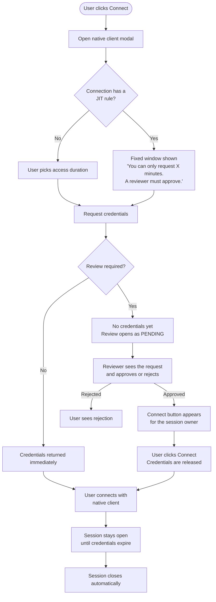

# Native Client Credentials: Session & JIT Review

**Status:** Proof of Concept
**Branch:** `claude/review-branch-analysis-CDjdL`

---

## What This Is

Hoop already let users connect to databases, SSH servers, and other resources through the CLI or the web terminal — both of which route traffic through the Hoop gateway. It also already issued short-lived credentials that native clients (DBeaver, `psql`, a local SSH client) could use to connect directly.

What was missing was **control and visibility** over those credential requests. There was no audit trail at the moment of the request, and there was no way to require approval before credentials were handed out — the review system existed for CLI sessions, but native client credentials bypassed it entirely.

This POC closes that gap.

---

## The Problem, Simply

Before this work, requesting native client credentials happened "in the dark":

- No session was recorded when someone asked for credentials — only when they actually connected with them. By then, the window to intercept had passed.
- If a connection had reviewers or a JIT rule configured, the credentials endpoint simply returned an error. There was no flow to request, wait, and receive.

The result: native client access was effectively ungoverned compared to every other access mode in Hoop.

---

## What Changed

Two things now happen that didn't before:

**1. A session is created at the moment credentials are requested**, not later when the client connects. This gives Hoop a hook to apply the same review logic that exists for CLI and runbook sessions.

**2. If the connection requires approval**, the endpoint no longer returns an error. Instead, it returns a pending review that must be approved before credentials are released. The user waits, the reviewer acts, and only then do credentials flow.

---

## Flow

---

## The Experience

### For the user requesting access

On a connection without review: nothing changes. Duration picker, confirm, done.

On a connection with a JIT rule: the picker is replaced by a clear notice explaining the fixed time window and that a reviewer must approve. Clicking "Request Access" opens the session details modal immediately — the user sees their request in PENDING state and knows exactly what's happening.

Once approved, a "Connect" button appears. One click, and the credentials are ready.

### For the reviewer

No change. The same review flow that exists for other session types now applies to native client requests.

---

## Why Session-First Matters

Every other access mode in Hoop — CLI exec, runbook, web terminal — creates a session record before anything runs. Native client credentials were the exception. By moving session creation to the moment of the request:

- The audit trail is complete from request to expiry, regardless of whether the user ever connected.
- Reviews can gate credential release, not just flag after the fact.
- Multiple native client connections using the same credentials are grouped under one session, not scattered across separate records.

---

## Key Decisions

**Session ID travels with the credential.** When the native client connects to the proxy, it reuses the session that was already created — instead of generating a new one. This keeps the audit trail unified.

**Timer doesn't reset on reconnect.** If a user calls the resume endpoint multiple times (e.g. after losing the key), they always get back the original expiry. The clock starts at first approval, not at each request.

**The session details modal is reused for review feedback.** Rather than a new purpose-built UI, the existing session modal was extended with a "Connect" section for credential sessions. This kept the review experience consistent across all session types.

---

## Known Limitations

- **Duration cap not enforced server-side.** The JIT rule defines the fixed window, but the backend currently doesn't reject requests exceeding it. Needs a follow-up.
- **No real-time update after approval.** The user must keep the session modal open. There's no push notification or auto-refresh when a reviewer approves.
- **OSS reviewers don't show the JIT callout.** The fixed-window notice only appears for enterprise JIT rules. Connections with legacy reviewers still show the duration picker, which is slightly inconsistent.
